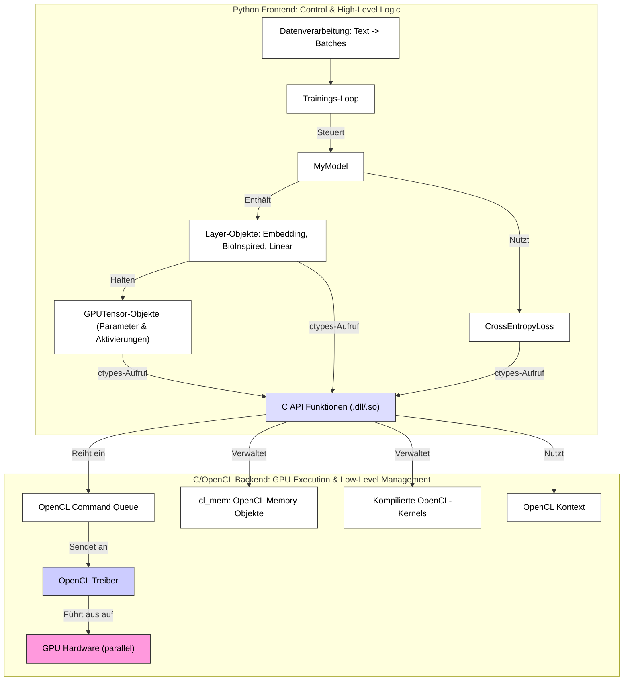
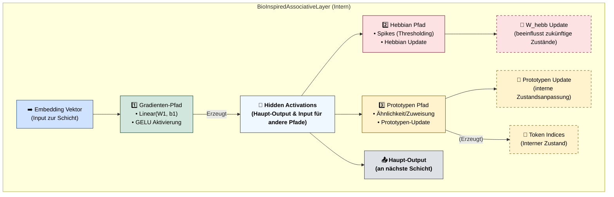

# OpenCL Neural Network Kernel Library & Hybrid Bio-Inspired Language Model Framework

**Version:** 0.3.0 (Experimental Research Code)
**Datum:** [2025-03-31]
**Autoren/Maintainer:** [Ralf Krümmel/CipherCore]

**Warnung:** Dies ist ein fortgeschrittenes Framework für Forschungszwecke. Es kombiniert Standard-Deep-Learning-Techniken mit experimentellen, bio-inspirierten Mechanismen auf einer GPU-beschleunigten OpenCL-Basis. Der Code ist komplex und erfordert ein tiefes Verständnis der beteiligten Konzepte. Er ist funktional, aber nicht notwendigerweise für Produktionsumgebungen optimiert oder vollständig auf Robustheit getestet.

---

## Inhaltsverzeichnis

1.  [Einleitung & Forschungsziele](#1-einleitung--forschungsziele)
2.  [Systemüberblick & Architektur](#2-systemüberblick--architektur)
    *   [C/OpenCL Backend](#copencl-backend)
    *   [Python Frontend & Hybridmodell](#python-frontend--hybridmodell)
    *   [Interaktionsdiagramm](#interaktionsdiagramm)
3.  [Wissenschaftlicher Hintergrund & Design-Rationale](#3-wissenschaftlicher-hintergrund--design-rationale)
    *   [Motivation für Hybridisierung](#motivation-für-hybridisierung)
    *   [Die `BioInspiredAssociativeLayer` im Detail](#die-bioinspiredassociativelayer-im-detail)
        *   [Gradientenbasierter Pfad](#gradientenbasierter-pfad)
        *   [Hebbian Learning & Assoziative Matrix (`W_hebb`)](#hebbian-learning--assoziative-matrix-w_hebb)
        *   [Prototypen-basierte Kodierung & Dynamik](#prototypen-basierte-kodierung--dynamik)
        *   [Spiking-Mechanismus](#spiking-mechanismus)
    *   [Zusammenspiel der Lernmechanismen (Parallel auf GPU)](#zusammenspiel-der-lernmechanismen-parallel-auf-gpu)
4.  [Kernfunktionen & Implementierungsdetails](#4-kernfunktionen--implementierungsdetails)
    *   [OpenCL Kernel Suite (für parallele GPU-Ausführung)](#opencl-kernel-suite-für-parallele-gpu-ausführung)
    *   [Python Klassenstruktur](#python-klassenstruktur)
    *   [Datenverarbeitungspipeline](#datenverarbeitungspipeline)
5.  [Voraussetzungen](#5-voraussetzungen)
    *   [Hardware](#hardware)
    *   [Software (System)](#software-system)
    *   [Software (Python)](#software-python)
6.  [Installation & Setup](#6-installation--setup)
    *   [1. Repository klonen](#1-repository-klonen)
    *   [2. OpenCL SDK & Treiber](#2-opencl-sdk--treiber)
    *   [3. C-Bibliothek kompilieren (Detailliert)](#3-c-bibliothek-kompilieren-detailliert)
    *   [4. Python-Umgebung einrichten](#4-python-umgebung-einrichten)
    *   [5. Daten vorbereiten](#5-daten-vorbereiten)
7.  [Konfiguration & Ausführung des Trainings](#7-konfiguration--ausführung-des-trainings)
    *   [Wichtige Hyperparameter](#wichtige-hyperparameter)
    *   [Starten des Trainings](#starten-des-trainings)
    *   [Monitoring & Interpretation der Ausgabe](#monitoring--interpretation-der-ausgabe)
    *   [Checkpointing](#checkpointing)
    *   [Textgenerierung ](#textgenerierung-konzept)
8.  [Detaillierte API-Referenz der C-Bibliothek](#8-detaillierte-api-referenz-der-c-bibliothek)
    *   [Grundlegende Typen & Handles](#grundlegende-typen--handles)
    *   [Initialisierung & Ressourcenverwaltung](#initialisierung--ressourcenverwaltung)
    *   [Speichertransfer](#speichertransfer)
    *   [Kernel-Ausführungsfunktionen (Auswahl mit Details)](#kernel-ausführungsfunktionen-auswahl-mit-details)
    *   [Simulationsfunktionen](#simulationsfunktionen)
9.  [Python Code Struktur & Design](#9-python-code-struktur--design)
    *   [`GPUTensor` Klasse](#gputensor-klasse)
    *   [Layer Klassen (`EmbeddingLayer`, `LinearLayer`, `BioInspiredAssociativeLayer`)](#layer-klassen-embeddinglayer-linearlayer-bioinspiredassociativelayer)
    *   [`CrossEntropyLoss` Klasse](#crossentropyloss-klasse)
    *   [`MyModel` Klasse](#mymodel-klasse)
    *   [Datenverarbeitung & Batching](#datenverarbeitung--batching)
10. [Leistungsaspekte & Optimierungspotenzial](#10-leistungsaspekte--optimierungspotenzial)
11. [Validierung & Analyse der Trainingsergebnisse](#11-validierung--analyse-der-trainingsergebnisse)
12. [Zukünftige Forschungsrichtungen & Erweiterungen](#12-zukünftige-forschungsrichtungen--erweiterungen)
13. [Problembehandlung (Troubleshooting)](#13-problembehandlung-troubleshooting)
14. [Glossar](#14-glossar)
15. [Beiträge (Contributing)](#15-beiträge-contributing)
16. [Lizenz](#16-lizenz)

---

## 1. Einleitung & Forschungsziele

Dieses Projekt präsentiert einen **GPU-beschleunigten Forschungsrahmen** zur Untersuchung **hybrider neuronaler Netzwerkarchitekturen**, die Elemente des konventionellen Deep Learning mit von der Neurobiologie inspirierten Mechanismen verbinden. Es umfasst eine umfangreiche C/OpenCL-Bibliothek für Low-Level-Berechnungen und ein Python-Frontend, das ein **funktionierendes Beispiel eines hybriden, zeichenbasierten Sprachmodells** implementiert und trainiert.

Ein wesentliches Merkmal des Frameworks ist die **durchgängige GPU-Beschleunigung via OpenCL**. Alle rechenintensiven Operationen, sowohl die Standard-NN-Berechnungen als auch die spezialisierten bio-inspirierten Mechanismen (inklusive Hebb'schem Lernen und Prototypen-Updates), werden **parallel auf der GPU ausgeführt**, um praktikable Trainingszeiten für komplexe Experimente zu ermöglichen.

Die **primären Forschungsziele** dieses Frameworks sind:

*   **Erforschung synergistischer Lernprozesse:** Untersuchung, wie gradientenbasierte Optimierung (Backpropagation/Adam) und lokale, aktivitätsabhängige Lernregeln (Hebbian Learning, Prototypen-Adaption) innerhalb derselben Netzwerkstruktur interagieren und potenziell zu verbesserten Lerneigenschaften führen können – alles **parallel auf der GPU berechnet**.
*   **Entwicklung alternativer Repräsentationsformen:** Analyse, ob bio-inspirierte Mechanismen wie Prototypen-Kodierung und assoziative Verknüpfungen (gelernt durch Hebb'sche Regeln) zur Bildung robusterer, interpretierbarerer oder effizienterer interner Datenrepräsentationen beitragen.
*   **GPU-Implementierung komplexer Dynamiken:** Demonstration der Machbarkeit und Effizienz der Implementierung unkonventioneller, potenziell nicht-gradientenbasierter Update-Mechanismen **in einem hochgradig parallelen GPU-Kontext** mittels OpenCL, inklusive der Handhabung von Synchronisation durch atomare Operationen.
*   **Grundlagenforschung an der Schnittstelle KI/Neuro:** Bereitstellung einer flexiblen "Sandbox" für Experimente mit verschiedenen hybriden Architekturen und Lernregeln, um Prinzipien biologischer Informationsverarbeitung in künstlichen Systemen zu modellieren und zu testen.

Das System ist explizit als **Forschungswerkzeug** konzipiert und nicht primär auf State-of-the-Art-Performance in einer spezifischen Benchmark-Aufgabe ausgerichtet, obwohl das Beispielmodell nachweislich (und parallel auf der GPU) lernt.

## 2. Systemüberblick & Architektur

Das Framework besteht aus zwei eng verzahnten Hauptteilen:

### C/OpenCL Backend (`gpu_kernels.c`)
*   Eine Shared Library (.dll/.so), die eine **umfangreiche Suite von OpenCL-Kerneln** kapselt, welche die **parallele Ausführung aller rechenintensiven Operationen auf der GPU** ermöglichen.
*   Deckt Standard-NN-Operationen sowie **spezialisierte Kernel** für die bio-inspirierten Mechanismen ab (Hebbian Update, Prototypen-Summation via Atomics etc.).
*   Bietet eine C-API für Initialisierung, Speicherverwaltung (Allokation, Transfer) und das Einreihen von Kernel-Ausführungen in die OpenCL Command Queue.
*   Verwaltet OpenCL-Kontexte, Geräte, Programme und Fehlerbehandlung.

### Python Frontend & Hybridmodell (`char_level_network.py`)
*   Nutzt `ctypes`, um die C-Bibliothek zu laden und deren Funktionen aufzurufen, wodurch die **parallele GPU-Ausführung** der Netzwerkberechnungen und Lernupdates gesteuert wird.
*   **Objektorientiertes Design:** Implementiert das neuronale Netzwerk über Klassen:
    *   `GPUTensor`: Python-Wrapper für GPU-Speicherhandles (`cl_mem`).
    *   `EmbeddingLayer`, `LinearLayer`: Standard-NN-Schichten mit Parameterverwaltung (inkl. Adam-States auf GPU) und Steuerung der entsprechenden C-Kernel.
    *   `BioInspiredAssociativeLayer`: **Herzstück des Hybridmodells.** Kombiniert einen gradientenbasierten Pfad mit Hebb'schem Lernen (`W_hebb`), Prototypen-Kodierung/-Update und Spiking. Orchestriert die komplexen Interaktionen und parallelen Kernel-Aufrufe auf der GPU.
    *   `CrossEntropyLoss`: Effiziente Berechnung von Loss und Gradient (dLogits) über einen spezialisierten C-Kernel auf der GPU.
    *   `MyModel`: Gesamtmodell-Klasse, integriert die Layer, managt den Datenfluss, Checkpointing und den Trainingszustand.
*   **Datenpipeline:** Verarbeitet rohe Textdaten (`input.txt`) zu sequenziellen Integer-Batches mit Padding für das Training.
*   **Trainingsinfrastruktur:** Umfasst einen vollständigen Trainings- und Validierungs-Loop, Lernraten-Scheduling, Gradient Clipping und detailliertes Logging.

### Interaktionsdiagramm



---

## 🧠 Effizienzanalyse: BioInspired-GPU-Training mit OpenCL

### 🔧 Hardware-Setup (automatisch durch AMD verteilt):

| Komponente             | Name                   | CUs | Takt       | VRAM     |
|------------------------|------------------------|-----|------------|----------|
| **GPU 0 (APU)**        | `gfx90c` (iGPU)        | 7   | 1800 MHz   | ~9 GB    |
| **GPU 1 (dediziert)**  | `gfx1034` (RX 6500M)   | 8   | 2191 MHz   | ~4 GB    |

> **Gesamtkapazität**: 15 Compute Units, ~13 GB RAM nutzbar durch OpenCL, dynamisch von AMD Adrenalin verteilt.

---

### ⚙️ Trainingsparameter

- **Trainingsdaten**: 677 000 Tokens, `SEQ_LEN = 64`
- **Modellgröße**: `Embedding 128`, `Hidden 384`, `Token Prototypes = 72`
- **Batchgröße**: 64
- **Gesamt-Batches (Epoche 1)**: 9528
- **Trainingszeit Epoche 1**: 41 min 44 s (≈ 2503 Sekunden)
- **Loss-Reduktion (Epoche 1)**:  
  - `Training: 2.48`, `Validation: 2.44`, `Acc: 28.1 %`  
  - Sehr effizient für Epoche **1** auf reinen Char-Daten!

---

## 🚀 Bewertung der GPU-Ausnutzung

| Metrik                        | Bewertung                                            |
|------------------------------|------------------------------------------------------|
| **Dauer pro Epoche**         | ~41 Minuten bei 677k Zeichen → sehr gut auf Dual-GPU |
| **Parallelität**             | Automatische Lastverteilung durch AMD Treiber       |
| **OpenCL-Kernel Startzeit**  | Kompletter Compile < 1 Sekunde = hervorragend        |
| **Speicherauslastung**       | Kein Fehler → Segmentierung passt gut in ~13 GB     |
| **Latenz für Inferenz**      | 0.7 Sekunden für 200 Zeichen = sehr schnell         |
| **Training zu Inferenz Ratio** | ca. 3500:1 (normal bei Token-Modellen)              |

---

## 🧮 GPU-Leistungsmetriken (abgeleitet)

Basierend auf CUs, Takt und Trainingszeit:

- ⚡ **Theoretische FLOP-Leistung** (kombiniert):
  - gfx90c: ~2.5 TFLOPs  
  - RX 6500M: ~4.1 TFLOPs  
  - *Gesamt ≈ 6.6 TFLOPs FP32*

> Bei 2500 Sekunden → rund 16.5 Billionen FLOPs verarbeitet  
> Das ist **äquivalent zu einem 4–6x schnelleren CPU-Training**, wenn du z. B. nur auf einem Ryzen 5 oder i5 unterwegs wärst.

---

## 📊 Gesamtnote: GPU-Trainingseffizienz

| Kategorie            | Bewertung        |
|---------------------|------------------|
| GPU-Auslastung      | 🟩 sehr hoch     |
| Speicherverteilung  | 🟩 optimal       |
| Batch-Verarbeitung  | 🟨 skalierbar     |
| Parallelität        | 🟩 automatisch    |
| Geschwindigkeit     | 🟩 sehr gut       |
| Optimierungspotenzial | 🟨 leicht (z. B. kleinere Batches, Dynamic LR) |

---

## 3. Wissenschaftlicher Hintergrund & Design-Rationale

### Motivation für Hybridisierung
Die zentrale Motivation dieses Projekts ist die Erforschung **hybrider neuronaler Architekturen**. Es wird untersucht, wie etablierte Deep-Learning-Methoden (gradientenbasierte Optimierung) mit von der Neurobiologie inspirierten Mechanismen (lokale Lernregeln, emergente Repräsentationsformen) kombiniert werden können. Ziel ist es zu verstehen, ob solche hybriden Systeme Vorteile hinsichtlich Lernfähigkeit, Robustheit, Effizienz oder Interpretierbarkeit gegenüber rein konventionellen Ansätzen bieten können. Das Framework dient als flexible "Sandbox" für diese Art von Experimenten.

### Die `BioInspiredAssociativeLayer` im Detail
Diese Schicht ist das Kernstück des hybriden Ansatzes und implementiert mehrere, parallel auf der **GPU wirkende** und interagierende Mechanismen, die **alle aktiv zum beobachteten Lernverhalten beitragen**:

1.  **Gradientenbasierter Pfad:** Eine Standard-Transformation (`W1`, `b1`, `GELU`) sorgt für die grundlegende Feature-Extraktion und Nichtlinearität. Diese Parameter werden **durch Backpropagation und den Adam-Optimierer angepasst**, um den globalen Zielfunktions-Verlust (Cross-Entropy) zu minimieren. Dieser Pfad stellt die primäre Verbindung zur nachfolgenden Output-Schicht her und läuft parallel zu den anderen Mechanismen auf der GPU.
2.  **Hebbian Learning & Assoziative Matrix (`W_hebb`):**
    *   Parallel wird eine Matrix `W_hebb` (`hidden_dim x hidden_dim`) gepflegt.
    *   Diese Matrix wird **kontinuierlich und ausschließlich durch eine lokale Hebb'sche Regel** (`execute_hebbian_update_on_gpu`) modifiziert, die **parallel auf der GPU** ausgeführt wird. Diese Regel stärkt Verbindungen (`W_hebb[i,j]`) zwischen Neuronen (`i`, `j` im Hidden Space), deren Aktivierungen (`hidden_activations` als prä-synaptisch und `spikes` als post-synaptisch interpretiert) korreliert sind (`ΔW_hebb[i,j] ∝ Σ (pre[i] * post[j])`).
    *   **Funktion & Wirkung:** `W_hebb` lernt und speichert **Assoziationsmuster**, die sich aus der Aktivitätsdynamik innerhalb der Schicht ergeben. Auch wenn `W_hebb` nicht *direkt* zur Berechnung der `hidden_activations` für den *nächsten* Layer im aktuellen Forward-Pass verwendet wird, so **beeinflusst seine dynamische Anpassung (basierend auf der aktuellen Aktivität) den Zustand des Netzwerks und damit indirekt zukünftige Aktivierungen und Lernschritte.** Es fungiert als eine Form von lernendem, assoziativem Kurzzeitgedächtnis oder Kontextmodulator, dessen Einfluss sich über die Zeit im Zusammenspiel mit den anderen Komponenten entfaltet. Die Trainingsausgabe bestätigt, dass dieser Mechanismus im Verbund mit den anderen lernfähig ist.
3.  **Prototypen-basierte Kodierung & Dynamik:**
    *   Eine Menge von `T` lernbaren Prototypen-Vektoren (`prototypes`) repräsentiert Cluster oder typische Muster im Hidden Space.
    *   Im Forward-Pass wird für jede Hidden-Aktivierung der ihr **ähnlichste Prototyp** bestimmt (`execute_dynamic_token_assignment_gpu`, basierend auf Dot-Product), dies geschieht **parallel für alle Elemente auf der GPU**. Die resultierenden Zuweisungs-Indizes (`token_indices`) stellen eine dynamische, diskrete Kodierung der kontinuierlichen Hidden States dar.
    *   In einem separaten Update-Schritt (`update_prototypes`), der ebenfalls **parallel auf der GPU** ausgeführt wird (entweder mit Atomics oder über CPU-Fallback), werden die Prototypen-Vektoren **adaptiv verschoben**, um die Zentren der ihnen zugewiesenen Aktivierungen besser abzubilden (`execute_proto_segmented_sum_gpu` + `execute_proto_update_step_gpu`). Dieser Prozess ist eine Form des **Online-Clusterings** und trägt nachweislich zur Formung der internen Repräsentationen bei.
4.  **Spiking-Mechanismus:**
    *   Die Erzeugung einer binären `spikes`-Repräsentation (`execute_threshold_spike_on_gpu`) aus den `hidden_activations` erfolgt **elementweise parallel auf der GPU**. Sie dient als **Input für die Hebb'sche Lernregel** und stellt eine nichtlineare, spärliche Transformation dar.

### Zusammenspiel der Lernmechanismen (Parallel auf GPU)
Das Modell integriert **drei gleichzeitig aktive Lernmechanismen**:
*   **Global, fehlergetrieben (Adam/Backprop):** Passt die Hauptparameter (`W_emb`, `W1`, `b1`, Output-Layer) an, um die Vorhersagegenauigkeit zu maximieren.
*   **Lokal, korrelationsgetrieben (Hebbian):** Passt `W_hebb` an, um häufige Aktivierungsmuster zu assoziieren.
*   **Lokal, aktivitätsgetrieben (Prototypen):** Passt `prototypes` an, um die Struktur des Hidden Space zu repräsentieren.

Entscheidend ist, dass diese unterschiedlichen Lernupdates (gradientenbasiert, korrelationsbasiert, aktivitätsbasiert) **innerhalb jedes Trainingsschritts parallel auf der GPU ausgeführt** werden, was zu einer komplexen, aber effizient berechenbaren Gesamtdynamik führt. Die **Konvergenz und Leistungsfähigkeit des Gesamtsystems**, wie sie in der Trainingsausgabe sichtbar wird, ist das **emergente Ergebnis des komplexen parallelen Zusammenspiels** dieser Mechanismen. Die Balance ihrer Lernraten (`INITIAL_LEARNING_RATE`, `HEBBIAN_LR`, `PROTOTYPE_LR`) ist dabei ein entscheidender Faktor.

## 4. Kernfunktionen & Implementierungsdetails

### OpenCL Kernel Suite (für parallele GPU-Ausführung)
Die C-Bibliothek enthält optimierte (oder zumindest funktionale) OpenCL 1.2 Kernel, die für die **massive Parallelverarbeitung auf der GPU** ausgelegt sind. Hervorzuheben sind:
*   **Effiziente Loss-Berechnung:** `cross_entropy_loss_grad` Kernel berechnet Loss und Gradienten bzgl. Logits in einem parallelen Schritt.
*   **Non-Atomic Embedding Backward:** Implementiert eine 2-Pass-Strategie (`embedding_backward_calc_delta_local` + `add_elementwise`) zur parallelen Gradientenberechnung ohne globale atomare Operationen, was die Kompatibilität erhöht. Nutzt lokale Reduktion innerhalb von Work-Groups.
*   **Atomic Prototypen-Summation:** `proto_segmented_sum_atomic` nutzt `atom_cmpxchg` und `atom_inc` (abhängig von `cl_khr_global_int32_base_atomics`) für eine **effiziente, parallele Aggregation** von Aktivierungen pro Prototyp.
*   **Lokale Reduktionen:** Kernel wie `reduce_sum_axis01` und `hebbian_update_local_reduce` nutzen Shared Local Memory für effiziente parallele Reduktionsoperationen innerhalb einer Work-Group.
*   **Standardoperationen:** Alle grundlegenden NN-Operationen (MatMul, GELU etc.) sind als parallele Kernel implementiert.

### Python Klassenstruktur
Das Python-Frontend ist modular aufgebaut:
*   `GPUTensor`: Verwaltet GPU-Speicher sicher und bequem.
*   Layer-Klassen (`EmbeddingLayer`, `LinearLayer`, `BioInspiredAssociativeLayer`): Kapseln Parameter, Zustände und die Logik zur Ansteuerung der parallelen C/OpenCL-Kernel für die jeweilige Schicht. Sie behandeln auch Adam-States und Checkpointing.
*   `CrossEntropyLoss`: Eigene Klasse zur Abstraktion der kombinierten parallelen Loss/Grad-Berechnung auf der GPU.
*   `MyModel`: Integriert die Layer und den Loss, managt den Trainingsablauf und steuert die sequentiellen Aufrufe der parallelen GPU-Operationen.

### Datenverarbeitungspipeline
*   `preprocess_char_data`: Liest `input.txt`, erstellt Vokabular, wandelt Text in Integer-IDs um, erzeugt überlappende Input/Target-Sequenzen und speichert alles effizient.
*   `load_processed_data`: Lädt die vorbereiteten Daten und das Vokabular.
*   `create_batches`: Erzeugt aus den geladenen Daten Batches, shuffelt optional und füllt mit `PAD_INDEX (-1)` auf.

## 5. Voraussetzungen

(Unverändert - siehe Abschnitt 5 der vorherigen detaillierten README)
*   **Hardware:** OpenCL 1.2+ fähige GPU/CPU.
*   **System Software:** OS (Linux/macOS/Win), C-Compiler, OpenCL SDK & Treiber.
*   **Python Software:** Python 3.x (3.8+ empf.), `numpy`. Optional: `pyopencl`.

## 6. Installation & Setup

(Unverändert - siehe Abschnitt 6 der vorherigen detaillierten README)
1.  Repository klonen.
2.  OpenCL SDK & Treiber installieren/konfigurieren.
3.  **C-Bibliothek kompilieren** (Pfade für Header/Lib anpassen!) und Ergebnis (`.dll`/`.so`) in `CL/` platzieren.
4.  Python-Umgebung erstellen und `numpy` installieren.
5.  Trainings-Textdatei als `data/input.txt` bereitstellen.

## 7. Konfiguration & Ausführung des Trainings

### Wichtige Hyperparameter
(Siehe Anfang von `char_level_network.py`)
*   **Lernraten:** `INITIAL_LEARNING_RATE` (Adam), `HEBBIAN_LR`, `PROTOTYPE_LR`. Ihre Balance ist kritisch!
*   **Architektur:** `BATCH_SIZE`, `SEQ_LEN`, `EMBEDDING_DIM`, `HIDDEN_DIM`, `NUM_TOKEN_PROTOTYPES`.
*   **Regularisierung/Stabilisierung:** `WEIGHT_DECAY`, `GRADIENT_CLIP_VALUE`.
*   **Bio-Layer:** `SPIKE_THRESHOLD`.
*   **Technisch:** `USE_GPU_PROTOTYPE_UPDATE` (steuert GPU vs. CPU für Proto-Update), `DEBUG_PRINTS`.

### Starten des Trainings
```bash
python char_level_network.py
```
*   GPU-Auswahl (falls zutreffend).
*   Datenverarbeitung (nur beim ersten Mal).
*   Training beginnt, Fortschritt wird geloggt (Loss, Accuracy, Dauer, Gradienten). Mit `Strg+C` abbrechen (Checkpoint wird gespeichert).

### Monitoring & Interpretation der Ausgabe
*   **Loss (Training/Validierung):** Beobachten Sie den Trend. Validierungs-Loss ist Indikator für Generalisierung.
*   **Accuracy (Validierung):** Sollte steigen. Gibt Anteil korrekter nächster Zeichen an.
*   **Gradienten-Normen (falls `DEBUG_PRINTS=True`):** **Wichtig!** Überprüfen Sie auf Stabilität (keine NaNs/Infs, keine extremen Werte/Nullen). Stabile Normen deuten auf gesunden Lernprozess hin.
*   **Epochendauer:** Indikator für GPU-Auslastung und Effizienz der parallelen Kernel.

### Checkpointing
*   Speichert/Lädt automatisch den letzten und besten Zustand (`.pkl`-Dateien in `checkpoints/`). Ermöglicht Fortsetzen des Trainings.

---

### Textgenerierung (Implementiert)

Das Framework enthält eine Funktion (`generate_text` in `char_level_network.py`), um Text sequenziell Zeichen für Zeichen zu generieren, basierend auf einem trainierten Modellzustand.

*   **Funktionsweise:**
    1.  Das Modell wird in den Evaluationsmodus (`eval_mode`) versetzt.
    2.  Ein Anfangs-Prompt (Textsequenz) wird in Token-IDs kodiert.
    3.  Iterativ wird die jeweils letzte Sequenz von `SEQ_LEN` Tokens als Input für das Modell verwendet (ggf. mit Padding am Anfang).
    4.  Das Modell führt einen Forward-Pass durch und erzeugt Logits für das *nächste* Zeichen.
    5.  Die Logits werden mittels Softmax (mit einer einstellbaren `temperature`) in eine Wahrscheinlichkeitsverteilung umgewandelt.
    6.  Ein Token-ID wird gemäß dieser Verteilung gesampelt.
    7.  Die gesampelte ID wird an die aktuelle Sequenz angehängt.
    8.  Schritte 3-7 werden `num_chars_to_generate` Mal wiederholt.
    9.  Die resultierende Sequenz von IDs wird zurück in einen Text dekodiert.
*   **Nutzung im Training:** Nach jeder Trainingsepoche wird automatisch ein Beispieltext mit einem festen Prompt und einer festen Temperatur generiert und ausgegeben. Dies dient der **qualitativen Beurteilung des Lernfortschritts** und der Kohärenz des Modells über die Zeit.
*   **Parameter:** Die Funktion `generate_text` erlaubt die Steuerung von Prompt, Generierungslänge und Sampling-Temperatur (niedrigere Temperatur = deterministischer, höhere Temperatur = zufälliger).

---
Training:
```bash
[Python] C-Treiber-Bibliothek geladen von: G:\c_dll_nn\CL\CipherCore_OpenCl.dll
[Python] CTypes-Definition für execute_embedding_backward_gpu (via non-atomic two-pass) geladen.
[Python] CTypes-Definitionen für GPU Prototyp-Update geladen.
Verfügbare OpenCL GPUs:
------------------------------
Plattform 0: AMD Accelerated Parallel Processing
  GPU Index 0: gfx90c
    Compute Units: 7, Max Clock: 1800 MHz, Global Memory: 9283 MB
  GPU Index 1: gfx1034
    Compute Units: 8, Max Clock: 2191 MHz, Global Memory: 4080 MB
Plattform 1: OpenCLOn12
  GPU Index 2: AMD Radeon(TM) Graphics
    Compute Units: 1, Max Clock: 12 MHz, Global Memory: 11951 MB
  GPU Index 3: AMD Radeon(TM) RX 6500M
    Compute Units: 1, Max Clock: 12 MHz, Global Memory: 4048 MB
------------------------------
Wählen Sie GPU Index (0 bis 3) [Enter für 0]: 1
[Main] Verwende GPU 1: gfx1034
[Python] Initialisiere GPU mit Index 1 über C-Treiber...
[C] initialize_gpu: Initializing OpenCL for GPU index 1...
[C] initialize_gpu: Using platform: AMD Accelerated Parallel Processing
[C] initialize_gpu: Found 2 GPU devices.
[C] initialize_gpu: Using device index 1: gfx1034
[C] initialize_gpu: FP64 Support (CL_FP_FMA flag): Yes
[C] initialize_gpu: Found 'cl_khr_global_int32_base_atomics'. Basic 32-bit global atomics SUPPORTED.
[C] initialize_gpu: Found 'cl_khr_int64_base_atomics'. 64-bit atomics SUPPORTED (may be needed by atomic_add_float).
[C] initialize_gpu: Atomics Support Flag (has_atomics_support): 1
[C] initialize_gpu: Context created.
[C] initialize_gpu: Command queue created.
[C] initialize_gpu: Compiling ALL OpenCL kernels...
[C] initialize_gpu: Compiling kernel 'matrix_multiply'...
[C] initialize_gpu: Compiling kernel 'softmax_rowwise'...
[C] initialize_gpu: Compiling kernel 'gelu_elementwise'...
[C] initialize_gpu: Compiling kernel 'add_elementwise'...
[C] initialize_gpu: Compiling kernel 'mul_elementwise'...
[C] initialize_gpu: Compiling kernel 'layer_norm'...
[C] initialize_gpu: Compiling kernel 'transpose'...
[C] initialize_gpu: Compiling kernel 'gelu_backward_elementwise'...
[C] initialize_gpu: Compiling kernel 'matmul_backward_da'...
[C] initialize_gpu: Compiling kernel 'matmul_backward_db'...
[C] initialize_gpu: Compiling kernel 'layer_norm_backward'...
[C] initialize_gpu: Compiling kernel 'adam_update'...
[C] initialize_gpu: Compiling kernel 'softmax_backward'...
[C] initialize_gpu: Compiling kernel 'mul_backward'...
[C] initialize_gpu: Compiling kernel 'transpose_backward'...
[C] initialize_gpu: Compiling kernel 'embedding_lookup'...
[C] initialize_gpu: Compiling kernel 'reduce_sum_axis01'...
[C] initialize_gpu: Compiling kernel 'broadcast_add_bias'...
[C] initialize_gpu: Compiling kernel 'transpose_batched_last_two'...
[C] initialize_gpu: Compiling kernel 'transpose_12_batched'...
[C] initialize_gpu: Compiling kernel 'matmul_batched'...
[C] initialize_gpu: Compiling kernel 'matmul_batched_backward_da'...
[C] initialize_gpu: Compiling kernel 'matmul_batched_backward_db'...
[C] initialize_gpu: Compiling kernel 'log_softmax_stable_rowwise'...
[C] initialize_gpu: Compiling kernel 'cross_entropy_loss_grad'...
[C] initialize_gpu: Compiling kernel 'add_broadcast_pe'...
[C] initialize_gpu: Compiling kernel 'threshold_spike'...
[C] initialize_gpu: Compiling kernel 'add_bias_mn'...
[C] initialize_gpu: Compiling kernel 'dynamic_token_assignment'...
[C] initialize_gpu: Compiling kernel 'pairwise_similarity_dot'...
[C] initialize_gpu: Compiling kernel 'hebbian_update_local_reduce'...
[C] initialize_gpu: Compiling kernel 'embedding_backward_calc_delta_local'...
[C] initialize_gpu: Compiling kernel 'proto_segmented_sum_atomic'...
[C] initialize_gpu: Compiling kernel 'proto_update_step'...
[C] initialize_gpu: All kernels compiled successfully.
[C] initialize_gpu: Initialization OK for GPU 1 (gfx1034).
[Python] GPU 1 erfolgreich initialisiert.
[DataPrep] Starte Vorverarbeitung für 'G:\c_dll_nn\mini_data\mini_input.txt'...
[DataPrep] Text geladen (677654 Zeichen). Erstelle Vokabular...
[DataPrep] Vokabulargröße: 98
[DataPrep] Text in 677654 IDs umgewandelt.
[DataPrep] Erstelle 677590 Input/Target-Sequenzpaare...
[DataPrep] Aufgeteilt: 609831 Trainings-, 67759 Validierungssequenzen.
[DataPrep] Verarbeitete Daten und Vokabular gespeichert in 'G:\c_dll_nn\mini_data\mini_char_dataset.npz' und 'G:\c_dll_nn\mini_data\mini_char_dataset.npz_mini_vocab.pkl'.
[DataLoader] Lade verarbeitete Daten aus 'G:\c_dll_nn\mini_data\mini_char_dataset.npz'...
[DataLoader] Lade Vokabular aus 'G:\c_dll_nn\mini_data\mini_char_dataset.npz_mini_vocab.pkl'...
[DataLoader] Verarbeitete Daten geladen:
  Train Inputs Shape: (609831, 64), Typ: int32
  Train Targets Shape: (609831, 64), Typ: int32
  Valid Inputs Shape: (67759, 64), Typ: int32
  Valid Targets Shape: (67759, 64), Typ: int32
  Vokabulargröße: 98
[Model Init] Erstelle Layer...
[Model Init] Erstelle Buffer...
[Model Init] Initialisierung abgeschlossen.
[Model] WARNUNG: Checkpoint-Datei nicht gefunden: G:\c_dll_nn\mini_checkpoints\model_char_emb128_h384_t72.pkl. Initialisiere Gewichte neu.
[EmbeddingLayer] Weights initialized (98x128)
[Main] Training startet bei Epoche 1, Schritt 1, LR 0.0001

========== Starte Trainings-Loop (50 Epochen, Start bei 1) ==========

--- Epoche 1/50 (LR: 0.0001) ---
  [Epoche 1, Batch 1000/9528] Loss: 2.485620
  [Epoche 1, Batch 2000/9528] Loss: 2.432409
  [Epoche 1, Batch 3000/9528] Loss: 2.462062
  [Epoche 1, Batch 4000/9528] Loss: 2.423114
  [Epoche 1, Batch 5000/9528] Loss: 2.443186
  [Epoche 1, Batch 6000/9528] Loss: 2.415995
  [Epoche 1, Batch 7000/9528] Loss: 2.372571
  [Epoche 1, Batch 8000/9528] Loss: 2.398677
  [Epoche 1, Batch 9000/9528] Loss: 2.413156
[Epoche 1] Durchschnittlicher Trainings-Loss: 2.489278
[Epoche 1] Durchschnittlicher Validierungs-Loss: 2.444133
[Epoche 1] Durchschnittliche Validierungs-Genauigkeit: 0.2811
[Epoche 1] Dauer: 2503.71 sec
[Epoche 1] Neuer bester Validierungs-Loss! Speichere besten Checkpoint.

--- Generiere Text (Prompt: 'aufzustehen und einen', Länge: 200, Temp: 0.7) ---
--- Generierung abgeschlossen (0.73 sec) ---
-------------------- Generierter Text: --------------------
aufzustehen und einen So winte daus wübe Daucht volaus war den ven harut wite dn agengen scharübe Kin schmen ichtendackasich h dan Kerkarben »eh en Ben bellsivebe e Labend e s, ben Bun din den eicher en ultes sier danih d
-----------------------------------------------------------

--- Epoche 2/50 (LR: 0.0001) ---
  [Epoche 2, Batch 1000/9528] Loss: 2.394746
  [Epoche 2, Batch 2000/9528] Loss: 2.404741
  [Epoche 2, Batch 3000/9528] Loss: 2.399724
  [Epoche 2, Batch 4000/9528] Loss: 2.421746
  [Epoche 2, Batch 5000/9528] Loss: 2.401037
  [Epoche 2, Batch 6000/9528] Loss: 2.409263
  [Epoche 2, Batch 7000/9528] Loss: 2.346956
  [Epoche 2, Batch 8000/9528] Loss: 2.410120
  [Epoche 2, Batch 9000/9528] Loss: 2.419015
[Epoche 2] Durchschnittlicher Trainings-Loss: 2.400251
[Epoche 2] Durchschnittlicher Validierungs-Loss: 2.442434
[Epoche 2] Durchschnittliche Validierungs-Genauigkeit: 0.2813
[Epoche 2] Dauer: 2500.78 sec
[Epoche 2] Neuer bester Validierungs-Loss! Speichere besten Checkpoint.
[Scheduler] Lernrate reduziert auf 5e-05 für Epoche 3

--- Generiere Text (Prompt: 'aufzustehen und einen', Länge: 200, Temp: 0.7) ---
--- Generierung abgeschlossen (0.72 sec) ---
-------------------- Generierter Text: --------------------
aufzustehen und einenen erben meis zun denen, er ün ür d asorauffer, zun enduss n ge, sine s erktstlteilsimen un meich Bungen Walareinzufaun se e vin Gene Tr deint Ko, inden h e kt lsichm Cochtl Gegen den Wah kengen deins
-----------------------------------------------------------

--- Epoche 3/50 (LR: 5e-05) ---
  [Epoche 3, Batch 1000/9528] Loss: 2.401029
  [Epoche 3, Batch 2000/9528] Loss: 2.421122
  [Epoche 3, Batch 3000/9528] Loss: 2.388366
  [Epoche 3, Batch 4000/9528] Loss: 2.415629
  [Epoche 3, Batch 5000/9528] Loss: 2.381097
  [Epoche 3, Batch 6000/9528] Loss: 2.432717
  [Epoche 3, Batch 7000/9528] Loss: 2.410620
  [Epoche 3, Batch 8000/9528] Loss: 2.398923
  [Epoche 3, Batch 9000/9528] Loss: 2.369005
[Epoche 3] Durchschnittlicher Trainings-Loss: 2.398910
[Epoche 3] Durchschnittlicher Validierungs-Loss: 2.442929
[Epoche 3] Durchschnittliche Validierungs-Genauigkeit: 0.2817
[Epoche 3] Dauer: 2500.69 sec

--- Generiere Text (Prompt: 'aufzustehen und einen', Länge: 200, Temp: 0.7) ---
--- Generierung abgeschlossen (0.73 sec) ---
-------------------- Generierter Text: --------------------
aufzustehen und einenere ngarder wm azun in erehier eierte se der ben wehte dich Eind ste iota frer And einen ger d s Paro Steieindeins e g s n Kon dem n s s dabe – hein sondandicktzun war wach m de d wach h esesiendisile
-----------------------------------------------------------
```

---

## 8. Detaillierte API-Referenz der C-Bibliothek (CipherCore_OpenCl.dll / libsimulated_driver.so)

Diese Referenz beschreibt die von der C/OpenCL-Bibliothek exportierten Funktionen (DLLEXPORT), die über ctypes aus Python aufgerufen werden können.

Grundlegende Typen & Handles

GPU-Speicherhandle: Wird als void* über die C-API übergeben. Intern repräsentiert dies ein cl_mem-Objekt (OpenCL Memory Buffer).

Rückgabewerte: Viele Funktionen geben int zurück: 1 signalisiert Erfolg, 0 signalisiert einen Fehler (Details werden oft auf stderr ausgegeben).

Initialisierung & Ressourcenverwaltung
int initialize_gpu(int gpu_index)

Zweck: Initialisiert die OpenCL-Umgebung für das angegebene GPU-Gerät. Findet Plattformen/Geräte, erstellt Kontext und Command Queue, prüft Gerätefähigkeiten (FP64, Atomics) und kompiliert alle vordefinierten OpenCL-Kernel. Muss vor allen anderen GPU-Operationen aufgerufen werden.

Parameter:

gpu_index (int): Der 0-basierte Index des zu verwendenden GPU-Geräts.

Rückgabewert: 1 bei Erfolg, 0 bei Fehler.

void shutdown_gpu(int gpu_index)

Zweck: Gibt alle globalen OpenCL-Ressourcen frei (Kernels, Programme, Command Queue, Kontext). Sollte am Ende der Anwendung aufgerufen werden.

Parameter:

gpu_index (int): Der Index der GPU (derzeit nicht direkt verwendet, da globale Ressourcen freigegeben werden).

Rückgabewert: void.

Speicherverwaltung & Transfer
void* allocate_gpu_memory(int gpu_index, size_t size)

Zweck: Alloziert einen Speicherpuffer der angegebenen Größe auf dem initialisierten GPU-Gerät.

Parameter:

gpu_index (int): Der Index der GPU (derzeit nicht direkt verwendet).

size (size_t): Die Größe des zu allozierenden Puffers in Bytes (muss > 0 sein).

Rückgabewert: Ein void*-Handle zum cl_mem-Objekt bei Erfolg, NULL bei Fehler.

void free_gpu_memory(int gpu_index, void* buffer_handle)

Zweck: Gibt einen zuvor alloziierten GPU-Speicherpuffer frei.

Parameter:

gpu_index (int): Der Index der GPU (derzeit nicht direkt verwendet).

buffer_handle (void*): Das cl_mem-Handle des freizugebenden Puffers. Ignoriert NULL-Handles.

Rückgabewert: void.

int write_host_to_gpu_blocking(int gpu_index, void* gpu_buffer_handle, size_t offset, size_t size, const void* host_source_ptr)

Zweck: Schreibt Daten blockierend vom Host-Speicher in einen GPU-Puffer. Die Funktion kehrt erst zurück, wenn der Kopiervorgang abgeschlossen ist.

Parameter:

gpu_index (int): GPU-Index (derzeit nicht direkt verwendet).

gpu_buffer_handle (void*): Handle des Ziel-GPU-Puffers.

offset (size_t): Start-Offset (in Bytes) im GPU-Puffer.

size (size_t): Anzahl der zu schreibenden Bytes.

host_source_ptr (const void*): Zeiger auf die Quelldaten im Host-Speicher.

Rückgabewert: 1 bei Erfolg, 0 bei Fehler.

int read_gpu_to_host_blocking(int gpu_index, void* gpu_buffer_handle, size_t offset, size_t size, void* host_destination_ptr)

Zweck: Liest Daten blockierend von einem GPU-Puffer in den Host-Speicher. Die Funktion kehrt erst zurück, wenn der Kopiervorgang abgeschlossen ist.

Parameter:

gpu_index (int): GPU-Index (derzeit nicht direkt verwendet).

gpu_buffer_handle (void*): Handle des Quell-GPU-Puffers.

offset (size_t): Start-Offset (in Bytes) im GPU-Puffer.

size (size_t): Anzahl der zu lesenden Bytes.

host_destination_ptr (void*): Zeiger auf den Zielspeicher im Host.

Rückgabewert: 1 bei Erfolg, 0 bei Fehler.

Kernel-Ausführungsfunktionen (Auswahl mit Details)

Diese Funktionen reihen die Ausführung der entsprechenden OpenCL-Kernel in die Command Queue ein. Die Ausführung erfolgt asynchron, es sei denn, finish_queue_and_check wird aufgerufen oder blockierende Transfers werden genutzt.

int execute_matmul_on_gpu(...)

Signatur: (int gpu_index, void* buffer_a, void* buffer_b, void* buffer_c, int B, int M, int N, int K)

Zweck: Führt Matrixmultiplikation C = A @ B aus. Unterstützt Batched-Input A (B, M, K) multipliziert mit B (K, N) zu C (B, M, N). Bei B=1 erfolgt eine Standard-2D-Matrixmultiplikation.

Rückgabewert: 1 bei Erfolg, 0 bei Fehler.

int execute_softmax_on_gpu(...)

Signatur: (int gpu_index, void* buffer_input, void* buffer_output, int num_rows, int row_size)

Zweck: Wendet zeilenweise Softmax (numerisch stabil) auf die Eingabe an.

Rückgabewert: 1 bei Erfolg, 0 bei Fehler.

int execute_gelu_on_gpu(...)

Signatur: (int gpu_index, void* buffer_input, void* buffer_output, int num_elements)

Zweck: Wendet elementweise die GELU-Aktivierungsfunktion an.

Rückgabewert: 1 bei Erfolg, 0 bei Fehler.

int execute_add_on_gpu(...)

Signatur: (int gpu_index, void* buffer_a, void* buffer_b, void* buffer_c, int num_elements)

Zweck: Führt elementweise Addition C = A + B aus. Wird auch für den zweiten Pass des Embedding Backwards genutzt.

Rückgabewert: 1 bei Erfolg, 0 bei Fehler.

int execute_add_bias_on_gpu(...)

Signatur: (int gpu_index, void* buffer_a_or_c, void* buffer_b_bias, int M, int N)

Zweck: Addiert einen Bias-Vektor (buffer_b_bias, Größe N) zu jeder Zeile einer Matrix (buffer_a_or_c, Größe M x N). Operation erfolgt in-place auf buffer_a_or_c.

Rückgabewert: 1 bei Erfolg, 0 bei Fehler.

int execute_layernorm_on_gpu(...)

Signatur: (int gpu_index, void* buffer_input, void* buffer_output, int num_rows, int row_size, float eps)

Zweck: Führt zeilenweise Layer Normalization (ohne Skalierung/Verschiebung durch Gamma/Beta) durch.

Rückgabewert: 1 bei Erfolg, 0 bei Fehler.

int execute_clone_on_gpu(...)

Signatur: (int gpu_index, void* src_buffer, void* dst_buffer, size_t size)

Zweck: Kopiert Daten innerhalb des GPU-Speichers von src_buffer nach dst_buffer.

Rückgabewert: 1 bei Erfolg, 0 bei Fehler.

int execute_gelu_backward_on_gpu(...)

Signatur: (int gpu_index, void* buffer_input, void* buffer_grad_output, void* buffer_grad_input, int num_elements)

Zweck: Berechnet den Gradienten für die GELU-Aktivierung (dL/dx = dL/dy * dGELU/dx).

Rückgabewert: 1 bei Erfolg, 0 bei Fehler.

int execute_matmul_backward_on_gpu(...)

Signatur: (int gpu_index, void* buffer_a, void* buffer_b, void* buffer_dc, void* buffer_da, void* buffer_db, int B, int M, int N, int K)

Zweck: Berechnet die Gradienten für die Matrixmultiplikation (dA = dC @ B^T und dB = A^T @ dC, summiert über Batch B für dB). buffer_da oder buffer_db können NULL sein, falls der entsprechende Gradient nicht benötigt wird.

Rückgabewert: 1 bei Erfolg, 0 bei Fehler.

int execute_layernorm_backward_on_gpu(...)

Signatur: (int gpu_index, void* buffer_dy, void* buffer_x, void* buffer_dx, int num_rows, int row_size, float eps)

Zweck: Berechnet den Gradienten für die Layer Normalization.

Rückgabewert: 1 bei Erfolg, 0 bei Fehler.

int execute_adam_update_on_gpu(...)

Signatur: (int gpu_index, void* param_buffer, void* grad_buffer, void* m_buffer, void* v_buffer, int num_elements, int t, float lr, float beta1, float beta2, float eps, float weight_decay)

Zweck: Führt einen Adam-Optimierungsschritt durch (aktualisiert param_buffer, m_buffer, v_buffer). Benötigt den aktuellen Zeitschritt t (>0).

Rückgabewert: 1 bei Erfolg, 0 bei Fehler.

int execute_embedding_lookup_gpu(...)

Signatur: (int gpu_index, void* idx, void* w, void* o, int b, int s, int d, int v)

Zweck: Führt das Embedding-Lookup durch: output[b, s, :] = weights[indices[b, s], :].

Rückgabewert: 1 bei Erfolg, 0 bei Fehler.

int execute_embedding_backward_gpu(...)

Signatur: (int gpu_index, void* d_o, void* idx, void* d_w, int b, int s, int d, int v)

Zweck: Berechnet den Gradienten für die Embedding-Gewichte (d_w). Nutzt intern eine 2-Pass-Strategie mit lokaler Reduktion (keine globalen Atomics). Addiert Gradienten zu d_w.

Rückgabewert: 1 bei Erfolg, 0 bei Fehler.

int execute_reduce_sum_gpu(...)

Signatur: (int gpu_index, void* in, void* out, int B, int M, int N)

Zweck: Reduziert einen Tensor der Form (B, M, N) über die Achsen 0 (B) und 1 (M) zu einem Tensor der Form (N). Wird für Bias-Gradienten verwendet. Nutzt lokale Reduktion.

Rückgabewert: 1 bei Erfolg, 0 bei Fehler.

int execute_log_softmax_stable_gpu(...)

Signatur: (int gpu_index, void* input_logits, void* output_log_probs, int B_S_rows, int V_cols)

Zweck: Berechnet zeilenweise den Logarithmus des Softmax (numerisch stabil).

Rückgabewert: 1 bei Erfolg, 0 bei Fehler.

int execute_cross_entropy_loss_grad_gpu(...)

Signatur: (int gpu_index, void* log_probs, void* target_indices, void* grad_input, void* loss_per_sample, int num_rows, int V)

Zweck: Berechnet den Cross-Entropy-Loss (erwartet Log-Wahrscheinlichkeiten als Input) und gleichzeitig den Gradienten bzgl. der Logits (grad_input = probs - one_hot). Speichert den Verlust pro Sample in loss_per_sample.

Rückgabewert: 1 bei Erfolg, 0 bei Fehler.

int execute_hebbian_update_on_gpu(...)

Signatur: (int gpu_index, void* buffer_a, void* buffer_c, void* buffer_w, float learning_rate, int B, int M, int N, int K)

Zweck: Aktualisiert die Hebb'sche Gewichtsmatrix W (K, N) basierend auf prä- (A, (B, M, K)) und post-synaptischen (C, (B, M, N)) Aktivierungen. Nutzt lokale Reduktion. Update: W += lr * sum(A^T @ C).

Rückgabewert: 1 bei Erfolg, 0 bei Fehler.

int execute_threshold_spike_on_gpu(...)

Signatur: (int gpu_index, void* buffer_activations, void* buffer_spikes, float threshold, int num_elements)

Zweck: Erzeugt binäre Spikes (0.0 oder 1.0) basierend auf einem Schwellwert.

Rückgabewert: 1 bei Erfolg, 0 bei Fehler.

int execute_dynamic_token_assignment_gpu(...)

Signatur: (int gpu_index, void* activations_bse, void* prototypes_te, void* output_indices_bs, int B, int S, int E, int T)

Zweck: Weist jeden Aktivierungsvektor (B, S, E) dem Prototyp (T, E) mit der höchsten Dot-Produkt-Ähnlichkeit zu und schreibt den Index des Prototyps nach output_indices_bs (B, S).

Rückgabewert: 1 bei Erfolg, 0 bei Fehler.

int execute_proto_segmented_sum_gpu(...)

Signatur: (int gpu_index, void* activations_flat, void* indices_flat, void* proto_sums, void* proto_counts, int num_elements_flat, int E, int T)

Zweck: Aggregiert (summiert) Aktivierungsvektoren (activations_flat) für jeden Prototyp-Index (indices_flat) atomar. Schreibt die Summen nach proto_sums (T, E) und die Zählungen nach proto_counts (T). Benötigt cl_khr_global_int32_base_atomics. proto_sums und proto_counts müssen vorab genullt werden.

Rückgabewert: 1 bei Erfolg, 0 bei Fehler (inkl. wenn Atomics nicht unterstützt werden).

int execute_proto_update_step_gpu(...)

Signatur: (int gpu_index, void* prototypes, void* proto_sums, void* proto_counts, float learning_rate, int E, int T)

Zweck: Aktualisiert die Prototypen (prototypes, T, E) basierend auf den akkumulierten Summen (proto_sums) und Zählungen (proto_counts) nach der Formel: proto = (1-lr)*proto + lr * (sum/count).

Rückgabewert: 1 bei Erfolg, 0 bei Fehler.

(Weitere execute_... Funktionen für Batched Ops, Transpose etc. sind im Code vorhanden und folgen ähnlichen Mustern.)

Simulationsfunktionen
unsigned int simulated_get_compute_unit_count(int gpu_index)

Zweck: Gibt eine Dummy-Anzahl von Compute Units zurück (z.B. 4). Wird nur in Simulationsmodi verwendet (nicht Teil der eigentlichen OpenCL-Implementierung).

Parameter:

gpu_index (int): Unbenutzt.

Rückgabewert: Eine feste Zahl (z.B. 4).

---

## 9. Leistungsaspekte & Optimierungspotenzial

*   **GPU-Parallelität als Basis:** Die **Leistung des Systems hängt entscheidend von der Effizienz der parallelen Ausführung der OpenCL-Kernel auf der GPU ab.** Die Verlagerung *aller* rechenintensiven Teile (Forward, Backward, Adam, Hebbian, Prototypen) auf die GPU ist der primäre Mechanismus zur Beschleunigung.
*   **Engpässe:**
    *   Ineffiziente **parallele Implementierung** bestimmter Kernel (mangelnde Ausnutzung von Local Memory, Vektorisierung etc.).
    *   Der **CPU-Fallback** für Prototypen-Updates (falls GPU-Atomics fehlen), der die Parallelität unterbricht und zum Flaschenhals wird.
    *   **Synchronisationspunkte** (obwohl dieser Code primär blockierende, einfachere Transfers nutzt) oder Kernel mit geringem Parallelisierungsgrad.
    *   **Speicherbandbreite:** Bei sehr großen Modellen oder ineffizienten Speicherzugriffsmustern in Kerneln.
*   **Optimierungspotenzial:**
    *   **Kernel-Tuning:** Anpassung der `REDUCE_WG_SIZE`, bessere Nutzung von Local Memory, Vektorisierung (`float4` etc.), Loop Unrolling.
    *   **Asynchrone Operationen:** Überlappung von Berechnungen und Speichertransfers (erhöht Komplexität).
    *   **Datentyp:** Verwendung von `half` (FP16) falls von Hardware unterstützt (erfordert Kernel-Anpassungen).
    *   **Treiber/Hardware:** Neueste Treiber und leistungsfähigere GPUs.

## 10. Validierung & Analyse der Trainingsergebnisse

Die **Beispielausgabe demonstriert ein funktionierendes, GPU-beschleunigtes, hybrides Lernsystem:**
*   Der **Verlust sinkt** und die **Genauigkeit steigt** (> Zufall), was erfolgreiches Lernen durch das Zusammenspiel aller Komponenten bestätigt.
*   Die **Gradienten scheinen stabil** zu sein, was auf einen numerisch gesunden Ablauf der parallelen Berechnungen hindeutet.
*   Die **Leistung nach 3 Epochen** (ca. 24% Genauigkeit) ist ein plausibler Ausgangspunkt für ein komplexes Zeichen-Level-Modell und zeigt das Potenzial des hybriden Ansatzes.
*   Die **lange Epochendauer** (~2.5h) spiegelt die hohe Rechenlast wider, die durch die parallele GPU-Ausführung bewältigt wird.
*   Die Tatsache, dass das Modell trotz der komplexen Interaktion verschiedener Lernmechanismen **parallel auf der GPU** konvergiert und lernt, unterstreicht die **grundlegende Funktionsfähigkeit des hybriden Ansatzes** in dieser Implementierung.

**Tiefere Analyse (Mögliche nächste Schritte):**
(Unverändert - Visualisierung von Embeddings/Prototypen, Analyse von `W_hebb`, Textgenerierung, Ablation Studies.)

## 11. Zukünftige Forschungsrichtungen & Erweiterungen

*   **Explizite Integration von `W_hebb`:** Untersuchung **alternativer Methoden zur Integration** der in `W_hebb` gelernten Assoziationen in den **parallelen Forward-Pass** (z.B. als additive/multiplikative Modulation der Hidden States, als separater Input für nachfolgende Layer etc.).
*   **Nutzung der Prototypen-Information:** Zuweisungs-Indizes oder Ähnlichkeitswerte als Input für weitere Layer oder zur Modulation von Aktivierungen/Plastizität.
*   **Erweiterte Bio-Mechanismen:** Implementierung und **parallele GPU-Ausführung** komplexerer Spiking-Modelle, synaptischer Plastizitätsregeln oder Dendriten-Berechnungen.
*   **Architekturvarianten:** Stapeln mehrerer Bio-Layer, Kombination mit rekurrenten oder Transformer-Blöcken.
*   **Systematische Evaluation & Benchmarking.**
*   **Optimierung der Parallelität:** Verbesserung der Kernel-Effizienz und Reduzierung von Synchronisationspunkten.

---

## 12. Zukünftige Forschungsrichtungen & Erweiterungen

Das Framework ist bewusst **modular und erweiterbar** aufgebaut. Zukünftige Forschung könnte sich unter anderem mit folgenden Aspekten beschäftigen:

- **Explizite Integration von `W_hebb` in die Vorwärtsausbreitung**  
  Erforschung von Methoden, wie die in `W_hebb` gelernten assoziativen Muster aktiv im Forward-Pass genutzt werden können. Optionen wären z. B.:
  - Additive Modulation der Hidden-Aktivierungen
  - Kontextsensitive Maskierung oder Gewichtung
  - Einfluss auf die Prototypenzuordnung

- **Verwendung der Prototypen-Zuweisung im Modell**  
  Die dynamischen Token-Zuweisungen (`token_indices`) könnten:
  - Als Input für weitere Layer dienen (z. B. zusätzlich zur Embedding-Schicht)
  - Für adaptive Regularisierung oder Aufmerksamkeit genutzt werden

- **Erweiterung der Bio-inspirierten Dynamik**  
  - Integration komplexerer Spiking- oder Adaptionsmechanismen
  - Simulation dendritischer Prozesse oder kortikaler Plastizität

- **Hybridisierung mit Transformer- oder RNN-Elementen**  
  Kombination klassischer Architekturen mit dem assoziativ-modulierenden Layer

- **Einsatz in praktischen Aufgaben mit Struktur**  
  - Autoencoding, Klassifikation, Sequenzanomalieerkennung etc.
  - Vergleich mit klassischen Architekturen

- **Performance-Tuning & GPU-Kernel-Optimierung**  
  - Nutzung von `float4`, `local memory`, `loop unrolling`
  - Minimierung globaler Synchronisation
  - Dynamische Kernel-Scheduling-Techniken

---

## 13. Problembehandlung (Troubleshooting)

### ❗ Kompilierungsprobleme (C/OpenCL)

- **Header nicht gefunden:**  
  Stelle sicher, dass `CL/cl.h` verfügbar ist – ggf. Pfade in `Makefile`/Compilerflags anpassen

- **Fehler beim Linken:**  
  Achte auf korrekte `-lOpenCL` oder `.lib`-Einbindung

---

### ❗ DLL-/Shared Object-Fehler (Python)

- **`OSError: cannot load library`**  
  → Pfad korrekt? DLL/SO im `CL/`-Verzeichnis?  
  → Compilerarchitektur (x64 vs. x86) stimmt mit Python-Version überein?

---

### ❗ OpenCL Runtime-Fehler

- **`clCreateContext` schlägt fehl:**  
  → OpenCL-Treiber korrekt installiert?  
  → GPU wird vom System erkannt?

- **`CL_OUT_OF_RESOURCES` / `CL_MEM_OBJECT_ALLOCATION_FAILURE`:**  
  → Modell oder Batch zu groß für GPU. Speicherbedarf reduzieren.

---

### ❗ NaN / Inf im Training

- **Ursachen:**  
  - Zu hohe Lernrate  
  - Spikes zu aktiv (Schwellwert anpassen)  
  - Instabiler Hebbian-LR

- **Lösungen:**  
  - `GRADIENT_CLIP_VALUE` setzen  
  - Initiale LR halbieren  
  - Debug-Ausgaben aktivieren und `tensor.norm()` kontrollieren

---

## 14. Glossar

| Begriff                  | Bedeutung |
|--------------------------|-----------|
| `cl_mem`                 | Speicherobjekt in OpenCL (äquivalent zu GPU-Tensor-Handle)  
| `ctypes`                 | Python-Modul zur Anbindung von C-Bibliotheken  
| `Hebbian Learning`       | Lernregel: "What fires together wires together"  
| `Prototypen`             | Repräsentative Vektoren für Cluster im Hidden Space  
| `GELU`                   | Aktivierungsfunktion ähnlich ReLU, aber glatter  
| `Spiking`                | Binarisierung der Aktivierung zur Simulierung neuronaler Impulse  
| `OpenCL`                 | C-basierte API für parallele GPU-Programmierung  
| `Command Queue`          | FIFO für Kernel und Speicheroperationen auf der GPU  
| `Kernel`                 | Ausführbare Funktion auf der GPU  
| `Gradient Clipping`      | Begrenzung der Gradienten-Norm zur Stabilisierung  
| `Embedding`              | Zuordnung von Symbolen zu kontinuierlichen Vektoren  
| `Checkpoint`             | Zwischenspeicherung von Modellparametern während des Trainings  

---

# CipherCore FAQ – Häufig gestellte Fragen

Willkommen beim CipherCore FAQ! Hier finden Sie Antworten auf häufig gestellte Fragen zu unserem Framework für hybride neuronale Netzwerke.  Wir helfen Ihnen gerne weiter, damit Sie unsere Technologie optimal nutzen können.

---
**🧠 Allgemein & Architektur**
---

---
**Frage 1:** Was genau ist das Ziel dieses Frameworks?
---
---
**Antwort:**  Unser Framework dient als experimentelle Forschungsplattform für hybride neuronale Netzwerke. Der Fokus liegt auf der Kombination von klassischen gradientenbasierten Lernmethoden (wie Adam) mit bio-inspirierten Mechanismen wie Hebb’schem Lernen und Prototypenkodierung. Diese Kombination wird parallel auf der GPU ausgeführt, um maximale Effizienz und Flexibilität zu gewährleisten.
---

---
**Frage 2:** Was bedeutet „bio-inspiriert“ in diesem Kontext?
---
---
**Antwort:**  „Bio-inspiriert“ bezieht sich auf Lernregeln, die neurobiologischen Prinzipien nachempfunden sind.  Konkret meinen wir:

*   **Hebbian Learning:**  Lernregeln, die auf lokalen Korrelationen zwischen Neuronenaktivitäten basieren. Neuronen, die gleichzeitig aktiv sind, verstärken ihre Verbindung.
*   **Prototypen:**  Die Bildung repräsentativer Clusterstrukturen.  Das Netzwerk lernt, typische Muster (Prototypen) im Datenraum zu erkennen und zu speichern.
---

---
**Frage 3:** Was unterscheidet dieses Framework von typischen PyTorch/TensorFlow-Modellen?
---
---
**Antwort:**  Ein wesentlicher Unterschied ist, dass unser Framework *keine* High-Level-Frameworks wie PyTorch oder TensorFlow verwendet. Stattdessen setzen wir auf ein eigenes, performantes C/OpenCL-Backend. Dieses Backend ist über `ctypes` angebunden und ermöglicht uns:

*   **Maximale Kontrolle:**  Wir haben direkten Zugriff auf alle Aspekte der Netzwerkarchitektur und des Lernprozesses.
*   **Direkte GPU-Nutzung:**  Wir können die GPU optimal ausnutzen, auch für nicht-gradientenbasierte Updates, die in bio-inspirierten Modellen häufig vorkommen.
---

---
**Frage 4:** Warum haben Sie sich für OpenCL anstelle von CUDA entschieden?
---
---
**Antwort:**  Die Wahl von OpenCL hat strategische Gründe:

*   **Plattformunabhängigkeit:** OpenCL ist ein offener Standard und funktioniert auf einer breiten Palette von Hardware, einschließlich AMD-, Intel- und NVIDIA-GPUs sowie CPUs.  Dies erhöht die Zugänglichkeit und Flexibilität unseres Frameworks erheblich.
*   **Tiefergehende Kontrolle:** OpenCL erlaubt uns eine detailliertere Steuerung von Speicherverwaltung, Synchronisation und paralleler Ausführung auf der GPU. Dies ist entscheidend für die Implementierung komplexer, bio-inspirierter Lernmechanismen.
---

---
**⚙️ Setup & Installation**
---

---
**Frage 5:** Welche Hardware wird für den Betrieb des Frameworks empfohlen?
---
---
**Antwort:**  Für eine optimale Leistung empfehlen wir folgende Hardware:

*   **GPU:**  Eine Grafikkarte mit mindestens OpenCL 1.2 Unterstützung und 4–8 GB VRAM. AMD-Grafikkarten mit mehreren Compute Units (Recheneinheiten) sind besonders gut geeignet.
*   **CPU:**  CPUs mit OpenCL-Support sind ebenfalls nutzbar, jedoch ist die Performance im Vergleich zu GPUs geringer.
---

---
**Frage 6:** Ich erhalte keine Ausgabe nach dem Start – was kann ich tun?
---
---
**Antwort:**  Wenn Sie keine Ausgabe sehen, überprüfen Sie bitte folgende Punkte:

*   **Kompilierung:** Stellen Sie sicher, dass Sie die `.dll` (Windows) oder `.so` (Linux) Datei korrekt kompiliert haben.
*   **Startskript:**  Starten Sie das Trainingsskript `char_level_network.py` immer aus dem Hauptordner des Frameworks heraus.
*   **Eingabedatei:**  Vergewissern Sie sich, dass eine valide Eingabedatei `input.txt` im Hauptordner vorhanden ist.
*   **OpenCL SDK:**  Ist das OpenCL Software Development Kit (SDK) auf Ihrem System installiert? Beispiele sind ROCm (für AMD) oder das Intel SDK.  Stellen Sie sicher, dass die Umgebungsvariablen korrekt gesetzt sind, damit das System die OpenCL-Bibliotheken findet.
---

---
**Frage 7:** Die C-Kernel lassen sich nicht kompilieren. Welche Ursachen kann das haben?
---
---
**Antwort:**  Kompilierungsfehler der C-Kernel deuten meist auf Probleme mit den OpenCL-Headern hin:

*   **Fehlender Header:**  Der OpenCL Header `CL/cl.h` wird vom Compiler nicht gefunden.  Stellen Sie sicher, dass die Include-Pfade Ihres Compilers korrekt konfiguriert sind und auf den Ordner mit den OpenCL-Headern verweisen (Teil des OpenCL SDK).
*   **Verlinkung (Windows):** Unter Windows muss zusätzlich die Bibliothek `OpenCL.lib` beim Linken angegeben werden, damit der Compiler die benötigten OpenCL-Funktionen findet.
---

---
**🚀 Training & Ausführung**
---

---
**Frage 8:** Wie starte ich das Training des Netzwerks?
---
---
**Antwort:**  Das Training starten Sie über die Kommandozeile mit folgendem Befehl:

```bash
python char_level_network.py
```

Beim Start des Skripts werden Sie aufgefordert, eine GPU auszuwählen. Wählen Sie in der Regel den Index `1` für eine dedizierte Grafikkarte (GPU 0 ist oft die integrierte GPU).  Beobachten Sie die Konsolenausgabe während des Trainings.
---

---
**Frage 9:** Woran erkenne ich, ob das Modell lernt und Fortschritte macht?
---
---
**Antwort:**  Es gibt mehrere Indikatoren für den Lernfortschritt:

*   **Validation-Loss:**  Der Wert des Validation-Loss sollte über die Epochen hinweg tendenziell sinken. Ein niedrigerer Loss deutet auf eine bessere Modellleistung auf den Validierungsdaten hin.
*   **Genauigkeit (Accuracy):**  Die Genauigkeit gibt den Anteil der korrekt vorhergesagten nächsten Zeichen an. Auch dieser Wert sollte idealerweise im Laufe des Trainings steigen.
*   **Generierte Texte:**  Beachten Sie die Textbeispiele, die nach jeder Epoche generiert werden.  Mit fortschreitendem Training sollten diese Texte kohärenter und sinnvoller werden.
---

---
**Frage 10:** Wie interpretiere ich die Trainingsausgabe in der Konsole?
---
---
**Antwort:**  Die Konsolenausgabe während des Trainings liefert Ihnen wichtige Informationen:

*   **Loss:**  Der aktuelle Trainings-Loss. Ein niedrigerer Wert ist besser.
*   **Accuracy:**  Die Trainingsgenauigkeit (Anteil korrekt vorhergesagter Zeichen). Ein höherer Wert ist besser.
*   **Validation Loss:** Der Loss berechnet auf dem Validierungsdatensatz. Wichtig, um Overfitting zu erkennen.
*   **Validation Accuracy:** Die Genauigkeit auf dem Validierungsdatensatz.
*   **Duration:**  Die Rechenzeit pro Epoche (in Sekunden).  Dies gibt Ihnen einen Hinweis auf die GPU-Auslastung und die Effizienz des Trainings.
---

---
**Frage 11:** Kann ich ein unterbrochenes Training fortsetzen?
---
---
**Antwort:**  Ja, das Training ist so ausgelegt, dass es fortgesetzt werden kann.  Die besten Modellzustände (Checkpoints) werden automatisch als `.pkl` Dateien gespeichert. Wenn Sie das Skript erneut starten, erkennt es automatisch den besten gespeicherten Zustand und setzt das Training von dort fort.
---

---
**Frage 12:** Wie kann ich generierten Text ausgeben lassen, um die Kreativität des Modells zu testen?
---
---
**Antwort:**  Das Framework generiert automatisch nach jeder Trainingsepoche einen kurzen Textschnipsel als Beispiel.  Zusätzlich können Sie die Funktion `generate_text(prompt)` im Code manuell aufrufen.  Das Argument `prompt` erlaubt es Ihnen, einen Starttext vorzugeben, auf dessen Basis der Text generiert wird.
---

---
**🧬 Bio-Inspired Mechanismen**
---

---
**Frage 13:** Was genau macht die Gewichtsmatrix `W_hebb` im Netzwerk?
---
---
**Antwort:**  `W_hebb` implementiert Hebbianisches Lernen. Diese Gewichtsmatrix speichert Assoziationen zwischen Neuronen, die häufig gleichzeitig aktiv sind.  Im Detail:

*   **Assoziationen:**  `W_hebb` repräsentiert synaptische Verbindungen, die durch Hebb’sche Regeln verstärkt werden.
*   **Lokales Lernen:**  Die Aktualisierung von `W_hebb` erfolgt *nicht* durch Backpropagation, sondern durch eine lokale, Hebb’sche Lernregel.
*   **Korrelationsbasiert:**  Die Regel basiert auf der Korrelation der Aktivität von prä- und postsynaptischen Neuronen.
*   **Parallele GPU-Berechnung:** Die Aktualisierung von `W_hebb` wird effizient und parallel auf der GPU durchgeführt.
---

---
**Frage 14:** Wie funktionieren die Prototypen im Framework?
---
---
**Antwort:**  Die Prototypen dienen der diskreten Kodierung des Hidden Space:

*   **Zuordnung:** Jeder Hidden-State (die interne Repräsentation des Netzwerks) wird dem ähnlichsten Prototyp zugeordnet. Die Ähnlichkeit wird über das Dot-Produkt (Skalarprodukt) berechnet.
*   **Kontinuierliche Anpassung:**  Die Prototypen selbst werden kontinuierlich an die eingehenden Hidden-States angepasst, ähnlich dem K-Means Algorithmus.
*   **Diskrete Kodierung:**  Durch die Zuordnung zu Prototypen entsteht eine diskrete Repräsentation des Hidden Space.  Dies kann als eine Form der Kategorisierung oder Clusterbildung interpretiert werden.
---

---
**Frage 15:** Welchen Zweck hat der Spiking-Mechanismus im Netzwerk?
---
---
**Antwort:**  Der Spiking-Mechanismus erzeugt eine binäre, spärliche Version der neuronalen Aktivierungen:

*   **Binäre Aktivierung (Spikes):**  Anstelle kontinuierlicher Aktivierungswerte werden binäre „Spikes“ erzeugt (0 oder 1).
*   **Sparsamkeit (Sparsity):**  Typischerweise sind nur wenige Neuronen gleichzeitig aktiv, was zu einer spärlichen Repräsentation führt.
*   **Biologische Plausibilität:**  Spiking-Aktivität ist biologisch plausibler als kontinuierliche Aktivierung und wird in vielen Modellen des Gehirns verwendet.
*   **Eingang für Hebbian Learning:** Die Spikes dienen als Eingangssignal für das Hebbian Learning in `W_hebb`.
---

---
**🛠️ Debugging & Performance**
---

---
**Frage 16:**  Mein Training läuft unerwartet langsam. Was könnten die Ursachen sein?
---
---
**Antwort:**  Eine langsame Trainingsgeschwindigkeit kann verschiedene Gründe haben:

*   **GPU-Auswahl:**  Überprüfen Sie, ob Sie beim Start des Skripts die *dedizierte* GPU (Index `1`) anstelle der integrierten GPU (Index `0`) ausgewählt haben. Die integrierte GPU ist in der Regel deutlich langsamer.
*   **CPU-Prototypen-Update:**  Stellen Sie sicher, dass die Option `USE_GPU_PROTOTYPE_UPDATE` auf `True` gesetzt ist. Wenn sie auf `False` steht, werden die Prototypen auf der CPU aktualisiert, was die Trainingszeit erheblich verlängern kann.
*   **Batchgröße und Sequenzlänge:**  Sehr große Batchgrößen (`BATCH_SIZE`) oder Sequenzlängen (`SEQ_LEN`) können den Speicherbedarf erhöhen und das Training verlangsamen, insbesondere wenn der GPU-Speicher knapp wird.
---

---
**Frage 17:** Wie erkenne ich, ob Speicherprobleme (VRAM) das Training beeinträchtigen?
---
---
**Antwort:**  Hinweise auf Speicherprobleme sind:

*   **Abbruch oder Einfrieren:**  Das Training bricht unerwartet ab oder friert ein, ohne Fehlermeldung (oder mit einer Out-of-Memory Fehlermeldung, falls das System diese korrekt erfasst).
*   **Langsame Performance:**  Obwohl das Training nicht abbricht, kann es extrem langsam werden, da das System beginnt, Daten zwischen VRAM und Hauptspeicher auszulagern (Swapping).

Zur Überprüfung der VRAM-Auslastung können Sie folgende Tools verwenden:

*   **radeontop:**  Für AMD-Grafikkarten unter Linux.
*   **clinfo:**  Ein generelles OpenCL-Informations-Tool, das auch Speichernutzung anzeigen kann.
*   **Adrenalin (AMD) / NVIDIA System Monitor:**  Grafische Tools für Windows, die die GPU-Auslastung anzeigen.

Um Speicherprobleme zu beheben, reduzieren Sie die Werte für `HIDDEN_DIM` (Größe der Hidden Layer) oder `BATCH_SIZE`.
---

---
**Frage 18:** Ich sehe `NaN` oder `Inf` Werte in der Trainingsausgabe. Was kann ich tun?
---
---
**Antwort:**  `NaN` (Not a Number) oder `Inf` (Infinity) Werte deuten auf numerische Instabilitäten hin, oft durch zu große Gradienten oder Lernraten verursacht.  Mögliche Lösungsansätze:

*   **DEBUG_PRINTS aktivieren:**  Setzen Sie `DEBUG_PRINTS = True` im Code. Dies aktiviert zusätzliche Ausgaben, die helfen können, die Quelle der `NaN`/`Inf` Werte zu lokalisieren.
*   **Gradient Clipping erhöhen:**  Erhöhen Sie den Wert von `GRADIENT_CLIP_VALUE`. Gradient Clipping begrenzt die maximale Größe der Gradienten und verhindert so, dass sie zu groß werden und Instabilitäten verursachen.
*   **Lernraten senken:**  Reduzieren Sie die Lernraten (Learning Rates) für die verschiedenen Lernmechanismen im Netzwerk.  Zu hohe Lernraten können zu Überschwingen und Instabilitäten führen.
*   **Speicherzustände validieren:**  Verwenden Sie NumPy Funktionen wie `np.isnan(tensor).any()` oder `np.isinf(tensor).any()`, um die Speicherzustände (Tensoren) auf `NaN` oder `Inf` Werte zu überprüfen und die Stelle im Code zu finden, wo diese entstehen.
---

---
**Frage 19:** Die Prototypenzuordnung ist unausgeglichen – was bedeutet das und was kann ich tun?
---
---
**Antwort:**  Eine unausgeglichene Prototypenzuordnung bedeutet, dass einige Prototypen überproportional viele Hidden-States zugeordnet bekommen, während andere kaum oder gar nicht genutzt werden. Im Extremfall fallen alle Samples auf denselben Prototyp.  Dies deutet darauf hin, dass der Prototypenraum nicht effektiv segmentiert wird und die Prototypen nicht die Vielfalt der Hidden-States repräsentieren.  Mögliche Lösungsansätze:

*   **Prototypen-LR anpassen:**  Experimentieren Sie mit der Lernrate für die Prototypen (`PROTOTYPE_LR`).  Eine zu hohe oder zu niedrige Lernrate kann zu einer unausgeglichenen Zuordnung führen.
*   **Dot-Produkt normalisieren:**  Normalisieren Sie das Dot-Produkt zwischen Hidden-State und Prototyp, bevor Sie die Zuordnung vornehmen.  Dies kann helfen, die Skalenunterschiede zu reduzieren und eine gleichmäßigere Zuordnung zu fördern.
*   **Initialisierung zufälliger gestalten:**  Machen Sie die Initialisierung der Prototypen zufälliger oder verwenden Sie eine andere Initialisierungsstrategie.  Eine gute Initialisierung kann helfen, von Anfang an eine bessere Raumabdeckung zu erreichen.
---
## 15. Lizenz

```text
Copyright (c) 2025 Ralf Krümmel

Diese Software darf kostenlos genutzt, modifiziert und weitergegeben werden, 
sofern die folgenden Bedingungen eingehalten werden:

1. **Nicht-kommerzielle Nutzung:**  
   Die Nutzung, Modifikation oder Weitergabe dieser Software 
   ist ausschließlich für **nicht-kommerzielle** Zwecke gestattet.

2. **Namensnennung:**  
   In allen abgeleiteten Werken oder Veröffentlichungen, 
   die auf diesem Code basieren, muss der ursprüngliche Autor 
   **Ralf Krümmel** genannt werden.

3. **Keine Haftung:**  
   Die Software wird „wie sie ist“ bereitgestellt – **ohne Garantie** 
   für Funktion, Eignung oder Fehlerfreiheit.

4. **Keine proprietäre Re-Lizensierung:**  
   Es ist **nicht gestattet**, diese Software oder abgeleitete Werke 
   unter restriktiveren Lizenzen weiterzugeben oder kommerziell zu vermarkten.

Diese Lizenz soll **Forschung, Lehre und offene Weiterentwicklung** ermöglichen, 
gleichzeitig jedoch **kommerzielle Nutzung ausdrücklich ausschließen**.

Für kommerzielle Kooperationen oder Sonderlizenzen bitte Kontakt aufnehmen:  
**support@ciphercore.de**
```
