# OpenCL Neural Network Kernel Library & Hybrid Bio-Inspired Language Model Framework

**Version:** 0.3.1 (Experimental Research Code mit Loss Shaping)
**Datum:** [Dein Datum, z.B. 2024-08-16]
**Autoren/Maintainer:** [Ralf Krümmel/CipherCore]

**Warnung:** Dies ist ein fortgeschrittenes Framework für Forschungszwecke. Es kombiniert Standard-Deep-Learning-Techniken mit experimentellen, bio-inspirierten Mechanismen auf einer GPU-beschleunigten OpenCL-Basis. Der Code ist komplex und erfordert ein tiefes Verständnis der beteiligten Konzepte. Er ist funktional, aber nicht notwendigerweise für Produktionsumgebungen optimiert oder vollständig auf Robustheit getestet.

---

## Inhaltsverzeichnis

1.  [Einleitung & Forschungsziele](#1-einleitung--forschungsziele)
2.  [Systemüberblick & Architektur](#2-systemüberblick--architektur)
    *   [C/OpenCL Backend](#copencl-backend)
    *   [Python Frontend & Hybridmodell](#python-frontend--hybridmodell)
    *   [Interaktionsdiagramm](#interaktionsdiagramm)
    *   [Effizienzanalyse (Beispiel)](#effizienzanalyse-beispiel)
3.  [Wissenschaftlicher Hintergrund & Design-Rationale](#3-wissenschaftlicher-hintergrund--design-rationale)
    *   [Motivation für Hybridisierung](#motivation-für-hybridisierung)
    *   [Die `BioInspiredAssociativeLayer` im Detail](#die-bioinspiredassociativelayer-im-detail)
        *   [Gradientenbasierter Pfad](#gradientenbasierter-pfad)
        *   [Hebbian Learning & Assoziative Matrix (`W_hebb`)](#hebbian-learning--assoziative-matrix-w_hebb)
        *   [Prototypen-basierte Kodierung & Dynamik (GPU-beschleunigt)](#prototypen-basierte-kodierung--dynamik-gpu-beschleunigt)
        *   [Spiking-Mechanismus](#spiking-mechanismus)
    *   [Zusammenspiel der Lernmechanismen (Parallel auf GPU)](#zusammenspiel-der-lernmechanismen-parallel-auf-gpu)
    *   [Loss Shaping (Optional)](#loss-shaping-optional)
4.  [Kernfunktionen & Implementierungsdetails](#4-kernfunktionen--implementierungsdetails)
    *   [OpenCL Kernel Suite (für parallele GPU-Ausführung)](#opencl-kernel-suite-für-parallele-gpu-ausführung)
    *   [Python Klassenstruktur](#python-klassenstruktur)
    *   [Datenverarbeitungspipeline](#datenverarbeitungspipeline)
5.  [Voraussetzungen](#5-voraussetzungen)
    *   [Hardware](#hardware)
    *   [Software (System)](#software-system)
    *   [Software (Python)](#software-python)
6.  [Installation & Setup](#6-installation--setup)
    *   [1. Repository klonen](#1-repository-klonen)
    *   [2. OpenCL SDK & Treiber](#2-opencl-sdk--treiber)
    *   [3. C-Bibliothek kompilieren (Detailliert)](#3-c-bibliothek-kompilieren-detailliert)
    *   [4. Python-Umgebung einrichten](#4-python-umgebung-einrichten)
    *   [5. Daten vorbereiten](#5-daten-vorbereiten)
7.  [Konfiguration & Ausführung des Trainings](#7-konfiguration--ausführung-des-trainings)
    *   [Wichtige Hyperparameter](#wichtige-hyperparameter)
    *   [Starten des Trainings](#starten-des-trainings)
    *   [Beispielhafte Trainingsausgabe](#beispielhafte-trainingsausgabe)
    *   [Monitoring & Interpretation der Ausgabe](#monitoring--interpretation-der-ausgabe)
    *   [Checkpointing](#checkpointing)
    *   [Textgenerierung (Implementiert)](#textgenerierung-implementiert)
8.  [Detaillierte API-Referenz der C-Bibliothek](#8-detaillierte-api-referenz-der-c-bibliothek)
    *   [Grundlegende Typen & Handles](#grundlegende-typen--handles)
    *   [Initialisierung & Ressourcenverwaltung](#initialisierung--ressourcenverwaltung)
    *   [Speicherverwaltung & Transfer](#speicherverwaltung--transfer)
    *   [Kernel-Ausführungsfunktionen (Auswahl mit Details)](#kernel-ausführungsfunktionen-auswahl-mit-details)
    *   [Simulationsfunktionen](#simulationsfunktionen)
9.  [Python Code Struktur & Design](#9-python-code-struktur--design)
    *   [`GPUTensor` Klasse](#gputensor-klasse)
    *   [Layer Klassen (`EmbeddingLayer`, `LinearLayer`, `BioInspiredAssociativeLayer`)](#layer-klassen-embeddinglayer-linearlayer-bioinspiredassociativelayer)
    *   [`CrossEntropyLoss` Klasse](#crossentropyloss-klasse)
    *   [`MyModel` Klasse](#mymodel-klasse)
    *   [Datenverarbeitung & Batching](#datenverarbeitung--batching)
10. [Leistungsaspekte & Optimierungspotenzial](#10-leistungsaspekte--optimierungspotenzial)
11. [Validierung & Analyse der Trainingsergebnisse](#11-validierung--analyse-der-trainingsergebnisse)
12. [Zukünftige Forschungsrichtungen & Erweiterungen](#12-zukünftige-forschungsrichtungen--erweiterungen)
13. [Problembehandlung (Troubleshooting)](#13-problembehandlung-troubleshooting)
14. [Glossar](#14-glossar)
15. [CipherCore FAQ – Häufig gestellte Fragen](#ciphercore-faq--häufig-gestellte-fragen)
16. [Lizenz](#16-lizenz)

---

## 1. Einleitung & Forschungsziele

Dieses Projekt präsentiert einen **GPU-beschleunigten Forschungsrahmen** zur Untersuchung **hybrider neuronaler Netzwerkarchitekturen**, die Elemente des konventionellen Deep Learning mit von der Neurobiologie inspirierten Mechanismen verbinden. Es umfasst eine umfangreiche C/OpenCL-Bibliothek für Low-Level-Berechnungen und ein Python-Frontend, das ein **funktionierendes Beispiel eines hybriden, zeichenbasierten Sprachmodells** implementiert und trainiert.

Ein wesentliches Merkmal des Frameworks ist die **durchgängige GPU-Beschleunigung via OpenCL**. Alle rechenintensiven Operationen, sowohl die Standard-NN-Berechnungen (Forward/Backward, Adam) als auch die spezialisierten bio-inspirierten Mechanismen (inklusive Hebb'schem Lernen mittels lokaler Reduktion und Prototypen-Updates mittels atomarer Operationen), werden **parallel auf der GPU ausgeführt**, um praktikable Trainingszeiten für komplexe Experimente zu ermöglichen. Neu hinzugekommen ist eine optionale **Loss Shaping**-Funktionalität, ebenfalls GPU-beschleunigt, die spezifische Fehler bestrafen oder Belohnungen für korrekte, sichere Vorhersagen geben kann.

Die **primären Forschungsziele** dieses Frameworks sind:

*   **Erforschung synergistischer Lernprozesse:** Untersuchung, wie gradientenbasierte Optimierung (Backpropagation/Adam) und lokale, aktivitätsabhängige Lernregeln (Hebbian Learning, Prototypen-Adaption) innerhalb derselben Netzwerkstruktur interagieren und potenziell zu verbesserten Lerneigenschaften führen können – alles **parallel auf der GPU berechnet**.
*   **Entwicklung alternativer Repräsentationsformen:** Analyse, ob bio-inspirierte Mechanismen wie Prototypen-Kodierung und assoziative Verknüpfungen (gelernt durch Hebb'sche Regeln) zur Bildung robusterer, interpretierbarerer oder effizienterer interner Datenrepräsentationen beitragen.
*   **GPU-Implementierung komplexer Dynamiken:** Demonstration der Machbarkeit und Effizienz der Implementierung unkonventioneller, potenziell nicht-gradientenbasierter Update-Mechanismen **in einem hochgradig parallelen GPU-Kontext** mittels OpenCL, inklusive der Handhabung von Synchronisation durch atomare Operationen (für Prototypen) oder lokaler Reduktion (für Hebbian, Embedding Backward).
*   **Erforschung gezielter Lernbeeinflussung:** Untersuchung der Auswirkungen von **Loss Shaping** auf den Lernprozess, um die Konvergenz oder das Verhalten des Modells bei spezifischen Aufgaben zu steuern.
*   **Grundlagenforschung an der Schnittstelle KI/Neuro:** Bereitstellung einer flexiblen "Sandbox" für Experimente mit verschiedenen hybriden Architekturen und Lernregeln, um Prinzipien biologischer Informationsverarbeitung in künstlichen Systemen zu modellieren und zu testen.

Das System ist explizit als **Forschungswerkzeug** konzipiert und nicht primär auf State-of-the-Art-Performance in einer spezifischen Benchmark-Aufgabe ausgerichtet, obwohl das Beispielmodell nachweislich (und parallel auf der GPU) lernt und generiert.

## 2. Systemüberblick & Architektur

Das Framework besteht aus zwei eng verzahnten Hauptteilen:

### C/OpenCL Backend (`CipherCore_OpenCl.dll` / `libsimulated_driver.so`)
*   Eine Shared Library, die eine **umfangreiche Suite von OpenCL 1.2 kompatiblen Kerneln** kapselt, welche die **parallele Ausführung aller rechenintensiven Operationen auf der GPU** ermöglichen.
*   Deckt Standard-NN-Operationen sowie **spezialisierte Kernel** für die bio-inspirierten Mechanismen ab (Hebbian Update via lokaler Reduktion, Prototypen-Summation via Atomics (wenn verfügbar), Spiking etc.). Enthält auch einen Kernel für **Loss Shaping basierend auf einer Liste kritischer Paare**.
*   Bietet eine C-API für Initialisierung, Speicherverwaltung (Allokation, Transfer) und das Einreihen von Kernel-Ausführungen in die OpenCL Command Queue.
*   Verwaltet OpenCL-Kontexte, Geräte (inkl. Prüfung auf FP64/Atomic-Support), Programme und Fehlerbehandlung. Die Kompilierung prüft auf `cl_khr_global_int32_base_atomics` und `cl_khr_int64_base_atomics` für die Protoyp-Kernel.

### Python Frontend & Hybridmodell (`char_level_network.py`)
*   Nutzt `ctypes`, um die C-Bibliothek zu laden und deren Funktionen aufzurufen, wodurch die **parallele GPU-Ausführung** der Netzwerkberechnungen und Lernupdates gesteuert wird.
*   **Objektorientiertes Design:** Implementiert das neuronale Netzwerk über Klassen:
    *   `GPUTensor`: Python-Wrapper für GPU-Speicherhandles (`cl_mem`) mit grundlegender Fehlerprüfung.
    *   `EmbeddingLayer`: Standard-Embedding-Schicht. Nutzt einen **non-atomaren 2-Pass-Backward-Kernel** (`execute_embedding_backward_gpu`) für breitere Kompatibilität.
    *   `LinearLayer`: Standard-Linear-Schicht mit Parameterverwaltung (inkl. Adam-States auf GPU) und Steuerung der entsprechenden C-Kernel.
    *   `BioInspiredAssociativeLayer`: **Herzstück des Hybridmodells.** Kombiniert einen gradientenbasierten Pfad mit Hebb'schem Lernen (`W_hebb` via `execute_hebbian_update_on_gpu`), Prototypen-Kodierung/-Update (`execute_dynamic_token_assignment_gpu`, **GPU-Update via `execute_proto_segmented_sum_gpu` / `execute_proto_update_step_gpu` wenn Atomics verfügbar, sonst Host-Fallback**) und Spiking (`execute_threshold_spike_on_gpu`). Orchestriert die komplexen Interaktionen und parallelen Kernel-Aufrufe auf der GPU.
    *   `CrossEntropyLoss`: Effiziente Berechnung von Loss und Gradient (dLogits) über einen **spezialisierten kombinierten C-Kernel** (`execute_cross_entropy_loss_grad_gpu`) auf der GPU. Berücksichtigt Padding-Indizes.
    *   `MyModel`: Gesamtmodell-Klasse, integriert die Layer, managt den Datenfluss, Checkpointing, den Trainingszustand und **optional das Loss Shaping** (`execute_shape_loss_with_reward_penalty_list_gpu`).
*   **Datenpipeline:** Verarbeitet rohe Textdaten (`input.txt`) zu sequenziellen Integer-Batches mit Padding (`PAD_INDEX = -1`) für das Training.
*   **Trainingsinfrastruktur:** Umfasst einen vollständigen Trainings- und Validierungs-Loop, Lernraten-Scheduling (`StepLR`), Gradient Clipping und detailliertes Logging inkl. optionalem Shaped Loss.

### Interaktionsdiagramm

```mermaid
graph TD
    subgraph "BioInspiredAssociativeLayer (Intern)"
        Input["➡️ Embedding Vektor<br/>(Input zur Schicht)"]

        Input --> GradPath["1️⃣ Gradienten-Pfad<br/>• Linear(W1, b1)<br/>• GELU Aktivierung"]

        %% Das Ergebnis des Gradienten-Pfads ist der zentrale Punkt
        GradPath -- "Erzeugt" --> HiddenAct["🧠 Hidden Activations<br/>(Haupt-Output & Input für andere Pfade)"]

        %% Die anderen Pfade nutzen die Hidden Activations
        HiddenAct --> HebbPath["2️⃣ Hebbian Pfad<br/>• Spikes (Thresholding)<br/>• Hebbian Update (GPU, local reduce)"]
        HebbPath --> WhebbUpdate["🔄 W_hebb Update<br/>(beeinflusst zukünftige Zustände)"]

        HiddenAct --> ProtoPath["3️⃣ Prototypen Pfad<br/>• Ähnlichkeit/Zuweisung (GPU)<br/>• Prototypen-Update (GPU Atomics / CPU)"]
        ProtoPath --> ProtoUpdate["🔄 Prototypen Update<br/>(interne Zustandsanpassung)"]
        ProtoPath -- "(Erzeugt)" --> TokenIndices["🔢 Token Indices<br/>(Interner Zustand, GPU)"]

        %% Der Haupt-Output an die nächste Schicht
        HiddenAct --> Output["📤 Haupt-Output<br/>(an nächste Schicht)"]
    end

    %% Styling - Jetzt mit expliziter schwarzer Schrift (color:#000) für alle
    style Input fill:#cfe2ff,stroke:#084298,color:#000
    style GradPath fill:#d1e7dd,stroke:#0a3622,color:#000
    style HiddenAct fill:#f0f8ff,stroke:#333,font-weight:bold,color:#000
    style HebbPath fill:#fde2e4,stroke:#6e0d25,color:#000
    style WhebbUpdate fill:#fde2e4,stroke:#6e0d25,stroke-dasharray: 5 5,color:#000
    style ProtoPath fill:#fff3cd,stroke:#664d03,color:#000
    style ProtoUpdate fill:#fff3cd,stroke:#664d03,stroke-dasharray: 5 5,color:#000
    style TokenIndices fill:#fff3cd,stroke:#664d03,stroke-dasharray: 5 5,color:#000
    style Output fill:#dee2e6,stroke:#343a40,font-weight:bold,color:#000
```




### Effizienzanalyse (Beispiel)
(Basierend auf den bereitgestellten Log-Daten für RX 6500M / iGPU)

---

## 🧠 Effizienzanalyse: BioInspired-GPU-Training mit OpenCL

### 🔧 Hardware-Setup (Beispiel aus Logs):

| Komponente             | Name                   | CUs | Takt       | VRAM     | Verwendet |
|------------------------|------------------------|-----|------------|----------|-----------|
| **GPU 0 (APU)**        | `gfx90c` (iGPU)        | 7   | 1800 MHz   | ~9 GB    | Nein      |
| **GPU 1 (dediziert)**  | `gfx1034` (RX 6500M)   | 8   | 2191 MHz   | ~4 GB    | **Ja**    |

> **Anmerkung**: Obwohl mehrere GPUs erkannt wurden, wurde im Beispiel GPU 1 (RX 6500M) für das Training ausgewählt. Das Framework unterstützt aktuell **kein Multi-GPU-Training**, sondern nur die Auswahl *einer* GPU.

---

### ⚙️ Trainingsparameter (Beispiel aus Logs)

- **Trainingsdaten**: ~677.000 Tokens, `SEQ_LEN = 64`
- **Modellgröße**: `Embedding 128`, `Hidden 384`, `Token Prototypes = 72` (Hinweis: Im Code sind `HIDDEN_DIM=384` und `NUM_TOKEN_PROTOTYPES=384` gesetzt, die Log-Angabe `T=72` weicht ab - Checkpoint könnte von älterem Lauf stammen)
- **Batchgröße**: 64
- **Gesamt-Batches (Epoche 1)**: 9528
- **Trainingszeit Epoche 1**: 41 min 44 s (≈ 2503 Sekunden)
- **Loss-Reduktion (Epoche 1)**:
  - `Training (Orig): 2.489`, `Validation: 2.444`, `Acc: 28.1 %`
  - Deutet auf ein funktionierendes Lernsignal in der ersten Epoche hin.

---

## 🚀 Bewertung der GPU-Ausnutzung (für die verwendete GPU 1)

| Metrik                        | Bewertung                                                   |
|-------------------------------|-------------------------------------------------------------|
| **Dauer pro Epoche**          | ~42 Minuten für 677k Zeichen → Akzeptabel für diese GPU-Klasse |
| **Parallelität**              | Single-GPU Ausführung, Parallelität *innerhalb* der GPU      |
| **OpenCL-Kernel Startzeit**   | Kompilierung < 1 Sekunde = Sehr gut                         |
| **Speicherauslastung**        | Modell passt in 4GB VRAM der RX 6500M (keine OOM Fehler)    |
| **Latenz für Inferenz**       | ~0.7 Sekunden für 200 Zeichen = Schnell                     |
| **Training zu Inferenz Ratio** | ca. 3500:1 (normal für autoregressive Modelle)               |

---

## 🧮 GPU-Leistungsmetriken (abgeleitet für RX 6500M)

- ⚡ **Theoretische FLOP-Leistung** (RX 6500M): ~4.1 TFLOPs FP32

> Bei 2500 Sekunden Laufzeit wurden signifikante Berechnungen durchgeführt, die auf einer reinen CPU-Implementierung (ohne spezielle Optimierungen wie AVX) deutlich länger gedauert hätten.

---

## 📊 Gesamtnote: GPU-Trainingseffizienz (für die verwendete Single-GPU)

| Kategorie            | Bewertung            |
|---------------------|----------------------|
| GPU-Auslastung      | 🟩 Gut               |
| Speicherverteilung  | 🟩 Optimal (für 4GB) |
| Batch-Verarbeitung  | 🟩 Effizient         |
| Parallelität        | 🟨 Single-GPU         |
| Geschwindigkeit     | 🟩 Deutlich > CPU    |
| Optimierungspotenzial | 🟨 (Kernel-Tuning, FP16) |

---

## 3. Wissenschaftlicher Hintergrund & Design-Rationale

### Motivation für Hybridisierung
Die zentrale Motivation dieses Projekts ist die Erforschung **hybrider neuronaler Architekturen**. Es wird untersucht, wie etablierte Deep-Learning-Methoden (gradientenbasierte Optimierung) mit von der Neurobiologie inspirierten Mechanismen (lokale Lernregeln, emergente Repräsentationsformen) kombiniert werden können. Ziel ist es zu verstehen, ob solche hybriden Systeme Vorteile hinsichtlich Lernfähigkeit, Robustheit, Effizienz oder Interpretierbarkeit gegenüber rein konventionellen Ansätzen bieten können. Das Framework dient als flexible "Sandbox" für diese Art von Experimenten.

### Die `BioInspiredAssociativeLayer` im Detail
Diese Schicht ist das Kernstück des hybriden Ansatzes und implementiert mehrere, parallel auf der **GPU wirkende** und interagierende Mechanismen, die **alle aktiv zum beobachteten Lernverhalten beitragen**:

1.  **Gradientenbasierter Pfad:** Eine Standard-Transformation (`W1`, `b1`, `GELU`) sorgt für die grundlegende Feature-Extraktion und Nichtlinearität. Diese Parameter werden **durch Backpropagation und den Adam-Optimierer angepasst**, um den globalen Zielfunktions-Verlust (Cross-Entropy) zu minimieren. Dieser Pfad stellt die primäre Verbindung zur nachfolgenden Output-Schicht her und läuft parallel zu den anderen Mechanismen auf der GPU.
2.  **Hebbian Learning & Assoziative Matrix (`W_hebb`):**
    *   Parallel wird eine Matrix `W_hebb` (`hidden_dim x hidden_dim`) gepflegt.
    *   Diese Matrix wird **kontinuierlich und ausschließlich durch eine lokale Hebb'sche Regel** (`execute_hebbian_update_on_gpu`) modifiziert, die **parallel auf der GPU** ausgeführt wird. Dieser Kernel nutzt **lokale Reduktion** innerhalb von Work-Groups, um die Notwendigkeit globaler atomarer Operationen zu vermeiden. Die Regel stärkt Verbindungen (`W_hebb[i,j]`) zwischen Neuronen (`i`, `j` im Hidden Space), deren Aktivierungen (`hidden_activations` als prä-synaptisch und `spikes` als post-synaptisch interpretiert) korreliert sind (`ΔW_hebb[i,j] ∝ Σ (pre[i] * post[j])`).
    *   **Funktion & Wirkung:** `W_hebb` lernt und speichert **Assoziationsmuster**, die sich aus der Aktivitätsdynamik innerhalb der Schicht ergeben. Auch wenn `W_hebb` nicht *direkt* zur Berechnung der `hidden_activations` für den *nächsten* Layer im aktuellen Forward-Pass verwendet wird, so **beeinflusst seine dynamische Anpassung (basierend auf der aktuellen Aktivität) den Zustand des Netzwerks und damit indirekt zukünftige Aktivierungen und Lernschritte.** Es fungiert als eine Form von lernendem, assoziativem Kurzzeitgedächtnis oder Kontextmodulator, dessen Einfluss sich über die Zeit im Zusammenspiel mit den anderen Komponenten entfaltet.
3.  **Prototypen-basierte Kodierung & Dynamik (GPU-beschleunigt):**
    *   Eine Menge von `T` lernbaren Prototypen-Vektoren (`prototypes`) repräsentiert Cluster oder typische Muster im Hidden Space.
    *   Im Forward-Pass wird für jede Hidden-Aktivierung der ihr **ähnlichste Prototyp** bestimmt (`execute_dynamic_token_assignment_gpu`, basierend auf Dot-Product), dies geschieht **parallel für alle Elemente auf der GPU**. Die resultierenden Zuweisungs-Indizes (`token_indices`) stellen eine dynamische, diskrete Kodierung der kontinuierlichen Hidden States dar.
    *   In einem separaten Update-Schritt (`update_prototypes`), der **optional parallel auf der GPU** ausgeführt wird, werden die Prototypen-Vektoren **adaptiv verschoben**, um die Zentren der ihnen zugewiesenen Aktivierungen besser abzubilden.
        *   **GPU-Pfad (wenn `USE_GPU_PROTOTYPE_UPDATE=True` und Atomics unterstützt):** Nutzt `execute_proto_segmented_sum_gpu` (mit `atom_cmpxchg` / `atom_inc` für effiziente parallele Aggregation) und `execute_proto_update_step_gpu` (für den EMA-Update-Schritt). Dies erfordert die OpenCL-Extensions `cl_khr_global_int32_base_atomics` und potenziell `cl_khr_int64_base_atomics`.
        *   **CPU-Fallback (wenn GPU-Atomics nicht verfügbar oder deaktiviert):** Die Zuweisungen werden zur CPU gelesen, der Update dort berechnet und die neuen Prototypen zurück zur GPU geschrieben. Dies ist deutlich langsamer.
    *   Dieser Prozess ist eine Form des **Online-Clusterings** und trägt nachweislich zur Formung der internen Repräsentationen bei.
4.  **Spiking-Mechanismus:**
    *   Die Erzeugung einer binären `spikes`-Repräsentation (`execute_threshold_spike_on_gpu`) aus den `hidden_activations` erfolgt **elementweise parallel auf der GPU**. Sie dient als **Input für die Hebb'sche Lernregel** und stellt eine nichtlineare, spärliche Transformation dar.

### Zusammenspiel der Lernmechanismen (Parallel auf GPU)
Das Modell integriert **drei gleichzeitig aktive Lernmechanismen**, die alle **parallel auf der GPU** laufen:
*   **Global, fehlergetrieben (Adam/Backprop):** Passt die Hauptparameter (`W_emb`, `W1`, `b1`, Output-Layer) an, um die Vorhersagegenauigkeit zu maximieren.
*   **Lokal, korrelationsgetrieben (Hebbian):** Passt `W_hebb` an, um häufige Aktivierungsmuster zu assoziieren (GPU-Kernel mit lokaler Reduktion).
*   **Lokal, aktivitätsgetrieben (Prototypen):** Passt `prototypes` an, um die Struktur des Hidden Space zu repräsentieren (GPU-Kernel mit Atomics / CPU-Fallback).

Entscheidend ist, dass diese unterschiedlichen Lernupdates (gradientenbasiert, korrelationsbasiert, aktivitätsbasiert) **innerhalb jedes Trainingsschritts parallel auf der GPU ausgeführt** werden, was zu einer komplexen, aber effizient berechenbaren Gesamtdynamik führt. Die **Konvergenz und Leistungsfähigkeit des Gesamtsystems**, wie sie in der Trainingsausgabe sichtbar wird, ist das **emergente Ergebnis des komplexen parallelen Zusammenspiels** dieser Mechanismen. Die Balance ihrer Lernraten (`INITIAL_LEARNING_RATE`, `HEBBIAN_LR`, `PROTOTYPE_LR`) ist dabei ein entscheidender Faktor.

### Loss Shaping (Optional)
Zusätzlich kann ein **Loss Shaping**-Mechanismus aktiviert werden (`USE_LOSS_SHAPING = True`). Dieser modifiziert den berechneten Loss *nach* dem Cross-Entropy-Schritt, aber *bevor* er zur Berechnung des Durchschnitts-Loss verwendet wird (beeinflusst also nicht direkt die Gradienten des Backpropagation-Pfades im aktuellen Code, aber das Logging und potenziell zukünftige Lernraten-Anpassungen oder Metriken).
*   **Funktionsweise:** Nutzt den GPU-Kernel `execute_shape_loss_with_reward_penalty_list_gpu`.
*   **Eingabe:** Benötigt den ursprünglichen Loss pro Sample, die Modell-Wahrscheinlichkeiten (aus Softmax), die Ziel-IDs und eine **Liste von kritischen (Ziel-ID, Vorhersage-ID)-Paaren** (`CRITICAL_PAIRS_CHAR` / `CRITICAL_PAIRS_ID`).
*   **Logik:**
    *   **Penalty:** Wenn die tatsächliche Ziel-ID und die vom Modell vorhergesagte ID einem der kritischen Paare entsprechen, wird ein `PENALTY_WEIGHT` zum Loss dieses Samples addiert.
    *   **Reward:** Wenn die Vorhersage korrekt ist *und* die Wahrscheinlichkeit für die korrekte Klasse über einem `HIGH_CONFIDENCE_THRESHOLD` liegt, wird ein `REWARD_WEIGHT` vom Loss dieses Samples subtrahiert.
*   **Ziel:** Kann verwendet werden, um das Modell davon abzuhalten, bestimmte häufige Fehler zu machen oder um es zu bestärken, wenn es sich bei korrekten Vorhersagen sehr sicher ist. Die Wirksamkeit hängt stark von der Wahl der Paare und Gewichte ab.

## 4. Kernfunktionen & Implementierungsdetails

### OpenCL Kernel Suite (für parallele GPU-Ausführung)
Die C-Bibliothek enthält optimierte (oder zumindest funktionale) OpenCL 1.2 kompatible Kernel, die für die **massive Parallelverarbeitung auf der GPU** ausgelegt sind. Hervorzuheben sind:
*   **Effiziente Loss-Berechnung:** `cross_entropy_loss_grad` Kernel berechnet Loss und Gradienten bzgl. Logits in einem parallelen Schritt, unter Berücksichtigung von Padding-Indizes (`PAD_INDEX`).
*   **Non-Atomic Embedding Backward:** `embedding_backward_calc_delta_local` + `add_elementwise` implementieren die Gradientenberechnung ohne globale atomare Operationen durch lokale Reduktion und einen zweiten Additions-Pass, was die Kompatibilität erhöht.
*   **Atomic Prototypen-Summation (Optional):** `proto_segmented_sum_atomic` nutzt `atom_cmpxchg` und `atom_inc` (abhängig von `cl_khr_global_int32_base_atomics` und `cl_khr_int64_base_atomics`) für eine **effiziente, parallele Aggregation** von Aktivierungen pro Prototyp, wenn die Hardware und Treiber dies unterstützen. Der `initialize_gpu`-Aufruf prüft diese Unterstützung.
*   **Lokale Reduktionen:** Kernel wie `reduce_sum_axis01` und `hebbian_update_local_reduce` nutzen Shared Local Memory für effiziente parallele Reduktionsoperationen innerhalb einer Work-Group.
*   **Loss Shaping (Liste):** Der neue Kernel `shape_loss_reward_penalty_list` wendet die Belohnungs-/Bestrafungslogik basierend auf einer Liste kritischer Paare parallel auf den Loss-pro-Sample-Buffer an.
*   **Standardoperationen:** Alle grundlegenden NN-Operationen (MatMul, GELU etc.) sind als parallele Kernel implementiert.

### Python Klassenstruktur
Das Python-Frontend ist modular aufgebaut:
*   `GPUTensor`: Verwaltet GPU-Speicher sicher und bequem mit grundlegender Fehlerprüfung.
*   Layer-Klassen (`EmbeddingLayer`, `LinearLayer`, `BioInspiredAssociativeLayer`): Kapseln Parameter, Zustände und die Logik zur Ansteuerung der parallelen C/OpenCL-Kernel für die jeweilige Schicht. Sie behandeln auch Adam-States und Checkpointing. `BioInspiredAssociativeLayer` steuert den optionalen GPU-Prototypen-Update-Pfad.
*   `CrossEntropyLoss`: Eigene Klasse zur Abstraktion der kombinierten parallelen Loss/Grad-Berechnung auf der GPU, berücksichtigt Padding.
*   `MyModel`: Integriert die Layer und den Loss, managt den Trainingsablauf, steuert die sequentiellen Aufrufe der parallelen GPU-Operationen und orchestriert das optionale **Loss Shaping**.

### Datenverarbeitungspipeline
*   `preprocess_char_data`: Liest `input.txt`, erstellt Vokabular (Zeichen -> ID), wandelt Text in Integer-IDs um, erzeugt überlappende Input/Target-Sequenzen und speichert alles effizient als `.npz` und `.pkl`.
*   `load_processed_data`: Lädt die vorbereiteten Daten und das Vokabular.
*   `create_batches`: Erzeugt aus den geladenen Daten Batches, shuffelt optional und **füllt den letzten Batch mit `PAD_INDEX (-1)` auf**, um eine konstante Batch-Dimension für die GPU zu gewährleisten.

## 5. Voraussetzungen

*   **Hardware:** OpenCL 1.2+ fähige GPU oder CPU. Für GPU-Prototypen-Updates werden OpenCL-Extensions für 32/64-Bit-Atomics (`cl_khr_global_int32_base_atomics`, `cl_khr_int64_base_atomics`) benötigt (wird bei Initialisierung geprüft). Empfohlen: Dedizierte GPU mit >= 4 GB VRAM.
*   **Software (System):**
    *   Betriebssystem (Linux, macOS, Windows)
    *   C-Compiler (GCC, Clang, MSVC)
    *   OpenCL SDK (z.B. von AMD, NVIDIA, Intel oder Khronos) und installierte GPU-Treiber mit OpenCL-Unterstützung. **Wichtig:** Die Laufzeitbibliothek (`OpenCL.dll`, `libOpenCL.so`) muss für Python/ctypes auffindbar sein (entweder im Systempfad oder im `CL/`-Unterordner).
*   **Software (Python):**
    *   Python 3.x (3.8+ empfohlen wegen `os.add_dll_directory` unter Windows)
    *   `numpy`
    *   `pyopencl` (Optional, aber empfohlen für GPU-Erkennung/Auswahl)

## 6. Installation & Setup

1.  **Repository klonen:**
    ```bash
    git clone <repository_url>
    cd <repository_name>
    ```

2.  **OpenCL SDK & Treiber:** Stellen Sie sicher, dass das OpenCL SDK und die Treiber für Ihre Hardware korrekt installiert und konfiguriert sind. Überprüfen Sie ggf. die Umgebungsvariablen (z.B. `OPENCL_VENDOR_PATH`, `LD_LIBRARY_PATH` unter Linux).

3.  **C-Bibliothek kompilieren (Detailliert):**
    *   Navigieren Sie in das Code-Verzeichnis.
    *   Sie müssen `opencl_driver.c` zu einer Shared Library kompilieren (`CipherCore_OpenCl.dll` unter Windows, `libsimulated_driver.so` unter Linux/macOS).
    *   **Passen Sie die Compiler-Flags an Ihr System an:**
        *   **Include-Pfad:** Der Compiler muss die OpenCL-Header (`CL/cl.h`) finden. Fügen Sie den Pfad zum `include`-Verzeichnis Ihres SDKs hinzu (z.B. `-I/path/to/opencl/include`).
        *   **Library-Pfad:** Der Linker muss die OpenCL-Bibliothek finden. Fügen Sie den Pfad zum `lib`-Verzeichnis Ihres SDKs hinzu (z.B. `-L/path/to/opencl/lib`).
        *   **Linker-Flag:** Binden Sie die OpenCL-Bibliothek ein (z.B. `-lOpenCL`).
    *   **Beispiel (GCC unter Linux):**
        ```bash
        gcc opencl_driver.c -o CL/libsimulated_driver.so -shared -fPIC -Wall -Wextra -O2 -I/opt/rocm/include -L/opt/rocm/lib -lOpenCL -lm
        ```
        (Pfade `/opt/rocm/...` an Ihr SDK anpassen!)
    *   **Beispiel (MinGW unter Windows):**
        ```bash
        gcc opencl_driver.c -o CL/CipherCore_OpenCl.dll -shared -O2 -I"C:/Pfad/zum/OpenCL/SDK/include" -L"C:/Pfad/zum/OpenCL/SDK/lib/x86_64" -lOpenCL -lm
        ```
        (Pfade und ggf. `-lopengl32` anpassen. Stellen Sie sicher, dass die Architektur (x64/x86) zu Ihrer Python-Installation passt!)
    *   **Wichtig:** Platzieren Sie die resultierende `.dll`/`.so`-Datei im `CL`-Unterverzeichnis des Projekts.

4.  **Python-Umgebung einrichten:**
    *   Erstellen Sie eine virtuelle Umgebung (empfohlen):
        ```bash
        python -m venv .venv
        source .venv/bin/activate  # Linux/macOS
        # .venv\Scripts\activate  # Windows
        ```
    *   Installieren Sie die Abhängigkeiten:
        ```bash
        pip install numpy pyopencl  # pyopencl ist optional für GPU-Auswahl
        ```

5.  **Daten vorbereiten:**
    *   Platzieren Sie Ihre Trainings-Textdatei als `mini_data/mini_input.txt`. Eine sehr kleine Beispieldatei wird erstellt, falls keine vorhanden ist.
    *   Beim ersten Ausführen von `char_level_network.py` wird diese Datei verarbeitet und als `mini_data/mini_char_dataset.npz` (+ `_vocab.pkl`) gespeichert.

## 7. Konfiguration & Ausführung des Trainings

### Wichtige Hyperparameter
(Siehe Anfang von `char_level_network.py`)
*   **Lernraten:** `INITIAL_LEARNING_RATE` (Adam), `LR_DECAY_STEP`, `LR_DECAY_GAMMA`, `HEBBIAN_LR`, `PROTOTYPE_LR`. Ihre Balance ist kritisch!
*   **Architektur:** `BATCH_SIZE`, `SEQ_LEN`, `EMBEDDING_DIM`, `HIDDEN_DIM`, `NUM_TOKEN_PROTOTYPES`, `VOCAB_SIZE` (wird aus Daten geladen).
*   **Regularisierung/Stabilisierung:** `WEIGHT_DECAY`, `GRADIENT_CLIP_VALUE`.
*   **Bio-Layer:** `SPIKE_THRESHOLD`.
*   **Technisch:** `USE_GPU_PROTOTYPE_UPDATE` (steuert GPU vs. CPU für Proto-Update, benötigt Atomics), `DEBUG_PRINTS`.
*   **Loss Shaping (Optional):** `USE_LOSS_SHAPING`, `PENALTY_WEIGHT`, `REWARD_WEIGHT`, `HIGH_CONFIDENCE_THRESHOLD`, `CRITICAL_PAIRS_CHAR` (Liste von Zeichenpaaren).

### Starten des Trainings
```bash
python char_level_network.py
```
*   GPU-Auswahl (falls mehrere OpenCL-GPUs erkannt werden).
*   Datenverarbeitung (nur beim ersten Mal oder wenn `.npz`-Datei fehlt).
*   Optionales Laden eines Checkpoints.
*   Training beginnt, Fortschritt wird geloggt (Epoche, Batch, Loss (Original & optional Shaped), Validierungs-Loss, Validierungs-Genauigkeit, Dauer). Mit `Strg+C` abbrechen (Checkpoint wird gespeichert).

### Beispielhafte Trainingsausgabe
```bash
[Python] C-Treiber-Bibliothek geladen von: G:\c_dll_nn\CipherCore_OpenCl.dll
[Python] CTypes-Definition für execute_embedding_backward_gpu (via non-atomic two-pass) geladen.
[Python] CTypes-Definitionen für GPU Prototyp-Update geladen.
[Python] CTypes-Definition für Loss Shaping (List) geladen.
Verfügbare OpenCL GPUs:
------------------------------
Plattform 0: AMD Accelerated Parallel Processing
  GPU Index 0: gfx90c
    Compute Units: 7, Max Clock: 1800 MHz, Global Memory: 9283 MB
  GPU Index 1: gfx1034
    Compute Units: 8, Max Clock: 2191 MHz, Global Memory: 4080 MB
Plattform 1: OpenCLOn12
  GPU Index 2: AMD Radeon(TM) Graphics
    Compute Units: 1, Max Clock: 12 MHz, Global Memory: 11951 MB
  GPU Index 3: AMD Radeon(TM) RX 6500M
    Compute Units: 1, Max Clock: 12 MHz, Global Memory: 4048 MB
------------------------------
Wählen Sie GPU Index (0 bis 3) [Enter für 0]: 1
[Main] Verwende GPU 1: gfx1034
[Python] Initialisiere GPU mit Index 1 über C-Treiber...
[C] initialize_gpu: Initializing OpenCL for GPU index 1...
[C] initialize_gpu: Using platform: AMD Accelerated Parallel Processing
[C] initialize_gpu: Found 2 GPU devices.
[C] initialize_gpu: Using device index 1: gfx1034
[C] initialize_gpu: FP64 Support (CL_FP_FMA flag): Yes
[C] initialize_gpu: Found 'cl_khr_global_int32_base_atomics'. Basic 32-bit global atomics SUPPORTED.
[C] initialize_gpu: Found 'cl_khr_int64_base_atomics'. 64-bit atomics SUPPORTED (may be needed by atomic_add_float).
[C] initialize_gpu: Atomics Support Flag (has_atomics_support): 1
[C] initialize_gpu: Context created.
[C] initialize_gpu: Command queue created.
[C] initialize_gpu: Compiling ALL OpenCL kernels...
[C] initialize_gpu: Compiling kernel 'matrix_multiply'...
[C] initialize_gpu: Compiling kernel 'softmax_rowwise'...
[C] initialize_gpu: Compiling kernel 'gelu_elementwise'...
[C] initialize_gpu: Compiling kernel 'add_elementwise'...
[C] initialize_gpu: Compiling kernel 'mul_elementwise'...
[C] initialize_gpu: Compiling kernel 'layer_norm'...
[C] initialize_gpu: Compiling kernel 'transpose'...
[C] initialize_gpu: Compiling kernel 'gelu_backward_elementwise'...
[C] initialize_gpu: Compiling kernel 'matmul_backward_da'...
[C] initialize_gpu: Compiling kernel 'matmul_backward_db'...
[C] initialize_gpu: Compiling kernel 'layer_norm_backward'...
[C] initialize_gpu: Compiling kernel 'adam_update'...
[C] initialize_gpu: Compiling kernel 'softmax_backward'...
[C] initialize_gpu: Compiling kernel 'transpose_backward'...
[C] initialize_gpu: Compiling kernel 'embedding_lookup'...
[C] initialize_gpu: Compiling kernel 'reduce_sum_axis01'...
[C] initialize_gpu: Compiling kernel 'broadcast_add_bias'...
[C] initialize_gpu: Compiling kernel 'transpose_batched_last_two'...
[C] initialize_gpu: Compiling kernel 'transpose_12_batched'...
[C] initialize_gpu: Compiling kernel 'matmul_batched'...
[C] initialize_gpu: Compiling kernel 'matmul_batched_backward_da'...
[C] initialize_gpu: Compiling kernel 'matmul_batched_backward_db'...
[C] initialize_gpu: Compiling kernel 'log_softmax_stable_rowwise'...
[C] initialize_gpu: Compiling kernel 'cross_entropy_loss_grad'...
[C] initialize_gpu: Compiling kernel 'add_broadcast_pe'...
[C] initialize_gpu: Compiling kernel 'threshold_spike'...
[C] initialize_gpu: Compiling kernel 'add_bias_mn'...
[C] initialize_gpu: Compiling kernel 'dynamic_token_assignment'...
[C] initialize_gpu: Compiling kernel 'pairwise_similarity_dot'...
[C] initialize_gpu: Compiling kernel 'hebbian_update_local_reduce'...
[C] initialize_gpu: Compiling kernel 'embedding_backward_calc_delta_local'...
[C] initialize_gpu: Compiling kernel 'proto_segmented_sum_atomic'...
[C] initialize_gpu: Compiling kernel 'proto_update_step'...
[C] initialize_gpu: Compiling kernel 'shape_loss_reward_penalty'...
[C] initialize_gpu: Compiling kernel 'shape_loss_reward_penalty_list'...
[C] initialize_gpu: All kernels compiled successfully.
[C] initialize_gpu: Initialization OK for GPU 1 (gfx1034).
[Python] GPU 1 erfolgreich initialisiert.
[DataPrep] Starte Vorverarbeitung für 'G:\c_dll_nn\mini_data\mini_input.txt'...
[DataPrep] Text geladen (283731 Zeichen). Erstelle Vokabular...
[DataPrep] Vokabulargröße: 89
[DataPrep] Text in 283731 IDs umgewandelt.
[DataPrep] Erstelle 283667 Input/Target-Sequenzpaare...
[DataPrep] Aufgeteilt: 255300 Trainings-, 28367 Validierungssequenzen.
[DataPrep] Verarbeitete Daten und Vokabular gespeichert in 'G:\c_dll_nn\mini_data\mini_char_dataset.npz' und 'G:\c_dll_nn\mini_data\mini_char_dataset.npz_vocab.pkl'.
[DataLoader] Lade verarbeitete Daten aus 'G:\c_dll_nn\mini_data\mini_char_dataset.npz'...
[DataLoader] Lade Vokabular aus 'G:\c_dll_nn\mini_data\mini_char_dataset.npz_vocab.pkl'...
[DataLoader] Verarbeitete Daten geladen:
  Train Inputs Shape: (255300, 64), Typ: int32
  Train Targets Shape: (255300, 64), Typ: int32
  Valid Inputs Shape: (28367, 64), Typ: int32
  Valid Targets Shape: (28367, 64), Typ: int32
  Vokabulargröße: 89
[Main] Verarbeite kritische Klassenpaare für Loss Shaping...
  Gefundenes Paar: ('.' -> ID 10, ' ' -> ID 1)
  Gefundenes Paar: ('
' -> ID 0, ' ' -> ID 1)
[Main] Loss Shaping aktiviert für 2 Paare.
[Model Init] Erstelle Layer...
[Model Init] Erstelle Buffer...
[Model Init] Initialisierung abgeschlossen.
[Model] WARNUNG: Checkpoint-Datei nicht gefunden: G:\c_dll_nn\mini_checkpoints\model_char_emb128_h384_t384.pkl. Initialisiere Gewichte neu.
[EmbeddingLayer] Weights initialized (89x128)
[Main] Training startet bei Epoche 1, Schritt 1, LR 0.01
[Main] Kritische Paar-Daten (16 bytes, 2 Paare) auf GPU geschrieben.

========== Starte Trainings-Loop (13 Epochen, Start bei 1) ==========

--- Epoche 1/13 (LR: 0.01) ---
  [Epoche 1, Batch 200/3990] Loss: 2.356081
  [Epoche 1, Batch 400/3990] Loss: 2.328159
  [Epoche 1, Batch 600/3990] Loss: 2.348140
  [Epoche 1, Batch 800/3990] Loss: 2.351168
  [Epoche 1, Batch 1000/3990] Loss: 2.363101
  [Epoche 1, Batch 1200/3990] Loss: 2.355327
  [Epoche 1, Batch 1400/3990] Loss: 2.373659
  [Epoche 1, Batch 1600/3990] Loss: 2.342580
  [Epoche 1, Batch 1800/3990] Loss: 2.357383
  [Epoche 1, Batch 2000/3990] Loss: 2.370077
  [Epoche 1, Batch 2200/3990] Loss: 2.351466
  [Epoche 1, Batch 2400/3990] Loss: 2.330971
  [Epoche 1, Batch 2600/3990] Loss: 2.311225
  [Epoche 1, Batch 2800/3990] Loss: 2.320166
  [Epoche 1, Batch 3000/3990] Loss: 2.329409
  [Epoche 1, Batch 3200/3990] Loss: 2.327708
  [Epoche 1, Batch 3400/3990] Loss: 2.324979
  [Epoche 1, Batch 3600/3990] Loss: 2.347876
  [Epoche 1, Batch 3800/3990] Loss: 2.342744
[Epoche 1] Durchschnittl. Train-Loss (Original): 2.344560
[Epoche 1] Durchschnittl. Train-Loss (Shaped) : 2.341296
[Epoche 1] Durchschnittl. Validierungs-Loss: 2.330716
[Epoche 1] Durchschnittl. Validierungs-Genauigkeit: 0.3055
[Epoche 1] Dauer: 1425.62 sec
[Epoche 1] Neuer bester Validierungs-Loss! Speichere besten Checkpoint.
[Scheduler] Lernrate reduziert auf 0.007 für Epoche 2

--- Generiere Text (Prompt: 'Das Wetter ist', Länge: 200, Temp: 0.7) ---
--- Generierung abgeschlossen (3.09 sec) ---
-------------------- Generierter Text: --------------------
Das Wetter istes, bter s de ven zunstieilt Inderter de digen at Be wer aneien zwen, - ienden zur engent un ote demenen, unaster ge dend Ahegein. einen s enn d en Aund we kmer wer sen ven eben, nfterdere s zien wer,
-----------------------------------------------------------
```

### Monitoring & Interpretation der Ausgabe
*   **Loss (Training/Validierung):** Beobachten Sie den Trend des *originalen* Validierungs-Loss. Er ist der primäre Indikator für Generalisierung. Der Trainings-Loss (Original oder Shaped, je nach Konfiguration) sollte ebenfalls sinken. Wenn der Shaped Loss stark vom Original abweicht, analysieren Sie, ob die Shaping-Regeln greifen wie erwartet.
*   **Accuracy (Validierung):** Sollte steigen. Gibt den Anteil korrekter nächster Zeichen auf den Validierungsdaten an (unbeeinflusst von Loss Shaping).
*   **Gradienten-Normen (falls `DEBUG_PRINTS=True`):** **Wichtig!** Überprüfen Sie die Normen der Gradienten (z.B. `model.bio_layer.get_W1_grad().norm()`) auf Stabilität (keine NaNs/Infs, keine extremen Werte/Nullen). Stabile Normen deuten auf gesunden Lernprozess hin.
*   **Epochendauer:** Indikator für GPU-Auslastung und Effizienz der parallelen Kernel.
*   **Generierter Text:** Beobachten Sie die Qualität des generierten Texts nach jeder Epoche. Er sollte mit der Zeit kohärenter und plausibler werden.

### Checkpointing
*   Speichert/Lädt automatisch den letzten (`checkpoint_path`) und besten (`best_checkpoint_path`) Zustand (`.pkl`-Dateien in `checkpoints/`). Ermöglicht Fortsetzen des Trainings. Enthält jetzt auch `seq_len` und `num_prototypes` zur Konsistenzprüfung.

### Textgenerierung (Implementiert)

Das Framework enthält eine Funktion (`generate_text` in `char_level_network.py`), um Text sequenziell Zeichen für Zeichen zu generieren, basierend auf einem trainierten Modellzustand.

*   **Funktionsweise:**
    1.  Das Modell wird in den Evaluationsmodus (`eval_mode`) versetzt (beeinflusst aktuell keine Layer, aber gute Praxis).
    2.  Ein Anfangs-Prompt (Textsequenz) wird in Token-IDs kodiert.
    3.  Iterativ wird die jeweils letzte Sequenz von `SEQ_LEN` Tokens als Input für das Modell verwendet (ggf. mit `PAD_INDEX` am Anfang).
    4.  Das Modell führt einen Forward-Pass durch (Batchgröße 1) und erzeugt Logits für das *nächste* Zeichen über die gesamte Sequenzlänge.
    5.  Nur die Logits für das **allerletzte** Zeitschritt der Sequenz werden verwendet.
    6.  Diese Logits werden mittels Softmax (mit einer einstellbaren `temperature`) in eine Wahrscheinlichkeitsverteilung umgewandelt.
    7.  Ein Token-ID wird gemäß dieser Verteilung gesampelt (`sample_from_probs`).
    8.  Die gesampelte ID wird an die aktuelle Sequenz angehängt.
    9.  Schritte 3-8 werden `num_chars_to_generate` Mal wiederholt.
    10. Die resultierende Sequenz von IDs wird zurück in einen Text dekodiert.
*   **Nutzung im Training:** Nach jeder Validierungsphase wird automatisch ein Beispieltext mit einem festen Prompt und einer festen Temperatur generiert und ausgegeben. Dies dient der **qualitativen Beurteilung des Lernfortschritts** und der Kohärenz des Modells über die Zeit.
*   **Parameter:** Die Funktion `generate_text` erlaubt die Steuerung von Prompt, Generierungslänge und Sampling-Temperatur (niedrigere Temperatur = deterministischer/konservativer, höhere Temperatur = zufälliger/kreativer).

---

## 8. Detaillierte API-Referenz der C-Bibliothek (`CipherCore_OpenCl.dll` / `libsimulated_driver.so`)

Diese Referenz beschreibt die von der C/OpenCL-Bibliothek exportierten Funktionen (DLLEXPORT), die über ctypes aus Python aufgerufen werden können.

### Grundlegende Typen & Handles

*   **GPU-Speicherhandle:** Wird als `void*` über die C-API übergeben. Intern repräsentiert dies ein `cl_mem`-Objekt (OpenCL Memory Buffer).
*   **Rückgabewerte:** Viele Funktionen geben `int` zurück: `1` signalisiert Erfolg, `0` signalisiert einen Fehler (Details werden oft auf stderr ausgegeben).

### Initialisierung & Ressourcenverwaltung
*   `int initialize_gpu(int gpu_index)`
    *   **Zweck:** Initialisiert die OpenCL-Umgebung für das angegebene GPU-Gerät. Findet Plattformen/Geräte, erstellt Kontext und Command Queue, prüft Gerätefähigkeiten (FP64, **32/64-bit Atomics via Extensions**), setzt interne Flags (`has_fp64_support`, `has_atomics_support`) und **kompiliert alle vordefinierten OpenCL-Kernel** (inkl. bedingter Kompilierung basierend auf Atomic-Support). Muss vor allen anderen GPU-Operationen aufgerufen werden.
    *   **Parameter:** `gpu_index` (int): Der 0-basierte Index des zu verwendenden GPU-Geräts.
    *   **Rückgabewert:** 1 bei Erfolg, 0 bei Fehler.
*   `void shutdown_gpu(int gpu_index)`
    *   **Zweck:** Gibt alle globalen OpenCL-Ressourcen frei (Kernels, Programme, Command Queue, Kontext). Sollte am Ende der Anwendung aufgerufen werden.
    *   **Parameter:** `gpu_index` (int): Der Index der GPU (derzeit nicht direkt verwendet, da globale Ressourcen freigegeben werden).
    *   **Rückgabewert:** void.

### Speicherverwaltung & Transfer
*   `void* allocate_gpu_memory(int gpu_index, size_t size)`
    *   **Zweck:** Alloziert einen Speicherpuffer der angegebenen Größe auf dem initialisierten GPU-Gerät (`clCreateBuffer`).
    *   **Parameter:** `gpu_index` (int), `size` (size_t): Größe in Bytes (> 0).
    *   **Rückgabewert:** Ein `void*`-Handle zum `cl_mem`-Objekt bei Erfolg, `NULL` bei Fehler.
*   `void free_gpu_memory(int gpu_index, void* buffer_handle)`
    *   **Zweck:** Gibt einen zuvor alloziierten GPU-Speicherpuffer frei (`clReleaseMemObject`).
    *   **Parameter:** `gpu_index` (int), `buffer_handle` (void*): Das `cl_mem`-Handle. Ignoriert NULL-Handles.
    *   **Rückgabewert:** void.
*   `int write_host_to_gpu_blocking(int gpu_index, void* gpu_buffer_handle, size_t offset, size_t size, const void* host_source_ptr)`
    *   **Zweck:** Schreibt Daten blockierend vom Host-Speicher in einen GPU-Puffer (`clEnqueueWriteBuffer` mit `CL_TRUE`). Kehrt erst nach Abschluss zurück.
    *   **Parameter:** `gpu_index`, `gpu_buffer_handle`, `offset` (bytes), `size` (bytes), `host_source_ptr`.
    *   **Rückgabewert:** 1 bei Erfolg, 0 bei Fehler.
*   `int read_gpu_to_host_blocking(int gpu_index, void* gpu_buffer_handle, size_t offset, size_t size, void* host_destination_ptr)`
    *   **Zweck:** Liest Daten blockierend von einem GPU-Puffer in den Host-Speicher (`clEnqueueReadBuffer` mit `CL_TRUE`). Kehrt erst nach Abschluss zurück.
    *   **Parameter:** `gpu_index`, `gpu_buffer_handle`, `offset` (bytes), `size` (bytes), `host_destination_ptr`.
    *   **Rückgabewert:** 1 bei Erfolg, 0 bei Fehler.

### Kernel-Ausführungsfunktionen (Auswahl mit Details)

Diese Funktionen reihen die Ausführung der entsprechenden OpenCL-Kernel in die Command Queue ein. Die Ausführung erfolgt asynchron, es sei denn, `finish_queue_and_check` wird aufgerufen oder blockierende Transfers werden genutzt.

*   `int execute_matmul_on_gpu(...)`: Führt Matrixmultiplikation C = A @ B aus (Batched A (B, M, K) @ B (K, N) -> C (B, M, N)).
*   `int execute_softmax_on_gpu(...)`: Wendet zeilenweise Softmax an (für Loss Shaping).
*   `int execute_gelu_on_gpu(...)`: Wendet elementweise GELU an.
*   `int execute_add_on_gpu(...)`: Führt elementweise Addition C = A + B aus. **Wird auch für den zweiten Pass des Embedding Backwards genutzt.**
*   `int execute_add_bias_on_gpu(...)`: Addiert einen Bias-Vektor (N) zu jeder Zeile einer Matrix (M x N) (in-place).
*   `int execute_layernorm_on_gpu(...)`: Führt zeilenweise Layer Normalization durch (ohne affine Parameter).
*   `int execute_clone_on_gpu(...)`: Kopiert Daten innerhalb des GPU-Speichers (`clEnqueueCopyBuffer`).
*   `int execute_gelu_backward_on_gpu(...)`: Berechnet den Gradienten für GELU.
*   `int execute_matmul_backward_on_gpu(...)`: Berechnet dA = dC @ B^T und dB = sum(A^T @ dC).
*   `int execute_layernorm_backward_on_gpu(...)`: Berechnet den Gradienten für Layer Normalization.
*   `int execute_adam_update_on_gpu(...)`: Führt einen Adam-Optimierungsschritt durch (benötigt Zeitschritt `t`).
*   `int execute_embedding_lookup_gpu(...)`: Führt das Embedding-Lookup durch `output[b, s, :] = weights[indices[b, s], :]`. Behandelt out-of-bounds Indizes (gibt Nullen aus).
*   `int execute_embedding_backward_gpu(...)`: Berechnet den Gradienten für Embedding-Gewichte (d_w). **Nutzt intern eine 2-Pass-Strategie mit lokaler Reduktion (Kernel `embedding_backward_calc_delta_local`) und Addition (`add_elementwise`), um keine globalen Atomics zu benötigen.** Addiert Gradienten zu `d_w`.
*   `int execute_reduce_sum_gpu(...)`: Reduziert Tensor (B, M, N) über Achsen 0 und 1 zu (N) (für Bias-Gradienten). **Nutzt lokale Reduktion.**
*   `int execute_log_softmax_stable_gpu(...)`: Berechnet zeilenweise Log-Softmax (numerisch stabil).
*   `int execute_cross_entropy_loss_grad_gpu(...)`: **Kombinierter Kernel:** Berechnet den Cross-Entropy-Loss (erwartet Log-Wahrscheinlichkeiten) UND gleichzeitig den Gradienten bzgl. der Logits (`grad_input = probs - one_hot`). Speichert den Verlust pro Sample (`loss_per_sample`). Berücksichtigt Padding (`target_idx < 0`).
*   `int execute_hebbian_update_on_gpu(...)`: Aktualisiert die Hebb'sche Gewichtsmatrix `W += lr * sum(A^T @ C)`. **Nutzt lokale Reduktion (Kernel `hebbian_update_local_reduce`).**
*   `int execute_threshold_spike_on_gpu(...)`: Erzeugt binäre Spikes (0.0/1.0) basierend auf einem Schwellwert.
*   `int execute_dynamic_token_assignment_gpu(...)`: Weist jeden Aktivierungsvektor (B, S, E) dem Prototyp (T, E) mit der höchsten Dot-Produkt-Ähnlichkeit zu. Schreibt den Index nach `output_indices_bs`.
*   `int execute_proto_segmented_sum_gpu(...)`: **Atomarer Kernel (optional):** Aggregiert Aktivierungsvektoren für jeden Prototyp-Index. Schreibt Summen (`proto_sums`) und Zählungen (`proto_counts`). **Benötigt `cl_khr_global_int32_base_atomics` und `cl_khr_int64_base_atomics`.** `proto_sums`/`proto_counts` müssen vorab genullt werden. Gibt 0 zurück, wenn Atomics nicht unterstützt werden.
*   `int execute_proto_update_step_gpu(...)`: **Kernel für Prototypen-Update:** Aktualisiert die Prototypen (`prototypes`) basierend auf den akkumulierten Summen und Zählungen mittels EMA: `proto = (1-lr)*proto + lr * (sum/count)`.
*   `int execute_shape_loss_with_reward_penalty_list_gpu(...)`: **Neuer Loss Shaping Kernel:** Modifiziert den `loss_per_sample_in`-Buffer basierend auf den `predictions` (Wahrscheinlichkeiten), `targets` und einer Liste von `critical_pairs` (GPU-Buffer mit `[target_id, predicted_id, ...]`). Schreibt den modifizierten Loss nach `loss_per_sample_out`.

(Weitere `execute_...`-Funktionen für Batched Ops, Transpose etc. sind im Code vorhanden.)

### Simulationsfunktionen
*   `unsigned int simulated_get_compute_unit_count(int gpu_index)`: Gibt eine Dummy-Anzahl von Compute Units zurück (nur für Simulationsmodi).

---

## 9. Python Code Struktur & Design

*   **`GPUTensor` Klasse:** Verwaltet GPU-Speicher (`cl_mem`) sicher, inklusive Allokation, Freigabe, Schreiben/Lesen von `numpy`-Arrays und Zero-Initialisierung. Enthält grundlegende Fehlerprüfungen.
*   **Layer Klassen (`EmbeddingLayer`, `LinearLayer`, `BioInspiredAssociativeLayer`):**
    *   Kapseln Parameter (`GPUTensor`), Adam-Zustände (`GPUTensor`) und temporäre Buffer (`GPUTensor`).
    *   Implementieren `forward`, `backward`, `update`, `clip_gradients`, `get_state`, `set_state`, `free`.
    *   Steuern die Aufrufe der entsprechenden C/OpenCL-Kernel.
    *   `EmbeddingLayer`: Nutzt non-atomaren Backward-Kernel.
    *   `BioInspiredAssociativeLayer`: Orchestriert den komplexen Forward-Pass (Linear, GELU, Spiking, Token Assignment) und die parallelen Updates (Adam für W1/b1, Hebbian für `W_hebb`, Prototypen-Update über GPU-Atomics/CPU-Fallback).
*   **`CrossEntropyLoss` Klasse:** Kapselt die kombinierte Loss/Gradienten-Berechnung auf der GPU (`execute_cross_entropy_loss_grad_gpu`). Holt den Gradienten (`d_logits`) und berechnet den durchschnittlichen Loss unter Berücksichtigung von Padding (`PAD_INDEX`).
*   **`MyModel` Klasse:**
    *   Integriert die Layer und die Loss-Funktion.
    *   Managt den Datenfluss durch die Schichten.
    *   Implementiert `forward`, `compute_loss_and_backward`, `clip_all_gradients`, `update_trainable`, `update_special`.
    *   **Koordiniert optional das Loss Shaping:** Berechnet Wahrscheinlichkeiten, ruft den `execute_shape_loss_with_reward_penalty_list_gpu`-Kernel auf und gibt sowohl den originalen als auch den geshapten Loss zurück.
    *   Handhabt Checkpointing (Speichern/Laden des gesamten Modellzustands inklusive Adam-States, Epoche, etc.) und prüft auf Konsistenz der Hyperparameter beim Laden.
    *   Stellt Methoden für `train_mode()` und `eval_mode()` bereit.
*   **Datenverarbeitung & Batching:** Funktionen (`preprocess_char_data`, `load_processed_data`, `create_batches`) zur Umwandlung von Rohtext in gepaddete Integer-ID-Batches für das Training.

## 10. Leistungsaspekte & Optimierungspotenzial

*   **GPU-Parallelität als Basis:** Die **Leistung des Systems hängt entscheidend von der Effizienz der parallelen Ausführung der OpenCL-Kernel auf der GPU ab.** Die Verlagerung *aller* rechenintensiven Teile (Forward, Backward, Adam, Hebbian, Prototypen, Loss Shaping) auf die GPU ist der primäre Mechanismus zur Beschleunigung.
*   **Engpässe:**
    *   **CPU-Fallback für Prototypen-Updates:** Wenn GPU-Atomics nicht verfügbar sind (`has_atomics_support == 0`), wird der Prototypen-Update auf der CPU berechnet, was die Parallelität unterbricht und zum Flaschenhals wird.
    *   **Kernel-Effizienz:** Ineffiziente Implementierung bestimmter Kernel (mangelnde Ausnutzung von Local Memory, Vektorisierung, unpassende Work-Group-Größen).
    *   **Speicherbandbreite:** Bei sehr großen Modellen oder ineffizienten Speicherzugriffsmustern in Kerneln (z.B. non-coalesced access).
    *   **Synchronisationspunkte:** Obwohl dieser Code primär blockierende Transfers nutzt, können implizite oder explizite Synchronisationen (z.B. `clFinish` oder Warten auf Events) die Leistung limitieren.
*   **Optimierungspotenzial:**
    *   **Kernel-Tuning:** Anpassung der Work-Group-Größen (z.B. `REDUCE_WG_SIZE`), bessere Nutzung von Local Memory, Vektorisierung (`float4` etc.), Loop Unrolling.
    *   **Asynchrone Operationen:** Überlappung von Berechnungen und Speichertransfers (erhöht Komplexität, erfordert Event-Management).
    *   **Datentyp:** Verwendung von `half` (FP16) falls von Hardware unterstützt (erfordert Kernel-Anpassungen und Typ-Handling in C/Python).
    *   **Treiber/Hardware:** Neueste Treiber und leistungsfähigere GPUs.
    *   **Multi-GPU:** Aktuell nicht implementiert, wäre eine größere Erweiterung.

## 11. Validierung & Analyse der Trainingsergebnisse

Die **Beispielausgabe demonstriert ein funktionierendes, GPU-beschleunigtes, hybrides Lernsystem:**
*   Der **Validierungs-Loss sinkt** und die **Validierungs-Genauigkeit steigt** (> Zufall), was erfolgreiches Lernen durch das Zusammenspiel aller Komponenten bestätigt.
*   Der **Shaped Loss** (falls aktiviert) kann vom originalen Loss abweichen, was die Wirkung der Shaping-Regeln zeigt (muss aber nicht zwingend zu besserem *Validierungs*-Loss führen).
*   Die **Gradienten scheinen stabil** zu sein (keine NaN/Inf-Fehler im Log), was auf einen numerisch gesunden Ablauf der parallelen Berechnungen hindeutet.
*   Die **Leistung nach wenigen Epochen** (z.B. ~28% Genauigkeit) ist ein plausibler Ausgangspunkt für ein komplexes Zeichen-Level-Modell und zeigt das Potenzial des hybriden Ansatzes.
*   Die **Epochendauer** (z.B. ~42 Min auf RX 6500M) spiegelt die hohe Rechenlast wider, die durch die parallele GPU-Ausführung bewältigt wird.
*   Die **generierten Texte** verbessern sich qualitativ über die Epochen (siehe Beispiel-Logs), was ein gutes Indiz für das Lernen von Sprachmustern ist.
*   Die Tatsache, dass das Modell trotz der komplexen Interaktion verschiedener Lernmechanismen **parallel auf der GPU** konvergiert und lernt, unterstreicht die **grundlegende Funktionsfähigkeit des hybriden Ansatzes** in dieser Implementierung.

**Tiefere Analyse (Mögliche nächste Schritte):**
*   Visualisierung der Embedding-Vektoren und Prototypen (z.B. mit t-SNE/UMAP) zur Analyse der gelernten Repräsentationen.
*   Analyse der `W_hebb`-Matrix: Gibt es erkennbare Strukturen? Korrelieren starke Verbindungen mit häufigen Zeichen-/Aktivierungspaaren?
*   Systematische Untersuchung der Hyperparameter, insbesondere der Lernraten (`INITIAL_LEARNING_RATE`, `HEBBIAN_LR`, `PROTOTYPE_LR`) und der Loss-Shaping-Parameter (`PENALTY_WEIGHT`, `REWARD_WEIGHT`, `CRITICAL_PAIRS_CHAR`).
*   Ablation Studies: Deaktivieren einzelner Komponenten (Hebbian, Prototypen, Loss Shaping), um ihren Beitrag zur Gesamtleistung zu isolieren.

## 12. Zukünftige Forschungsrichtungen & Erweiterungen

Das Framework ist bewusst **modular und erweiterbar** aufgebaut. Zukünftige Forschung könnte sich unter anderem mit folgenden Aspekten beschäftigen:

- **Explizite Integration von `W_hebb` in die Vorwärtsausbreitung:** Erforschung von Methoden, wie die in `W_hebb` gelernten assoziativen Muster aktiv im Forward-Pass genutzt werden können (additive/multiplikative Modulation, Gating, separater Pfad).
- **Verwendung der Prototypen-Zuweisung im Modell:** Die dynamischen Token-Zuweisungen (`token_indices`) oder Ähnlichkeitswerte könnten als Input für weitere Layer, zur Modulation von Aufmerksamkeit oder für adaptive Lernraten genutzt werden.
- **Erweiterung der Bio-inspirierten Dynamik:** Integration komplexerer Spiking-Neuron-Modelle (z.B. LIF, Izhikevich), adaptiver Schwellwerte, verschiedener synaptischer Plastizitätsregeln (STDP), Simulation dendritischer Prozesse.
- **Systematische Studie von Loss Shaping:** Untersuchung der optimalen Wahl von kritischen Paaren und Gewichten für verschiedene Aufgaben oder zur Förderung bestimmter Modellverhaltensweisen (z.B. Reduzierung spezifischer Grammatikfehler).
- **Hybridisierung mit Transformer- oder RNN-Elementen:** Kombination klassischer Architekturen mit dem assoziativ-modulierenden Layer als zusätzlichem Block oder Modulator.
- **Einsatz in praktischen Aufgaben mit Struktur:** Autoencoding, Klassifikation strukturierter Daten, Sequenzanomalieerkennung, Vergleich mit klassischen Architekturen auf Benchmarks.
- **Performance-Tuning & GPU-Kernel-Optimierung:** Weitere Optimierung der OpenCL-Kernel (Vektorisierung, Local Memory), Implementierung asynchroner Operationen, Untersuchung von FP16/BF16 (falls Hardware unterstützt).
- **Multi-GPU-Unterstützung:** Erweiterung des Frameworks zur Nutzung mehrerer GPUs für verteiltes Training.

---

## 13. Problembehandlung (Troubleshooting)

### ❗ Kompilierungsprobleme (C/OpenCL)

- **Header nicht gefunden (`CL/cl.h`):**
  - Stellen Sie sicher, dass das OpenCL SDK installiert ist.
  - Passen Sie den Include-Pfad (`-I...`) im Compiler-Befehl an den `include`-Ordner Ihres SDKs an.
- **Fehler beim Linken (`cannot find -lOpenCL` o.ä.):**
  - Passen Sie den Library-Pfad (`-L...`) im Compiler-Befehl an den `lib`-Ordner Ihres SDKs an.
  - Stellen Sie sicher, dass das Linker-Flag (`-lOpenCL`) korrekt ist. Unter Windows benötigen Sie ggf. auch den Pfad zur `OpenCL.lib`-Datei.

---

### ❗ DLL-/Shared Object-Fehler (Python)

- **`OSError: cannot load library ...` / `ImportError: DLL load failed...`:**
  - **Pfad:** Ist die kompilierte `.dll`/`.so`-Datei im `CL/`-Unterverzeichnis des Projekts?
  - **Abhängigkeiten:** Fehlt die OpenCL-Laufzeitbibliothek (`OpenCL.dll`/`libOpenCL.so`) im Systempfad oder im `CL/`-Ordner? (Unter Windows ist das Hinzufügen zum DLL-Suchpfad durch `os.add_dll_directory` in Python 3.8+ wichtig).
  - **Architektur:** Stimmt die Architektur der kompilierten Bibliothek (64-bit/32-bit) mit der Ihrer Python-Installation überein?
  - **VC++ Redistributables (Windows):** Falls die DLL mit MSVC kompiliert wurde, stellen Sie sicher, dass die passende Version der Visual C++ Redistributables installiert ist.

---

### ❗ OpenCL Runtime-Fehler

- **`initialize_gpu` schlägt fehl / Keine Geräte gefunden:**
  - Sind die OpenCL-Treiber für Ihre GPU korrekt installiert und aktiv?
  - Wird die GPU vom Betriebssystem erkannt?
  - Versuchen Sie, einen anderen `gpu_index` auszuwählen.
- **`CL_OUT_OF_RESOURCES` / `CL_MEM_OBJECT_ALLOCATION_FAILURE`:**
  - Das Modell oder die `BATCH_SIZE` ist zu groß für den VRAM Ihrer GPU. Reduzieren Sie `HIDDEN_DIM`, `EMBEDDING_DIM` oder `BATCH_SIZE`.
- **`CL_BUILD_PROGRAM_FAILURE`:**
  - Fehler im OpenCL-Kernel-Code oder inkompatible Build-Optionen. Überprüfen Sie die Build-Log-Ausgabe in der Konsole auf detaillierte Fehlermeldungen.
- **`execute_proto_segmented_sum_gpu` schlägt fehl (Return 0):**
  - Die GPU/Treiber unterstützt die benötigten Atomic-Operationen nicht (`has_atomics_support` war 0). Setzen Sie `USE_GPU_PROTOTYPE_UPDATE = False` im Python-Code, um den CPU-Fallback zu nutzen (langsamer).

---

### ❗ NaN / Inf im Training

- **Ursachen:**
  - Zu hohe Lernrate (`INITIAL_LEARNING_RATE`, `HEBBIAN_LR`, `PROTOTYPE_LR`).
  - Explodierende Gradienten (trotz Clipping).
  - Numerische Instabilität in Kerneln (selten bei Standard-Ops).
  - Instabile Prototypen-Updates (wenn LR zu hoch ist).
- **Lösungen:**
  - Reduzieren Sie die Lernraten (insbesondere `INITIAL_LEARNING_RATE`).
  - Stellen Sie sicher, dass `GRADIENT_CLIP_VALUE` auf einen sinnvollen Wert gesetzt ist (z.B. 1.0).
  - Aktivieren Sie `DEBUG_PRINTS = True` und überwachen Sie die Gradienten-Normen (`.norm()` in Python nach dem Lesen vom GPU).
  - Überprüfen Sie Eingabedaten auf extreme Werte.

---

### ❗ Prototypen-Probleme

- **Unausgeglichene Zuweisung:** Nur wenige Prototypen werden verwendet.
  - Passen Sie `PROTOTYPE_LR` an (kleinere Werte können helfen).
  - Überdenken Sie die Initialisierung der Prototypen.
  - Normalisieren Sie ggf. Aktivierungen/Prototypen vor der Ähnlichkeitsberechnung (nicht implementiert).
- **Langsame Prototypen-Updates:**
  - Stellen Sie sicher, dass `USE_GPU_PROTOTYPE_UPDATE = True` ist und die Atomic-Extensions von Ihrer GPU unterstützt werden (siehe `initialize_gpu`-Logs). Wenn nicht, ist der CPU-Fallback aktiv und erwartet langsam.

---

## 14. Glossar

| Begriff                          | Bedeutung                                                                                                  |
|----------------------------------|------------------------------------------------------------------------------------------------------------|
| `OpenCL`                         | Framework zur plattformübergreifenden parallelen Programmierung von CPUs, GPUs und anderen Prozessoren.        |
| `Kernel`                         | Eine Funktion, die auf einem OpenCL-Gerät (z.B. GPU) parallel ausgeführt wird.                             |
| `Command Queue`                  | Eine Warteschlange, in die OpenCL-Befehle (Kernel-Ausführung, Speichertransfer) eingereiht werden.          |
| `cl_mem`                         | Datentyp für ein Speicherobjekt (Buffer) im OpenCL-Gerätespeicher.                                          |
| `ctypes`                         | Python-Bibliothek zum Laden und Aufrufen von Funktionen in C-Shared-Libraries (.dll/.so).                  |
| `GPUTensor`                      | Python-Wrapper-Klasse für `cl_mem`-Handles zur einfacheren Speicherverwaltung.                             |
| `Embedding`                      | Zuordnung diskreter Symbole (z.B. Zeichen-IDs) zu kontinuierlichen Vektoren.                                |
| `GELU`                           | Gaussian Error Linear Unit, eine Aktivierungsfunktion ähnlich zu ReLU, aber glatt.                           |
| `Hebbian Learning`               | Lernregel basierend auf dem Prinzip "Neurons that fire together, wire together". Stärkt korrelierte Aktivität. |
| `Prototypen`                     | Repräsentative Vektoren im Hidden Space, die Cluster oder typische Aktivierungsmuster repräsentieren.       |
| `Spiking`                        | Binarisierung neuronaler Aktivierungen (0 oder 1), oft basierend auf einem Schwellwert.                    |
| `Adam`                           | Ein adaptiver Optimierungsalgorithmus für gradientenbasiertes Lernen.                                        |
| `Gradient Clipping`              | Technik zur Begrenzung der Norm von Gradienten, um explodierende Gradienten und Instabilitäten zu verhindern. |
| `Checkpoint`                     | Gespeicherter Zustand des Modells (Parameter, Adam-States, Epoche etc.) zur Fortsetzung des Trainings.      |
| `Padding` (`PAD_INDEX = -1`)     | Auffüllen von Sequenzen auf eine feste Länge, hier mit dem speziellen Index -1, der im Loss ignoriert wird. |
| `Loss Shaping`                   | Technik zur Modifikation der Loss-Funktion, um bestimmte Fehler zu bestrafen oder gewünschtes Verhalten zu belohnen. |
| `Atomics` (`atom_...`)           | Operationen (z.B. `atom_inc`, `atom_cmpxchg`), die unteilbar auf Shared Memory ausgeführt werden, wichtig für parallele Updates. |
| `Local Reduction`                | Technik zur effizienten Berechnung von Aggregationen (z.B. Summen) innerhalb einer OpenCL Work-Group unter Nutzung von Local Memory. |
| `Non-Atomic Embedding Backward`  | Implementierung des Embedding-Gradienten ohne globale atomare Operationen, oft durch mehrere Kernel-Pässe. |

---

## 15. CipherCore FAQ – Häufig gestellte Fragen

(FAQ-Abschnitt aus dem Prompt hier unverändert einfügen)

---
**🧠 Allgemein & Architektur**
---

---
**Frage 1:** Was genau ist das Ziel dieses Frameworks?
---
---
**Antwort:**  Unser Framework dient als experimentelle Forschungsplattform für hybride neuronale Netzwerke. Der Fokus liegt auf der Kombination von klassischen gradientenbasierten Lernmethoden (wie Adam) mit bio-inspirierten Mechanismen wie Hebb’schem Lernen und Prototypenkodierung. Diese Kombination wird parallel auf der GPU ausgeführt, um maximale Effizienz und Flexibilität zu gewährleisten. Zusätzlich kann optional Loss Shaping eingesetzt werden, um das Lernverhalten gezielt zu beeinflussen.
---

---
**Frage 2:** Was bedeutet „bio-inspiriert“ in diesem Kontext?
---
---
**Antwort:**  „Bio-inspiriert“ bezieht sich auf Lernregeln, die neurobiologischen Prinzipien nachempfunden sind.  Konkret meinen wir:

*   **Hebbian Learning:**  Lernregeln, die auf lokalen Korrelationen zwischen Neuronenaktivitäten basieren. Neuronen, die gleichzeitig aktiv sind, verstärken ihre Verbindung.
*   **Prototypen:**  Die Bildung repräsentativer Clusterstrukturen.  Das Netzwerk lernt, typische Muster (Prototypen) im Datenraum zu erkennen und zu speichern.
*   **Spiking:** Die Verwendung binärer (0/1) Aktivierungen als vereinfachtes Modell neuronaler Impulse, oft als Input für Hebbian Learning.
---

---
**Frage 3:** Was unterscheidet dieses Framework von typischen PyTorch/TensorFlow-Modellen?
---
---
**Antwort:**  Ein wesentlicher Unterschied ist, dass unser Framework *keine* High-Level-Frameworks wie PyTorch oder TensorFlow verwendet. Stattdessen setzen wir auf ein eigenes, performantes C/OpenCL-Backend. Dieses Backend ist über `ctypes` angebunden und ermöglicht uns:

*   **Maximale Kontrolle:**  Wir haben direkten Zugriff auf alle Aspekte der Netzwerkarchitektur und des Lernprozesses, inklusive der Implementierung benutzerdefinierter GPU-Kernel.
*   **Direkte GPU-Nutzung:**  Wir können die GPU optimal ausnutzen, auch für nicht-gradientenbasierte Updates (Hebbian, Prototypen) und spezielle Operationen (Loss Shaping), die in Standard-Frameworks schwieriger oder ineffizienter zu implementieren wären.
*   **Plattformunabhängigkeit (durch OpenCL):** Läuft potenziell auf mehr Hardware als reine CUDA-Lösungen.
---

---
**Frage 4:** Warum haben Sie sich für OpenCL anstelle von CUDA entschieden?
---
---
**Antwort:**  Die Wahl von OpenCL hat strategische Gründe:

*   **Plattformunabhängigkeit:** OpenCL ist ein offener Standard und funktioniert auf einer breiten Palette von Hardware, einschließlich AMD-, Intel- und (mit Einschränkungen/Aufwand) NVIDIA-GPUs sowie CPUs. Dies erhöht die Zugänglichkeit und Flexibilität unseres Frameworks erheblich.
*   **Tiefergehende Kontrolle:** OpenCL erlaubt uns eine detaillierte Steuerung von Speicherverwaltung, Synchronisation und paralleler Ausführung auf der GPU. Dies ist entscheidend für die Implementierung komplexer, bio-inspirierter Lernmechanismen und benutzerdefinierter Kernel (wie Prototypen-Update mit Atomics oder Loss Shaping).
---

---
**⚙️ Setup & Installation**
---

---
**Frage 5:** Welche Hardware wird für den Betrieb des Frameworks empfohlen?
---
---
**Antwort:**  Für eine optimale Leistung empfehlen wir folgende Hardware:

*   **GPU:**  Eine Grafikkarte mit mindestens OpenCL 1.2 Unterstützung und 4–8 GB VRAM. Dedizierte GPUs (AMD, NVIDIA, Intel Arc) sind CPUs deutlich überlegen. Für das GPU-basierte Prototypen-Update werden OpenCL Atomic Extensions benötigt (wird bei Start geprüft).
*   **CPU:**  CPUs mit OpenCL-Support sind ebenfalls nutzbar (z.B. über Intel oder POCL Treiber), jedoch ist die Performance im Vergleich zu GPUs erheblich geringer.
---

---
**Frage 6:** Ich erhalte keine Ausgabe nach dem Start – was kann ich tun?
---
---
**Antwort:**  Wenn Sie keine Ausgabe sehen, überprüfen Sie bitte folgende Punkte:

*   **Kompilierung:** Stellen Sie sicher, dass Sie die `.dll` (Windows) oder `.so` (Linux/macOS) Datei korrekt kompiliert haben und sie sich im `CL/`-Unterordner befindet (siehe Abschnitt 6.3).
*   **Startskript:** Starten Sie das Trainingsskript `char_level_network.py` immer aus dem Hauptverzeichnis des Projekts heraus (`python char_level_network.py`).
*   **Eingabedatei:** Vergewissern Sie sich, dass eine (ggf. kleine) Eingabedatei `mini_data/mini_input.txt` vorhanden ist. Das Skript erstellt eine Dummy-Datei, falls sie fehlt, aber eine echte Datei ist besser.
*   **OpenCL SDK/Treiber:** Ist das OpenCL SDK auf Ihrem System installiert und der Treiber für Ihre GPU aktiv? Fehlt eventuell die OpenCL-Laufzeitbibliothek (`OpenCL.dll`/`libOpenCL.so`) im Suchpfad? (Siehe Abschnitt 13 für DLL-Fehler).
*   **Python-Abhängigkeiten:** Ist `numpy` installiert? (`pip install numpy`). Ist `pyopencl` installiert (optional, aber hilfreich)?
---

---
**Frage 7:** Die C-Kernel lassen sich nicht kompilieren. Welche Ursachen kann das haben?
---
---
**Antwort:**  Kompilierungsfehler der C-Kernel (`opencl_driver.c` zu `.dll`/`.so`) deuten meist auf Probleme mit den Pfaden oder fehlenden Bibliotheken hin:

*   **Fehlender Header (`CL/cl.h`):** Der OpenCL Header wird vom Compiler nicht gefunden. Stellen Sie sicher, dass der Include-Pfad (`-I...`) im Compiler-Befehl korrekt auf den `include`-Ordner Ihres OpenCL SDKs zeigt.
*   **Fehlende Bibliothek (`-lOpenCL`):** Die OpenCL-Bibliothek wird vom Linker nicht gefunden. Stellen Sie sicher, dass der Library-Pfad (`-L...`) korrekt auf den `lib`-Ordner Ihres SDKs zeigt und das Linker-Flag `-lOpenCL` gesetzt ist.
*   **Fehlende Mathe-Bibliothek (`-lm`):** Unter Linux/macOS wird oft auch die Mathe-Bibliothek benötigt. Fügen Sie `-lm` zum Linker-Befehl hinzu.
*   **Syntaxfehler im C-Code:** Überprüfen Sie die Compiler-Fehlermeldungen auf Tippfehler oder Syntaxprobleme im C-Code selbst.
---

---
**🚀 Training & Ausführung**
---

---
**Frage 8:** Wie starte ich das Training des Netzwerks?
---
---
**Antwort:**  Das Training starten Sie über die Kommandozeile aus dem Hauptverzeichnis des Projekts mit:

```bash
python char_level_network.py
```

Beim Start werden Sie (falls mehrere GPUs erkannt werden) aufgefordert, eine GPU auszuwählen. Beobachten Sie die Konsolenausgabe während des Trainings auf Fortschritt und mögliche Fehler.
---

---
**Frage 9:** Woran erkenne ich, ob das Modell lernt und Fortschritte macht?
---
---
**Antwort:**  Es gibt mehrere Indikatoren für den Lernfortschritt:

*   **Validation-Loss (Original):** Der Wert des *originalen* Validation-Loss sollte über die Epochen hinweg tendenziell sinken. Ein niedrigerer Loss deutet auf eine bessere Modellleistung auf den Validierungsdaten hin.
*   **Genauigkeit (Accuracy):** Die Validierungsgenauigkeit gibt den Anteil der korrekt vorhergesagten nächsten Zeichen an. Auch dieser Wert sollte idealerweise im Laufe des Trainings steigen.
*   **Trainings-Loss (Original/Shaped):** Der Trainings-Loss sollte ebenfalls sinken. Wenn Loss Shaping aktiv ist, beobachten Sie beide Werte – der Shaped Loss zeigt, ob die Regeln greifen, der Original Loss bleibt wichtig für die generelle Konvergenz.
*   **Generierte Texte:** Beachten Sie die Textbeispiele, die nach jeder Epoche generiert werden. Mit fortschreitendem Training sollten diese Texte kohärenter und sprachlich plausibler werden.
---

---
**Frage 10:** Wie interpretiere ich die Trainingsausgabe in der Konsole?
---
---
**Antwort:**  Die Konsolenausgabe während des Trainings liefert Ihnen wichtige Informationen pro Epoche:

*   **Durchschnittl. Train-Loss (Original):** Durchschnittlicher Verlust auf den Trainingsdaten (basierend auf Cross-Entropy).
*   **Durchschnittl. Train-Loss (Shaped):** (Nur wenn `USE_LOSS_SHAPING=True`) Durchschnittlicher Verlust auf den Trainingsdaten *nach* Anwendung der Reward/Penalty-Regeln.
*   **Durchschnittl. Validierungs-Loss:** Verlust berechnet auf dem Validierungsdatensatz (immer Original-Loss). Wichtig, um Overfitting zu erkennen.
*   **Durchschnittl. Validierungs-Genauigkeit:** Genauigkeit auf dem Validierungsdatensatz.
*   **Dauer:** Die Rechenzeit für die abgeschlossene Epoche (in Sekunden). Gibt einen Hinweis auf die GPU-Auslastung und die Effizienz des Trainings.
*   **LR:** Die aktuell verwendete Lernrate.
*   **Batch-Loss (periodisch):** Gibt den Loss für einzelne Batches während des Trainings aus.
---

---
**Frage 11:** Kann ich ein unterbrochenes Training fortsetzen?
---
---
**Antwort:**  Ja, das Training ist so ausgelegt, dass es fortgesetzt werden kann. Der letzte Zustand (`model_....pkl`) und der beste Zustand basierend auf dem Validierungs-Loss (`best_model_....pkl`) werden automatisch als Checkpoint-Dateien (`.pkl`) im `checkpoints/`-Ordner gespeichert. Wenn Sie das Skript erneut starten, lädt es automatisch den *letzten* gespeicherten Zustand (`model_....pkl`) und setzt das Training von dort fort (inklusive Epochennummer, Optimizer-Status und bestem bekannten Validierungs-Loss).
---

---
**Frage 12:** Wie kann ich generierten Text ausgeben lassen, um die Kreativität des Modells zu testen?
---
---
**Antwort:**  Das Framework generiert automatisch nach jeder Trainingsepoche einen kurzen Textschnipsel als Beispiel. Zusätzlich können Sie die Funktion `generate_text` im Code (`char_level_network.py`) manuell aufrufen oder modifizieren:

```python
# Beispiel für manuellen Aufruf (nachdem das Modell trainiert/geladen wurde)
if model is not None and char_to_id is not None and id_to_char is not None and sampling_input_gpu is not None:
    my_prompt = "Der Anfang war "
    generated = generate_text(model, my_prompt, 300, SEQ_LEN, VOCAB_SIZE, char_to_id, id_to_char, sampling_input_gpu, temperature=0.9, gpu_index=GPU_INDEX)
    print("\n--- Manueller Generierungstest ---")
    print(generated)
    print("-" * 30)
```
Passen Sie `my_prompt`, die Länge (`300`) und die `temperature` nach Bedarf an.
---

---
**🧬 Bio-Inspired Mechanismen & Loss Shaping**
---

---
**Frage 13:** Was genau macht die Gewichtsmatrix `W_hebb` im Netzwerk?
---
---
**Antwort:**  `W_hebb` implementiert Hebbianisches Lernen als assoziatives Gedächtnis im `BioInspiredAssociativeLayer`:

*   **Assoziationen:** Sie speichert Korrelationen zwischen den Aktivierungen (`hidden_activations`) und den abgeleiteten Spikes (`spikes`) innerhalb der Schicht.
*   **Lokales Lernen:** Die Aktualisierung erfolgt *nicht* durch Backpropagation, sondern durch eine lokale, Hebb’sche Lernregel (`Aktivität_prä * Aktivität_post`), implementiert im Kernel `hebbian_update_local_reduce`.
*   **Parallele GPU-Berechnung:** Die Aktualisierung von `W_hebb` wird effizient und parallel auf der GPU durchgeführt, wobei lokale Reduktion genutzt wird, um globale Atomics zu vermeiden.
*   **Indirekter Einfluss:** Obwohl `W_hebb` nicht direkt den Output für den nächsten Layer beeinflusst, moduliert ihr sich ändernder Zustand die interne Dynamik und beeinflusst so indirekt zukünftige Aktivierungen und Lernschritte über die Zeit.
---

---
**Frage 14:** Wie funktionieren die Prototypen im Framework?
---
---
**Antwort:**  Die Prototypen im `BioInspiredAssociativeLayer` dienen der diskreten Kodierung des Hidden Space:

*   **Zuordnung (GPU):** Jeder Hidden-State (Aktivierungsvektor) wird dem ähnlichsten Prototyp zugeordnet (`dynamic_token_assignment_gpu`). Die Ähnlichkeit wird über das Dot-Produkt berechnet. Das Ergebnis sind die `token_indices`.
*   **Kontinuierliche Anpassung (GPU/CPU):** Die Prototypen selbst werden kontinuierlich an die Mittelwerte der ihnen zugewiesenen Hidden-States angepasst (ähnlich Online-K-Means).
    *   **GPU-Pfad (bevorzugt):** Wenn Atomics verfügbar sind, werden Summen (`proto_segmented_sum_atomic`) und der Update-Schritt (`proto_update_step_gpu`) parallel auf der GPU berechnet.
    *   **CPU-Fallback (langsamer):** Wenn Atomics nicht verfügbar sind, werden Daten zur CPU transferiert, dort aktualisiert und zurückgeschrieben.
*   **Diskrete Kodierung:** Die `token_indices` stellen eine dynamische, diskrete Repräsentation des kontinuierlichen Hidden Space dar.
---

---
**Frage 15:** Welchen Zweck hat der Spiking-Mechanismus im Netzwerk?
---
---
**Antwort:**  Der Spiking-Mechanismus (`threshold_spike_gpu`) erzeugt eine binäre, spärliche Version der neuronalen Aktivierungen (`hidden_activations`):

*   **Binäre Aktivierung (Spikes):** Aktivierungen über einem `SPIKE_THRESHOLD` werden zu 1.0, darunter zu 0.0.
*   **Sparsamkeit (Sparsity):** Führt oft zu einer spärlichen Repräsentation, bei der nur ein Teil der Neuronen "feuert".
*   **Biologische Plausibilität (vereinfacht):** Modelliert grob das Alles-oder-Nichts-Prinzip neuronaler Impulse.
*   **Eingang für Hebbian Learning:** Die erzeugten `spikes` dienen als post-synaptisches Signal für die Hebb’sche Lernregel in `W_hebb`.
---

---
**Frage 16:** Was bewirkt das Loss Shaping?
---
---
**Antwort:** Loss Shaping (`shape_loss_reward_penalty_list_gpu`) ist eine optionale Technik, die den berechneten Verlust *pro Sample* nachträglich modifiziert, bevor der Durchschnitt gebildet wird:

*   **Ziel:** Bestimmte, häufige Fehler gezielt bestrafen oder korrekte, sichere Vorhersagen belohnen.
*   **Mechanismus:**
    *   **Penalty:** Addiert `PENALTY_WEIGHT` zum Loss, wenn ein vordefiniertes kritisches Paar aus (Ziel-Zeichen, Vorhersage-Zeichen) auftritt (z.B. Ziel='\n', Vorhersage=' ').
    *   **Reward:** Subtrahiert `REWARD_WEIGHT` vom Loss, wenn die Vorhersage korrekt ist UND die Wahrscheinlichkeit dafür über `HIGH_CONFIDENCE_THRESHOLD` liegt.
*   **Implementierung:** Nutzt eine Liste von `CRITICAL_PAIRS_CHAR`, die in IDs übersetzt und auf die GPU geladen wird. Der Kernel vergleicht dann jedes Sample mit dieser Liste.
*   **Auswirkung:** Beeinflusst den geloggten (shaped) Trainings-Loss, aber **nicht direkt die Gradienten** im aktuellen Backward-Pass. Kann aber indirekt das Lernen beeinflussen (z.B. durch Lernraten-Anpassung basierend auf dem shaped Loss oder durch Analyse der Abweichung).

---
**🛠️ Debugging & Performance**
---

---
**Frage 17:**  Mein Training läuft unerwartet langsam. Was könnten die Ursachen sein?
---
---
**Antwort:**  Eine langsame Trainingsgeschwindigkeit kann verschiedene Gründe haben:

*   **GPU-Auswahl:** Haben Sie versehentlich eine integrierte GPU statt einer dedizierten ausgewählt (falls vorhanden)?
*   **CPU-Prototypen-Update:** Überprüfen Sie die Start-Logs (`initialize_gpu`). Wenn `Atomics Support Flag: 0` angezeigt wird, läuft das Prototypen-Update auf der CPU (Fallback), was *deutlich* langsamer ist. Stellen Sie sicher, dass `USE_GPU_PROTOTYPE_UPDATE = True` gesetzt ist (Standard), aber es funktioniert nur, wenn die Hardware/Treiber Atomics unterstützen.
*   **Batchgröße und Sequenzlänge:** Sehr große `BATCH_SIZE` oder `SEQ_LEN` können den VRAM füllen und das System zum langsameren Swappen zwingen.
*   **Ineffiziente Kernel/Treiber:** Ältere Treiber oder spezifische Hardware könnten manche OpenCL-Kernel weniger effizient ausführen.
*   **Hohe CPU-Last:** Obwohl die Hauptarbeit auf der GPU liegt, kann eine hohe CPU-Last (durch Datenhandling, Logging etc.) die GPU-Pipeline verlangsamen.
---

---
**Frage 18:** Wie erkenne ich, ob Speicherprobleme (VRAM) das Training beeinträchtigen?
---
---
**Antwort:**  Hinweise auf VRAM-Probleme sind:

*   **`CL_MEM_OBJECT_ALLOCATION_FAILURE` / `CL_OUT_OF_RESOURCES`:** Fehlermeldungen beim Start oder während des Trainings, die direkt auf Speicherprobleme hindeuten.
*   **Abbruch oder Einfrieren:** Das Training bricht ohne klare Fehlermeldung ab oder das System reagiert nicht mehr.
*   **Extrem langsame Performance:** Das System beginnt, Daten zwischen VRAM und Hauptspeicher auszulagern (Swapping), was zu drastischen Geschwindigkeitseinbußen führt.

Zur Überprüfung der VRAM-Auslastung können Sie System-Tools verwenden:
*   **Windows:** Task-Manager (Reiter Leistung -> GPU) oder AMD/NVIDIA Control Panels.
*   **Linux:** `radeontop` (AMD), `nvidia-smi` (NVIDIA), `intel_gpu_top` (Intel).
*   Generell: `clinfo` kann Gerätespeicher anzeigen.

Um Speicherprobleme zu beheben, reduzieren Sie `HIDDEN_DIM`, `EMBEDDING_DIM` oder `BATCH_SIZE`.
---

---
**Frage 19:** Ich sehe `NaN` oder `Inf` Werte in der Trainingsausgabe. Was kann ich tun?
---
---
**Antwort:**  `NaN` (Not a Number) oder `Inf` (Infinity) Werte deuten auf numerische Instabilitäten hin:

*   **DEBUG_PRINTS aktivieren:** Setzen Sie `DEBUG_PRINTS = True` im Python-Code für detailliertere Ausgaben (Gradienten-Normen etc.).
*   **Gradient Clipping überprüfen/anpassen:** Stellen Sie sicher, dass `GRADIENT_CLIP_VALUE` gesetzt ist (z.B. `1.0`). Ein zu hoher Wert kann nutzlos sein, ein zu niedriger Wert kann das Lernen behindern.
*   **Lernraten senken:** Reduzieren Sie `INITIAL_LEARNING_RATE`. Manchmal auch `HEBBIAN_LR` oder `PROTOTYPE_LR`, falls diese zu Instabilität führen.
*   **Adam Epsilon:** Das `ADAM_EPS` (Standard 1e-8) ist normalerweise unproblematisch, aber bei sehr kleinen Gradienten/Varianzen könnte es relevant werden.
*   **Daten prüfen:** Sind extreme Werte in der Eingabedatei? (Unwahrscheinlich bei Text).
*   **Kernel-Fehler (selten):** Ein Fehler in einem Kernel könnte zu ungültigen Werten führen. Überprüfen Sie die Konsolenausgabe auf OpenCL-Fehler.
---

---
**Frage 20:** Die Prototypenzuordnung ist unausgeglichen – was bedeutet das und was kann ich tun?
---
---
**Antwort:**  Eine unausgeglichene Prototypenzuordnung bedeutet, dass die meisten Aktivierungsvektoren nur wenigen Prototypen zugeordnet werden, während viele Prototypen "sterben" (nie ausgewählt werden). Dies deutet darauf hin, dass die Prototypen den Hidden Space nicht gut repräsentieren.

*   **Prototypen-LR anpassen:** Experimentieren Sie mit `PROTOTYPE_LR`. Eine zu hohe Rate kann zu schnellem Kollabieren führen, eine zu niedrige zu langsamem Lernen.
*   **Initialisierung:** Die aktuelle Initialisierung (kleine Zufallswerte) ist einfach. Komplexere Methoden (z.B. K-Means++ auf einer Teilmenge der Daten) könnten helfen, sind aber nicht implementiert.
*   **Anzahl der Prototypen (`NUM_TOKEN_PROTOTYPES`):** Ist die Anzahl passend zur Komplexität der Daten und der `HIDDEN_DIM`?
*   **Skalierung:** Aktivierungen und Prototypen haben unterschiedliche Normen. Eine Normalisierung *vor* der Dot-Produkt-Berechnung für die Zuweisung könnte helfen (nicht implementiert).
---

## 16. Lizenz

```text
Copyright (c) 2024 Ralf Krümmel

Diese Software darf kostenlos genutzt, modifiziert und weitergegeben werden,
sofern die folgenden Bedingungen eingehalten werden:

1. **Nicht-kommerzielle Nutzung:**
   Die Nutzung, Modifikation oder Weitergabe dieser Software
   ist ausschließlich für **nicht-kommerzielle** Zwecke gestattet.

2. **Namensnennung:**
   In allen abgeleiteten Werken oder Veröffentlichungen,
   die auf diesem Code basieren, muss der ursprüngliche Autor
   **Ralf Krümmel** genannt werden.

3. **Keine Haftung:**
   Die Software wird „wie sie ist“ bereitgestellt – **ohne Garantie**
   für Funktion, Eignung oder Fehlerfreiheit. Der Autor übernimmt
   keine Haftung für Schäden, die durch die Nutzung der Software entstehen.

4. **Keine proprietäre Re-Lizensierung:**
   Es ist **nicht gestattet**, diese Software oder abgeleitete Werke
   unter restriktiveren Lizenzen weiterzugeben oder kommerziell zu vermarkten.

Diese Lizenz soll **Forschung, Lehre und offene Weiterentwicklung** ermöglichen,
gleichzeitig jedoch **kommerzielle Nutzung ausdrücklich ausschließen**.

Für kommerzielle Kooperationen oder Sonderlizenzen bitte Kontakt aufnehmen:
**support@ciphercore.de**
```

