# OpenCL Neural Network Kernel Library & Hybrid Bio-Inspired Language Model Framework

**Version:** 0.3.0 (Experimental Research Code)
**Datum:** [2025-03-31]
**Autoren/Maintainer:** [Ralf Krümmel/CipherCore]

**Warnung:** Dies ist ein fortgeschrittenes Framework für Forschungszwecke. Es kombiniert Standard-Deep-Learning-Techniken mit experimentellen, bio-inspirierten Mechanismen auf einer GPU-beschleunigten OpenCL-Basis. Der Code ist komplex und erfordert ein tiefes Verständnis der beteiligten Konzepte. Er ist funktional, aber nicht notwendigerweise für Produktionsumgebungen optimiert oder vollständig auf Robustheit getestet.

---

## Inhaltsverzeichnis

1.  [Einleitung & Forschungsziele](#1-einleitung--forschungsziele)
2.  [Systemüberblick & Architektur](#2-systemüberblick--architektur)
    *   [C/OpenCL Backend](#copencl-backend)
    *   [Python Frontend & Hybridmodell](#python-frontend--hybridmodell)
    *   [Interaktionsdiagramm](#interaktionsdiagramm)
3.  [Wissenschaftlicher Hintergrund & Design-Rationale](#3-wissenschaftlicher-hintergrund--design-rationale)
    *   [Motivation für Hybridisierung](#motivation-für-hybridisierung)
    *   [Die `BioInspiredAssociativeLayer` im Detail](#die-bioinspiredassociativelayer-im-detail)
        *   [Gradientenbasierter Pfad](#gradientenbasierter-pfad)
        *   [Hebbian Learning & Assoziative Matrix (`W_hebb`)](#hebbian-learning--assoziative-matrix-w_hebb)
        *   [Prototypen-basierte Kodierung & Dynamik](#prototypen-basierte-kodierung--dynamik)
        *   [Spiking-Mechanismus](#spiking-mechanismus)
    *   [Zusammenspiel der Lernmechanismen (Parallel auf GPU)](#zusammenspiel-der-lernmechanismen-parallel-auf-gpu)
4.  [Kernfunktionen & Implementierungsdetails](#4-kernfunktionen--implementierungsdetails)
    *   [OpenCL Kernel Suite (für parallele GPU-Ausführung)](#opencl-kernel-suite-für-parallele-gpu-ausführung)
    *   [Python Klassenstruktur](#python-klassenstruktur)
    *   [Datenverarbeitungspipeline](#datenverarbeitungspipeline)
5.  [Voraussetzungen](#5-voraussetzungen)
    *   [Hardware](#hardware)
    *   [Software (System)](#software-system)
    *   [Software (Python)](#software-python)
6.  [Installation & Setup](#6-installation--setup)
    *   [1. Repository klonen](#1-repository-klonen)
    *   [2. OpenCL SDK & Treiber](#2-opencl-sdk--treiber)
    *   [3. C-Bibliothek kompilieren (Detailliert)](#3-c-bibliothek-kompilieren-detailliert)
    *   [4. Python-Umgebung einrichten](#4-python-umgebung-einrichten)
    *   [5. Daten vorbereiten](#5-daten-vorbereiten)
7.  [Konfiguration & Ausführung des Trainings](#7-konfiguration--ausführung-des-trainings)
    *   [Wichtige Hyperparameter](#wichtige-hyperparameter)
    *   [Starten des Trainings](#starten-des-trainings)
    *   [Monitoring & Interpretation der Ausgabe](#monitoring--interpretation-der-ausgabe)
    *   [Checkpointing](#checkpointing)
    *   [Textgenerierung (Konzept)](#textgenerierung-konzept)
8.  [Detaillierte API-Referenz der C-Bibliothek](#8-detaillierte-api-referenz-der-c-bibliothek)
    *   [Grundlegende Typen & Handles](#grundlegende-typen--handles)
    *   [Initialisierung & Ressourcenverwaltung](#initialisierung--ressourcenverwaltung)
    *   [Speichertransfer](#speichertransfer)
    *   [Kernel-Ausführungsfunktionen (Auswahl mit Details)](#kernel-ausführungsfunktionen-auswahl-mit-details)
    *   [Simulationsfunktionen](#simulationsfunktionen)
9.  [Python Code Struktur & Design](#9-python-code-struktur--design)
    *   [`GPUTensor` Klasse](#gputensor-klasse)
    *   [Layer Klassen (`EmbeddingLayer`, `LinearLayer`, `BioInspiredAssociativeLayer`)](#layer-klassen-embeddinglayer-linearlayer-bioinspiredassociativelayer)
    *   [`CrossEntropyLoss` Klasse](#crossentropyloss-klasse)
    *   [`MyModel` Klasse](#mymodel-klasse)
    *   [Datenverarbeitung & Batching](#datenverarbeitung--batching)
10. [Leistungsaspekte & Optimierungspotenzial](#10-leistungsaspekte--optimierungspotenzial)
11. [Validierung & Analyse der Trainingsergebnisse](#11-validierung--analyse-der-trainingsergebnisse)
12. [Zukünftige Forschungsrichtungen & Erweiterungen](#12-zukünftige-forschungsrichtungen--erweiterungen)
13. [Problembehandlung (Troubleshooting)](#13-problembehandlung-troubleshooting)
14. [Glossar](#14-glossar)
15. [Beiträge (Contributing)](#15-beiträge-contributing)
16. [Lizenz](#16-lizenz)

---

## 1. Einleitung & Forschungsziele

Dieses Projekt präsentiert einen **GPU-beschleunigten Forschungsrahmen** zur Untersuchung **hybrider neuronaler Netzwerkarchitekturen**, die Elemente des konventionellen Deep Learning mit von der Neurobiologie inspirierten Mechanismen verbinden. Es umfasst eine umfangreiche C/OpenCL-Bibliothek für Low-Level-Berechnungen und ein Python-Frontend, das ein **funktionierendes Beispiel eines hybriden, zeichenbasierten Sprachmodells** implementiert und trainiert.

Ein wesentliches Merkmal des Frameworks ist die **durchgängige GPU-Beschleunigung via OpenCL**. Alle rechenintensiven Operationen, sowohl die Standard-NN-Berechnungen als auch die spezialisierten bio-inspirierten Mechanismen (inklusive Hebb'schem Lernen und Prototypen-Updates), werden **parallel auf der GPU ausgeführt**, um praktikable Trainingszeiten für komplexe Experimente zu ermöglichen.

Die **primären Forschungsziele** dieses Frameworks sind:

*   **Erforschung synergistischer Lernprozesse:** Untersuchung, wie gradientenbasierte Optimierung (Backpropagation/Adam) und lokale, aktivitätsabhängige Lernregeln (Hebbian Learning, Prototypen-Adaption) innerhalb derselben Netzwerkstruktur interagieren und potenziell zu verbesserten Lerneigenschaften führen können – alles **parallel auf der GPU berechnet**.
*   **Entwicklung alternativer Repräsentationsformen:** Analyse, ob bio-inspirierte Mechanismen wie Prototypen-Kodierung und assoziative Verknüpfungen (gelernt durch Hebb'sche Regeln) zur Bildung robusterer, interpretierbarerer oder effizienterer interner Datenrepräsentationen beitragen.
*   **GPU-Implementierung komplexer Dynamiken:** Demonstration der Machbarkeit und Effizienz der Implementierung unkonventioneller, potenziell nicht-gradientenbasierter Update-Mechanismen **in einem hochgradig parallelen GPU-Kontext** mittels OpenCL, inklusive der Handhabung von Synchronisation durch atomare Operationen.
*   **Grundlagenforschung an der Schnittstelle KI/Neuro:** Bereitstellung einer flexiblen "Sandbox" für Experimente mit verschiedenen hybriden Architekturen und Lernregeln, um Prinzipien biologischer Informationsverarbeitung in künstlichen Systemen zu modellieren und zu testen.

Das System ist explizit als **Forschungswerkzeug** konzipiert und nicht primär auf State-of-the-Art-Performance in einer spezifischen Benchmark-Aufgabe ausgerichtet, obwohl das Beispielmodell nachweislich (und parallel auf der GPU) lernt.

## 2. Systemüberblick & Architektur

Das Framework besteht aus zwei eng verzahnten Hauptteilen:

### C/OpenCL Backend (`gpu_kernels.c`)
*   Eine Shared Library (.dll/.so), die eine **umfangreiche Suite von OpenCL-Kerneln** kapselt, welche die **parallele Ausführung aller rechenintensiven Operationen auf der GPU** ermöglichen.
*   Deckt Standard-NN-Operationen sowie **spezialisierte Kernel** für die bio-inspirierten Mechanismen ab (Hebbian Update, Prototypen-Summation via Atomics etc.).
*   Bietet eine C-API für Initialisierung, Speicherverwaltung (Allokation, Transfer) und das Einreihen von Kernel-Ausführungen in die OpenCL Command Queue.
*   Verwaltet OpenCL-Kontexte, Geräte, Programme und Fehlerbehandlung.

### Python Frontend & Hybridmodell (`char_level_network.py`)
*   Nutzt `ctypes`, um die C-Bibliothek zu laden und deren Funktionen aufzurufen, wodurch die **parallele GPU-Ausführung** der Netzwerkberechnungen und Lernupdates gesteuert wird.
*   **Objektorientiertes Design:** Implementiert das neuronale Netzwerk über Klassen:
    *   `GPUTensor`: Python-Wrapper für GPU-Speicherhandles (`cl_mem`).
    *   `EmbeddingLayer`, `LinearLayer`: Standard-NN-Schichten mit Parameterverwaltung (inkl. Adam-States auf GPU) und Steuerung der entsprechenden C-Kernel.
    *   `BioInspiredAssociativeLayer`: **Herzstück des Hybridmodells.** Kombiniert einen gradientenbasierten Pfad mit Hebb'schem Lernen (`W_hebb`), Prototypen-Kodierung/-Update und Spiking. Orchestriert die komplexen Interaktionen und parallelen Kernel-Aufrufe auf der GPU.
    *   `CrossEntropyLoss`: Effiziente Berechnung von Loss und Gradient (dLogits) über einen spezialisierten C-Kernel auf der GPU.
    *   `MyModel`: Gesamtmodell-Klasse, integriert die Layer, managt den Datenfluss, Checkpointing und den Trainingszustand.
*   **Datenpipeline:** Verarbeitet rohe Textdaten (`input.txt`) zu sequenziellen Integer-Batches mit Padding für das Training.
*   **Trainingsinfrastruktur:** Umfasst einen vollständigen Trainings- und Validierungs-Loop, Lernraten-Scheduling, Gradient Clipping und detailliertes Logging.

### Interaktionsdiagramm

```mermaid
graph TD
    subgraph "Python Frontend: Control & High-Level Logic"
        P_Data["Datenverarbeitung: Text -> Batches"] --> P_TrainLoop["Trainings-Loop"]
        P_TrainLoop -- "Steuert" --> P_Model["MyModel"]
        P_Model -- "Enthält" --> P_Layers["Layer-Objekte: Embedding, BioInspired, Linear"]
        P_Model -- "Nutzt" --> P_Loss["CrossEntropyLoss"]
        P_Layers -- "Halten" --> P_GPU_T["GPUTensor-Objekte (Parameter & Aktivierungen)"]
        P_GPU_T -- "ctypes-Aufruf" --> C_API["C API Funktionen (.dll/.so)"]
        P_Layers -- "ctypes-Aufruf" --> C_API
        P_Loss -- "ctypes-Aufruf" --> C_API
    end

    subgraph "C/OpenCL Backend: GPU Execution & Low-Level Management"
        C_API -- "Reiht ein" --> C_Queue["OpenCL Command Queue"]
        C_Queue -- "Sendet an" --> C_Driver["OpenCL Treiber"]
        C_Driver -- "Führt aus auf" --> GPU["GPU Hardware (parallel)"]
        C_API -- "Verwaltet" --> C_Mem["cl_mem: OpenCL Memory Objekte"]
        C_API -- "Verwaltet" --> C_Kernels["Kompilierte OpenCL-Kernels"]
        C_API -- "Nutzt" --> C_Context["OpenCL Kontext"]
    end

    style GPU fill:#f9d,stroke:#333,stroke-width:2px
    style C_Driver fill:#ccf,stroke:#333,stroke-width:1px
    style C_API fill:#ddf,stroke:#333,stroke-width:1px

```



---

## 🧠 Effizienzanalyse: BioInspired-GPU-Training mit OpenCL

### 🔧 Hardware-Setup (automatisch durch AMD verteilt):

| Komponente             | Name                   | CUs | Takt       | VRAM     |
|------------------------|------------------------|-----|------------|----------|
| **GPU 0 (APU)**        | `gfx90c` (iGPU)        | 7   | 1800 MHz   | ~9 GB    |
| **GPU 1 (dediziert)**  | `gfx1034` (RX 6500M)   | 8   | 2191 MHz   | ~4 GB    |

> **Gesamtkapazität**: 15 Compute Units, ~13 GB RAM nutzbar durch OpenCL, dynamisch von AMD Adrenalin verteilt.

---

### ⚙️ Trainingsparameter

- **Trainingsdaten**: 677 000 Tokens, `SEQ_LEN = 64`
- **Modellgröße**: `Embedding 128`, `Hidden 384`, `Token Prototypes = 72`
- **Batchgröße**: 64
- **Gesamt-Batches (Epoche 1)**: 9528
- **Trainingszeit Epoche 1**: 41 min 44 s (≈ 2503 Sekunden)
- **Loss-Reduktion (Epoche 1)**:  
  - `Training: 2.48`, `Validation: 2.44`, `Acc: 28.1 %`  
  - Sehr effizient für Epoche **1** auf reinen Char-Daten!

---

## 🚀 Bewertung der GPU-Ausnutzung

| Metrik                        | Bewertung                                            |
|------------------------------|------------------------------------------------------|
| **Dauer pro Epoche**         | ~41 Minuten bei 677k Zeichen → sehr gut auf Dual-GPU |
| **Parallelität**             | Automatische Lastverteilung durch AMD Treiber       |
| **OpenCL-Kernel Startzeit**  | Kompletter Compile < 1 Sekunde = hervorragend        |
| **Speicherauslastung**       | Kein Fehler → Segmentierung passt gut in ~13 GB     |
| **Latenz für Inferenz**      | 0.7 Sekunden für 200 Zeichen = sehr schnell         |
| **Training zu Inferenz Ratio** | ca. 3500:1 (normal bei Token-Modellen)              |

---

## 🧮 GPU-Leistungsmetriken (abgeleitet)

Basierend auf CUs, Takt und Trainingszeit:

- ⚡ **Theoretische FLOP-Leistung** (kombiniert):
  - gfx90c: ~2.5 TFLOPs  
  - RX 6500M: ~4.1 TFLOPs  
  - *Gesamt ≈ 6.6 TFLOPs FP32*

> Bei 2500 Sekunden → rund 16.5 Billionen FLOPs verarbeitet  
> Das ist **äquivalent zu einem 4–6x schnelleren CPU-Training**, wenn du z. B. nur auf einem Ryzen 5 oder i5 unterwegs wärst.

---

## 📊 Gesamtnote: GPU-Trainingseffizienz

| Kategorie            | Bewertung        |
|---------------------|------------------|
| GPU-Auslastung      | 🟩 sehr hoch     |
| Speicherverteilung  | 🟩 optimal       |
| Batch-Verarbeitung  | 🟨 skalierbar     |
| Parallelität        | 🟩 automatisch    |
| Geschwindigkeit     | 🟩 sehr gut       |
| Optimierungspotenzial | 🟨 leicht (z. B. kleinere Batches, Dynamic LR) |

---

## 3. Wissenschaftlicher Hintergrund & Design-Rationale

### Motivation für Hybridisierung
Die zentrale Motivation dieses Projekts ist die Erforschung **hybrider neuronaler Architekturen**. Es wird untersucht, wie etablierte Deep-Learning-Methoden (gradientenbasierte Optimierung) mit von der Neurobiologie inspirierten Mechanismen (lokale Lernregeln, emergente Repräsentationsformen) kombiniert werden können. Ziel ist es zu verstehen, ob solche hybriden Systeme Vorteile hinsichtlich Lernfähigkeit, Robustheit, Effizienz oder Interpretierbarkeit gegenüber rein konventionellen Ansätzen bieten können. Das Framework dient als flexible "Sandbox" für diese Art von Experimenten.

### Die `BioInspiredAssociativeLayer` im Detail
Diese Schicht ist das Kernstück des hybriden Ansatzes und implementiert mehrere, parallel auf der **GPU wirkende** und interagierende Mechanismen, die **alle aktiv zum beobachteten Lernverhalten beitragen**:

1.  **Gradientenbasierter Pfad:** Eine Standard-Transformation (`W1`, `b1`, `GELU`) sorgt für die grundlegende Feature-Extraktion und Nichtlinearität. Diese Parameter werden **durch Backpropagation und den Adam-Optimierer angepasst**, um den globalen Zielfunktions-Verlust (Cross-Entropy) zu minimieren. Dieser Pfad stellt die primäre Verbindung zur nachfolgenden Output-Schicht her und läuft parallel zu den anderen Mechanismen auf der GPU.
2.  **Hebbian Learning & Assoziative Matrix (`W_hebb`):**
    *   Parallel wird eine Matrix `W_hebb` (`hidden_dim x hidden_dim`) gepflegt.
    *   Diese Matrix wird **kontinuierlich und ausschließlich durch eine lokale Hebb'sche Regel** (`execute_hebbian_update_on_gpu`) modifiziert, die **parallel auf der GPU** ausgeführt wird. Diese Regel stärkt Verbindungen (`W_hebb[i,j]`) zwischen Neuronen (`i`, `j` im Hidden Space), deren Aktivierungen (`hidden_activations` als prä-synaptisch und `spikes` als post-synaptisch interpretiert) korreliert sind (`ΔW_hebb[i,j] ∝ Σ (pre[i] * post[j])`).
    *   **Funktion & Wirkung:** `W_hebb` lernt und speichert **Assoziationsmuster**, die sich aus der Aktivitätsdynamik innerhalb der Schicht ergeben. Auch wenn `W_hebb` nicht *direkt* zur Berechnung der `hidden_activations` für den *nächsten* Layer im aktuellen Forward-Pass verwendet wird, so **beeinflusst seine dynamische Anpassung (basierend auf der aktuellen Aktivität) den Zustand des Netzwerks und damit indirekt zukünftige Aktivierungen und Lernschritte.** Es fungiert als eine Form von lernendem, assoziativem Kurzzeitgedächtnis oder Kontextmodulator, dessen Einfluss sich über die Zeit im Zusammenspiel mit den anderen Komponenten entfaltet. Die Trainingsausgabe bestätigt, dass dieser Mechanismus im Verbund mit den anderen lernfähig ist.
3.  **Prototypen-basierte Kodierung & Dynamik:**
    *   Eine Menge von `T` lernbaren Prototypen-Vektoren (`prototypes`) repräsentiert Cluster oder typische Muster im Hidden Space.
    *   Im Forward-Pass wird für jede Hidden-Aktivierung der ihr **ähnlichste Prototyp** bestimmt (`execute_dynamic_token_assignment_gpu`, basierend auf Dot-Product), dies geschieht **parallel für alle Elemente auf der GPU**. Die resultierenden Zuweisungs-Indizes (`token_indices`) stellen eine dynamische, diskrete Kodierung der kontinuierlichen Hidden States dar.
    *   In einem separaten Update-Schritt (`update_prototypes`), der ebenfalls **parallel auf der GPU** ausgeführt wird (entweder mit Atomics oder über CPU-Fallback), werden die Prototypen-Vektoren **adaptiv verschoben**, um die Zentren der ihnen zugewiesenen Aktivierungen besser abzubilden (`execute_proto_segmented_sum_gpu` + `execute_proto_update_step_gpu`). Dieser Prozess ist eine Form des **Online-Clusterings** und trägt nachweislich zur Formung der internen Repräsentationen bei.
4.  **Spiking-Mechanismus:**
    *   Die Erzeugung einer binären `spikes`-Repräsentation (`execute_threshold_spike_on_gpu`) aus den `hidden_activations` erfolgt **elementweise parallel auf der GPU**. Sie dient als **Input für die Hebb'sche Lernregel** und stellt eine nichtlineare, spärliche Transformation dar.

### Zusammenspiel der Lernmechanismen (Parallel auf GPU)
Das Modell integriert **drei gleichzeitig aktive Lernmechanismen**:
*   **Global, fehlergetrieben (Adam/Backprop):** Passt die Hauptparameter (`W_emb`, `W1`, `b1`, Output-Layer) an, um die Vorhersagegenauigkeit zu maximieren.
*   **Lokal, korrelationsgetrieben (Hebbian):** Passt `W_hebb` an, um häufige Aktivierungsmuster zu assoziieren.
*   **Lokal, aktivitätsgetrieben (Prototypen):** Passt `prototypes` an, um die Struktur des Hidden Space zu repräsentieren.

Entscheidend ist, dass diese unterschiedlichen Lernupdates (gradientenbasiert, korrelationsbasiert, aktivitätsbasiert) **innerhalb jedes Trainingsschritts parallel auf der GPU ausgeführt** werden, was zu einer komplexen, aber effizient berechenbaren Gesamtdynamik führt. Die **Konvergenz und Leistungsfähigkeit des Gesamtsystems**, wie sie in der Trainingsausgabe sichtbar wird, ist das **emergente Ergebnis des komplexen parallelen Zusammenspiels** dieser Mechanismen. Die Balance ihrer Lernraten (`INITIAL_LEARNING_RATE`, `HEBBIAN_LR`, `PROTOTYPE_LR`) ist dabei ein entscheidender Faktor.

## 4. Kernfunktionen & Implementierungsdetails

### OpenCL Kernel Suite (für parallele GPU-Ausführung)
Die C-Bibliothek enthält optimierte (oder zumindest funktionale) OpenCL 1.2 Kernel, die für die **massive Parallelverarbeitung auf der GPU** ausgelegt sind. Hervorzuheben sind:
*   **Effiziente Loss-Berechnung:** `cross_entropy_loss_grad` Kernel berechnet Loss und Gradienten bzgl. Logits in einem parallelen Schritt.
*   **Non-Atomic Embedding Backward:** Implementiert eine 2-Pass-Strategie (`embedding_backward_calc_delta_local` + `add_elementwise`) zur parallelen Gradientenberechnung ohne globale atomare Operationen, was die Kompatibilität erhöht. Nutzt lokale Reduktion innerhalb von Work-Groups.
*   **Atomic Prototypen-Summation:** `proto_segmented_sum_atomic` nutzt `atom_cmpxchg` und `atom_inc` (abhängig von `cl_khr_global_int32_base_atomics`) für eine **effiziente, parallele Aggregation** von Aktivierungen pro Prototyp.
*   **Lokale Reduktionen:** Kernel wie `reduce_sum_axis01` und `hebbian_update_local_reduce` nutzen Shared Local Memory für effiziente parallele Reduktionsoperationen innerhalb einer Work-Group.
*   **Standardoperationen:** Alle grundlegenden NN-Operationen (MatMul, GELU etc.) sind als parallele Kernel implementiert.

### Python Klassenstruktur
Das Python-Frontend ist modular aufgebaut:
*   `GPUTensor`: Verwaltet GPU-Speicher sicher und bequem.
*   Layer-Klassen (`EmbeddingLayer`, `LinearLayer`, `BioInspiredAssociativeLayer`): Kapseln Parameter, Zustände und die Logik zur Ansteuerung der parallelen C/OpenCL-Kernel für die jeweilige Schicht. Sie behandeln auch Adam-States und Checkpointing.
*   `CrossEntropyLoss`: Eigene Klasse zur Abstraktion der kombinierten parallelen Loss/Grad-Berechnung auf der GPU.
*   `MyModel`: Integriert die Layer und den Loss, managt den Trainingsablauf und steuert die sequentiellen Aufrufe der parallelen GPU-Operationen.

### Datenverarbeitungspipeline
*   `preprocess_char_data`: Liest `input.txt`, erstellt Vokabular, wandelt Text in Integer-IDs um, erzeugt überlappende Input/Target-Sequenzen und speichert alles effizient.
*   `load_processed_data`: Lädt die vorbereiteten Daten und das Vokabular.
*   `create_batches`: Erzeugt aus den geladenen Daten Batches, shuffelt optional und füllt mit `PAD_INDEX (-1)` auf.

## 5. Voraussetzungen

(Unverändert - siehe Abschnitt 5 der vorherigen detaillierten README)
*   **Hardware:** OpenCL 1.2+ fähige GPU/CPU.
*   **System Software:** OS (Linux/macOS/Win), C-Compiler, OpenCL SDK & Treiber.
*   **Python Software:** Python 3.x (3.8+ empf.), `numpy`. Optional: `pyopencl`.

## 6. Installation & Setup

(Unverändert - siehe Abschnitt 6 der vorherigen detaillierten README)
1.  Repository klonen.
2.  OpenCL SDK & Treiber installieren/konfigurieren.
3.  **C-Bibliothek kompilieren** (Pfade für Header/Lib anpassen!) und Ergebnis (`.dll`/`.so`) in `CL/` platzieren.
4.  Python-Umgebung erstellen und `numpy` installieren.
5.  Trainings-Textdatei als `data/input.txt` bereitstellen.

## 7. Konfiguration & Ausführung des Trainings

### Wichtige Hyperparameter
(Siehe Anfang von `char_level_network.py`)
*   **Lernraten:** `INITIAL_LEARNING_RATE` (Adam), `HEBBIAN_LR`, `PROTOTYPE_LR`. Ihre Balance ist kritisch!
*   **Architektur:** `BATCH_SIZE`, `SEQ_LEN`, `EMBEDDING_DIM`, `HIDDEN_DIM`, `NUM_TOKEN_PROTOTYPES`.
*   **Regularisierung/Stabilisierung:** `WEIGHT_DECAY`, `GRADIENT_CLIP_VALUE`.
*   **Bio-Layer:** `SPIKE_THRESHOLD`.
*   **Technisch:** `USE_GPU_PROTOTYPE_UPDATE` (steuert GPU vs. CPU für Proto-Update), `DEBUG_PRINTS`.

### Starten des Trainings
```bash
python char_level_network.py
```
*   GPU-Auswahl (falls zutreffend).
*   Datenverarbeitung (nur beim ersten Mal).
*   Training beginnt, Fortschritt wird geloggt (Loss, Accuracy, Dauer, Gradienten). Mit `Strg+C` abbrechen (Checkpoint wird gespeichert).

### Monitoring & Interpretation der Ausgabe
*   **Loss (Training/Validierung):** Beobachten Sie den Trend. Validierungs-Loss ist Indikator für Generalisierung.
*   **Accuracy (Validierung):** Sollte steigen. Gibt Anteil korrekter nächster Zeichen an.
*   **Gradienten-Normen (falls `DEBUG_PRINTS=True`):** **Wichtig!** Überprüfen Sie auf Stabilität (keine NaNs/Infs, keine extremen Werte/Nullen). Stabile Normen deuten auf gesunden Lernprozess hin.
*   **Epochendauer:** Indikator für GPU-Auslastung und Effizienz der parallelen Kernel.

### Checkpointing
*   Speichert/Lädt automatisch den letzten und besten Zustand (`.pkl`-Dateien in `checkpoints/`). Ermöglicht Fortsetzen des Trainings.

### Textgenerierung (Konzept)
(Unverändert - Beschreibung, wie man Text generieren könnte, falls implementiert.)

## 8. Detaillierte API-Referenz der C-Bibliothek

(Unverändert - siehe Abschnitt 8 der vorherigen detaillierten README für die Liste und Beschreibung der C-Funktionen.)

## 9. Leistungsaspekte & Optimierungspotenzial

*   **GPU-Parallelität als Basis:** Die **Leistung des Systems hängt entscheidend von der Effizienz der parallelen Ausführung der OpenCL-Kernel auf der GPU ab.** Die Verlagerung *aller* rechenintensiven Teile (Forward, Backward, Adam, Hebbian, Prototypen) auf die GPU ist der primäre Mechanismus zur Beschleunigung.
*   **Engpässe:**
    *   Ineffiziente **parallele Implementierung** bestimmter Kernel (mangelnde Ausnutzung von Local Memory, Vektorisierung etc.).
    *   Der **CPU-Fallback** für Prototypen-Updates (falls GPU-Atomics fehlen), der die Parallelität unterbricht und zum Flaschenhals wird.
    *   **Synchronisationspunkte** (obwohl dieser Code primär blockierende, einfachere Transfers nutzt) oder Kernel mit geringem Parallelisierungsgrad.
    *   **Speicherbandbreite:** Bei sehr großen Modellen oder ineffizienten Speicherzugriffsmustern in Kerneln.
*   **Optimierungspotenzial:**
    *   **Kernel-Tuning:** Anpassung der `REDUCE_WG_SIZE`, bessere Nutzung von Local Memory, Vektorisierung (`float4` etc.), Loop Unrolling.
    *   **Asynchrone Operationen:** Überlappung von Berechnungen und Speichertransfers (erhöht Komplexität).
    *   **Datentyp:** Verwendung von `half` (FP16) falls von Hardware unterstützt (erfordert Kernel-Anpassungen).
    *   **Treiber/Hardware:** Neueste Treiber und leistungsfähigere GPUs.

## 10. Validierung & Analyse der Trainingsergebnisse

Die **Beispielausgabe demonstriert ein funktionierendes, GPU-beschleunigtes, hybrides Lernsystem:**
*   Der **Verlust sinkt** und die **Genauigkeit steigt** (> Zufall), was erfolgreiches Lernen durch das Zusammenspiel aller Komponenten bestätigt.
*   Die **Gradienten scheinen stabil** zu sein, was auf einen numerisch gesunden Ablauf der parallelen Berechnungen hindeutet.
*   Die **Leistung nach 3 Epochen** (ca. 24% Genauigkeit) ist ein plausibler Ausgangspunkt für ein komplexes Zeichen-Level-Modell und zeigt das Potenzial des hybriden Ansatzes.
*   Die **lange Epochendauer** (~2.5h) spiegelt die hohe Rechenlast wider, die durch die parallele GPU-Ausführung bewältigt wird.
*   Die Tatsache, dass das Modell trotz der komplexen Interaktion verschiedener Lernmechanismen **parallel auf der GPU** konvergiert und lernt, unterstreicht die **grundlegende Funktionsfähigkeit des hybriden Ansatzes** in dieser Implementierung.

**Tiefere Analyse (Mögliche nächste Schritte):**
(Unverändert - Visualisierung von Embeddings/Prototypen, Analyse von `W_hebb`, Textgenerierung, Ablation Studies.)

## 11. Zukünftige Forschungsrichtungen & Erweiterungen

*   **Explizite Integration von `W_hebb`:** Untersuchung **alternativer Methoden zur Integration** der in `W_hebb` gelernten Assoziationen in den **parallelen Forward-Pass** (z.B. als additive/multiplikative Modulation der Hidden States, als separater Input für nachfolgende Layer etc.).
*   **Nutzung der Prototypen-Information:** Zuweisungs-Indizes oder Ähnlichkeitswerte als Input für weitere Layer oder zur Modulation von Aktivierungen/Plastizität.
*   **Erweiterte Bio-Mechanismen:** Implementierung und **parallele GPU-Ausführung** komplexerer Spiking-Modelle, synaptischer Plastizitätsregeln oder Dendriten-Berechnungen.
*   **Architekturvarianten:** Stapeln mehrerer Bio-Layer, Kombination mit rekurrenten oder Transformer-Blöcken.
*   **Systematische Evaluation & Benchmarking.**
*   **Optimierung der Parallelität:** Verbesserung der Kernel-Effizienz und Reduzierung von Synchronisationspunkten.

## 12. Problembehandlung (Troubleshooting)

(Unverändert - siehe Abschnitt 13 der vorherigen detaillierten README für Fehler bei Kompilierung, Laden, Laufzeit, NaN/Inf etc.)

## 13. Glossar

(Unverändert - enthält Erklärungen für OpenCL-Begriffe, NN-Operationen, Bio-Konzepte, Dimensionen etc.)

## 14. Beiträge (Contributing)

(Unverändert - Einladung zur Mitarbeit, Fokus auf Fehlerbehebungen, Kernel-Optimierung, neue Features, Analysewerkzeuge etc.)

## 15. Lizenz

(z.B. MIT License)
Dieses Projekt steht unter der MIT-Lizenz.

---
